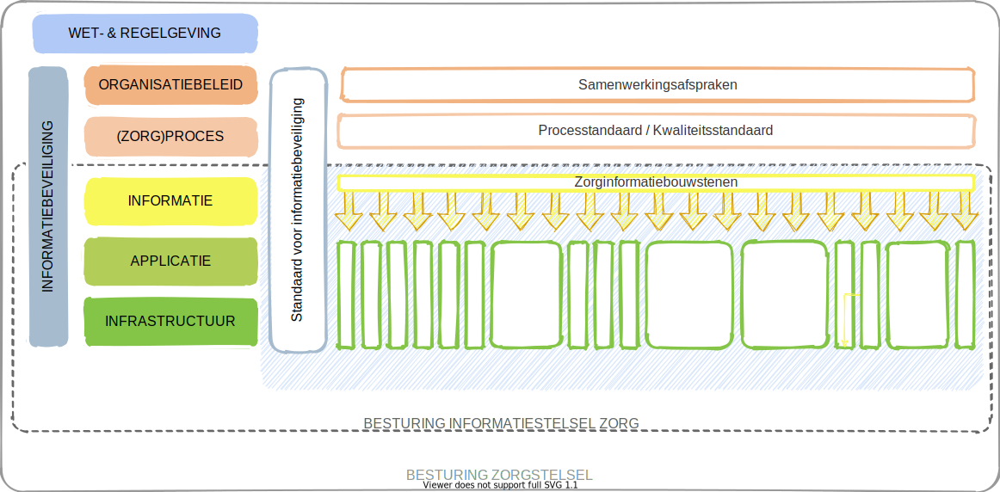

# Wat is DIZRA?

De zorg bouwt aan een duurzaam informatiestelsel. Een stelsel waarin data en services digitaal vindbaar, toegankelijk, uitwisselbaar en herbruikbaar zijn. DIZRA is de referentiearchitectuur voor dit informatiestelsel in de zorg. Het is een product van IT-Architecten voor IT-Architecten. Met DIZRA borgen we de samenhang en de duurzaamheid van het informatiestelsel, we delen kennis en verhogen de kwaliteit.

Dit doen we door het beschrijven van:

1. Een **manifest** met uitgangspunten. Het manifest beschrijft de uitgangspunten voor het maken van architectuurkeuzes. Met dezelfde uitgangspunten verkrijgen we meer samenhang.
2. Een **begrippenlijst** om de terminologie te verklaren en te definiëren**.** Voor de begrippen maken we hergebruik van bestaande begrippenlijksten om samen aan een gemeenschappelijk taalgebruik te werken zodat we elkaar beter begrijpen.
3. De **motivatie** voor de uitgangspunten.
4. Een beschrijving van de **besturing** van het informatiestelsel gebaseerd op NEN7522:2020. Het stelsel zien we als een stelsel van standaarden. In de besturing staat het voortbrengingsproces en de governance van de standaarden beschreven.
5. De context van het informatiestelsel als **ecosysteem** met haar deelnemers. Het laat zien wie de deelnemers zijn en hoe interoperabiliteit ontstaat tussen deelnemers.
6. De **technologie** achter het ecosysteem waarbij we inzicht geven in de systeemactoren, de functies van de systeemactoren en de leveranciers van de software in het informatiestelsel.

DIZRA is in opdracht van het Informatieberaad Zorg ontwikkeld. Het informatiestelsel is nodig om de zorg nog beter, betaalbaarder en toegankelijker te maken. Als IT-Architecten in de zorg dragen we bij door het stelsel uitgangspunten, structuur en samenhang te geven. DIZRA is het gezamenlijke resultaat van alle gesprekken en de ingebrachte kennis, kunde en ervaring van IT-Architecten in de zorg. DIZRA is vakinhoudelijk en vereist daarom kennis van informatievoorziening en informatietechnologie.


**Status van DIZRA als referentiearchitectuur voor het informatiestelsel in de zorg:**

Het Informatieberaad Zorg heeft de volgende besluiten genomen:

* 12-2018: De principes zijn vastgesteld
* 09-2019: De richtlijnen zijn vastgesteld onder voorwaarde van beproeving
* 04-2020: De resultaten van de beproeving zijn teruggemeld aan het informatieberaad. Het informatieberaad heeft op basis hiervan besloten DIZRA vast te stellen.


## Samen het gesprek voeren

DIZRA is een referentiearchitectuur. Maar wat betekent dat? Kort gezegd kun je zeggen dat het een fundament is waarop anderen kunnen voortbouwen. Een gemeenschappelijke basis dus. Omdat we vanuit een zelfde basis met dezelfde uitgangspunten vertrekken ontstaat er samenhang.

Met een referentiearchitectuur willen we ook het gesprek vereenvoudigen. Door een structuur te bieden van onderwerpen waarover we met elkaar in gesprek moeten gaan. Maar ook door de begrippen die we gebruiken in deze structuur.  

## Het probleem dat we willen oplossen

In de huidige situatie ontbreekt het aan standaarden op de applicatie en technische laag van het interoperabiliteitsmodel. Het is niet zo dat deze standaarden er niet zijn. Er is alleen geen keuze gemaakt voor een standaard. Iedere keten kiest daarom voor haar eigen standaard en veelal is het dominante product in een keten de standaard. We willen dit oplossen door in het informatiestelsel te kiezen voor een stelsel van standaarden vanuit een netwerkperspectief.

Het netwerkperspectief brengt alle ketens samen in een perspectief van de deelnemer naar het informatiestelsel en de andere deelnemers. Een netwerk is een deelnemer met verbindingen naar andere deelnemers. De deelnemer moet meedoen in al deze verbindingen, al deze ketens. De informatievoorziening en deelname aan alle ketens komt samen op de informatie, applicatie en technische laag. Op de informatielaag waar we vanuit domeinen moeten leren denken en op de applicatie- en technische laag waar we zorgbrede standaarden moeten gaan hanteren.

## De standaarden in het informatiestelsel

Het informatiestelsel is een stelsel van standaarden binnen het zorgstelsel omdat we willen uitgaan van een eerlijk speelveld voor alle leveranciers. In onderstaand figuur zijn  de verschillende standaarden weergegeven.

We onderkennen in het informatiestelsel informatiestandaarden en technische afspraken. Een informatiestandaard beschrijft de functionele behoefte van de deelnemers en de diensten die de deelnemers voor de invulling van die behoefte met elkaar afspreken. Een technische afspraak is een aanvulling op de informatiestandaard voor de invulling van de technische afspraken.

## Reactie geven

De ontwikkeling van DIZRA is een continu én dynamisch proces. We nodigen iedereen uit om een reactie te geven en jouw vragen, opmerkingen en ervaringen te delen. Alleen dan komen we tot een referentiearchitectuur die ons allen helpt in de realisatie van een duurzaam informatiestelsel in de zorg.

Reacties die we graag ontvangen gaan bijvoorbeeld over:

* verdere verduidelijking van een onderdeel;
* actualisering door nieuwe inzichten of veranderende omgeving;
* toevoegingen;
* voorbeelden hoe een onderdeel van DIZRA in de praktijk toegepast kan worden;
* vragen of twijfels hoe je iets moet uitleggen of toepassen.

Je kunt reageren door een mail te sturen naar: [architectuurcommunityzorg@zinl.nl](mailto:architectuurcommunityzorg@zinl.nl)
