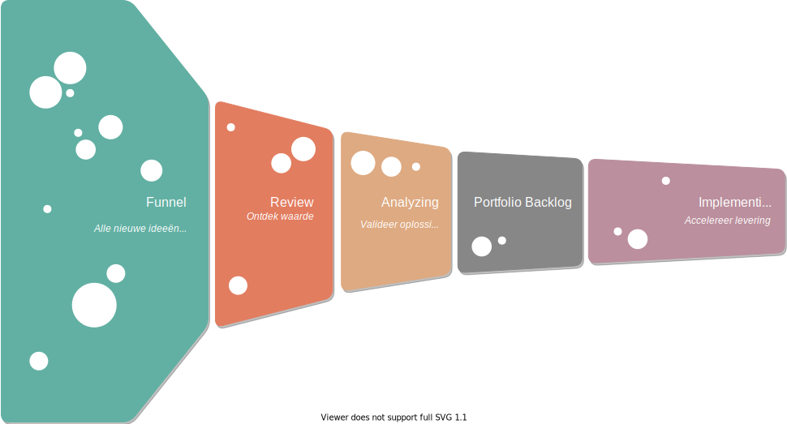
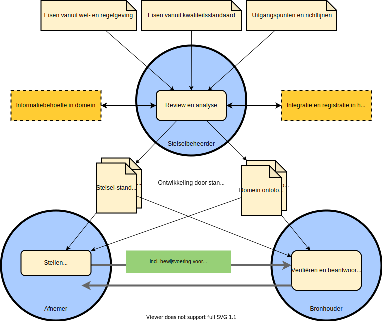

# Stelselbeheerder

Het informatiestelsel is een stelsel van stelselstandaarden zoals in onderstaand figuur weergegeven. Een stelsel heeft echter samenhang nodig om als ecosysteem te kunnen functioneren. Samenhang om bijvoorbeeld te weten wat waar wordt gebruikt, waar standaarden ontbreken en welke standaarden gerealiseerd en geïmplementeerd worden. Voor deze samenhang is stelselmanagement (zie NEN7522:2020) en een portfolio van stelselstandaarden nodig. Met stelselmanagement is weinig ervaring. We stellen echter dat stelselmanagement overeenkomsten heeft met portfolio management.

Het portfolio management en het bewaken van de samenhang is de verantwoordelijkheid van de stelselbeheerder.

De NEN7522:2020 kent twee soorten standaarden, individuele standaarden en een slelsel van standaarden. We onderkennen in de referentiearchitectuur daarnaast categorieën van standaarden voor een:

- **register**: voor de uitwisseling van verklaringen afkomstig van een registerhouder;
- **nutsvoorziening**: voor de uitwisseling van gegevens met een nutsvoorziening;
- **uitwisseling**: een uitwisseling tussen een bronhouder en een afnemer van data en services.

## Portfolio management

Portfolio management gaat over het regie voeren en managen van het geheel, terwijl het bij een stelselstandaard gaat om het domein waarvoor de standaard is ontwikkeld. Zonder portfolio management geen samenhang dus. Portfolio management is een uitgebreid onderwerp waarover vele boeken zijn geschreven. Een goede start voor meer informatie is: https://www.scaledagileframework.com/lean-portfolio-management/.

In het bovenstaande figuur is een voorbeeld weergegeven van een kanban voor de ontwikkeling van standaarden in het informatiestelsel (bron: https://www.scaledagileframework.com/portfolio-kanban/). Het portfolio aan epics (met mogelijk meerdere business use cases) valt onder de management verantwoordelijkheid van de stelselbeheerder. De implementatie van een epic zal uitgevoerd moeten worden door een of meerdere standaardisatieorganisaties. Deze standaardisatieorganisaties ontwikkelen en beheren de stelselstandaarden in het domein van de epic.

Hoewel een domeinontologie ook een stelselstandaard is, is in bovenstaand figuur deze separaat benoemd. Stelselstandaarden zijn namelijk veelal gericht op een keten of een enkelvoudige uitwisseling van gegevens. Voor hergebruik is echter noodzakelijk dat deze standaarden gebruik maken van dezelfde domeinontologieën. 