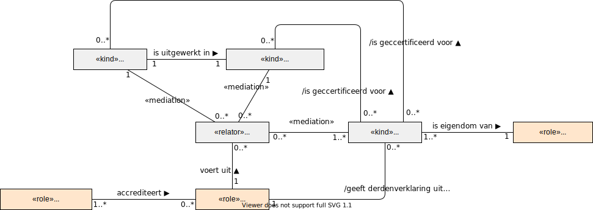

# Auditor

Een auditor voert een audit uit voor een norm en/of een technische afspraak. Het resultaat van een positieve audit is een derdenverklaring waarmee de softwareleverancier kan aantonen dat haar product voldoet aan de norm. De auditor moet geacccrediteerd zijn om een audit te mogen uitvoeren.

Een auditor heeft de volgende verantwoordelijkheden:

* De auditor voert audits uit op een versie van een norm en/of een technische afspraak.
* De auditor geeft een derdenverklaring waarmee zij een softwareproduct certificeert. 
* De auditor zelf is onderhevig aan accreditatie door een accreditatie-instantie, bijvoorbeeld de Raad voor Accreditatie.