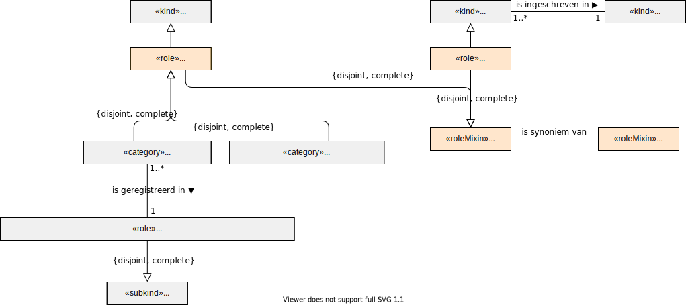

# Zorgverlener

Voor de definitie van een zorgverlener volgen we de Wet kwaliteit, klachten en geschillen zorg (Wkkgz). In onderstaand figuur is deze definitie uitgebeeld. 

Een zorgverlener is in het informatiestelsel een eindgebruiker van software die gebruik maakt van het informatiestelsel.