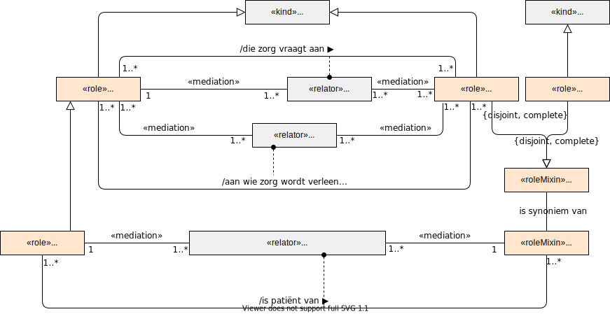

# Cliënt

Voor de definitie van een cliënt volgen we de Wet kwaliteit, klachten en geschillen zorg (Wkkgz). In onderstaand figuur is deze definitie uitgebeeld. 

Een andere term is patiënt. De term cliënt zien we als de generieke term en patiënt als een specialisatie van cliënt. Er is sprake van patiënt als de cliënt  een geneeskundige behandelovereenkomst heeft met de hulpverlener. Dit overeenkomstig de definitie in de Wet op de geneeskundige behandelingsovereenkomst: "*Degene op wiens persoon de handelingen rechtstreeks betrekking hebben wordt verder aangeduid als de patiënt.*"

Een cliënt is in het informatiestelsel een eindgebruiker van software die gebruik maakt van het informatiestelsel.