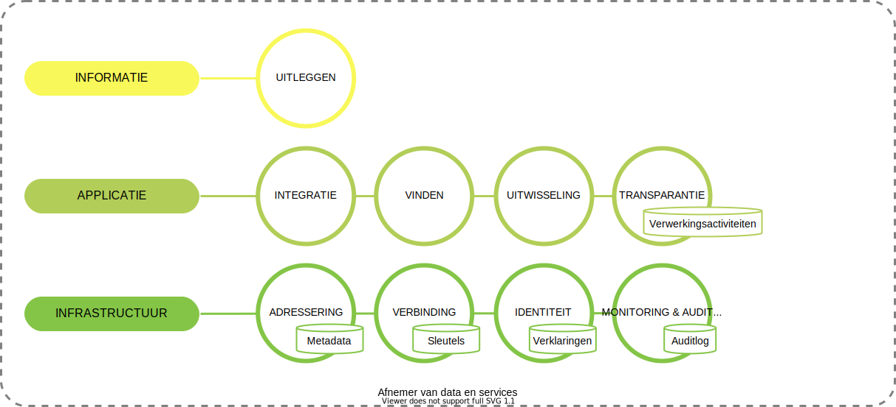

# Afnemer
In het ecosysteem van het informatiestelsel zijn rechtspersonen (organisatie) afnemers van data en services. Hierbij is het uitgangspunt dat een organisatie zelf verantwoordelijk is voor haar informatievoorziening. In onderstaand figuur zijn de functies opgenomen die een organisatie moet implementeren om mee te kunnen doen met het informatiestelsel.

Een afnemer is verantwoordelijk voor:

- het uitleggen van de betekenis van de data in haar informatiesystemen. Dit in de termen van een gemeenschappelijke ontologie van een domein.
- integratie met haar applicatielandschap, de informatiesystemen die gebruikt worden voor de reguliere processen. Mensen maken gebruik van deze informatiesystemen.
- het vinden van zorgverleners, zorgaanbieders of andere organisaties voor het uitwisselen van gegevens. We plaatsen deze in de applicatielaag omdat menselijk handelen vaak noodzakelijk is bij het vinden. Registers vormen de bron voor het vinden.
- het kunnen uitwisselen van gegevens c.q. gebruik maken van services van bronhouders. Met gegevens worden ook documenten bedoeld.
- het realiseren van transparantie over de verwerking van persoonsgegevens. Een afnemer moet inzicht kunnen geven in haar verwerkingen (waaronder raadplegingen) van persoonsgegevens om aan haar verantwoordingslicht te kunnen voldoen. Hiervoor moet zij een logboek onderhouden met de verwerkingsactiviteiten. Een organisatie moet hier al aan voldoen in de huidige situatie.
- het adresseren van data en services op basis van een identificatie van een gevonden zorgverlener, zorgaanbieder of andere organisatie.
- het realiseren van een veilige verbinding met bronhouders en andere actoren in het ecosysteem.
- het kunnen ontvangen en presenteren van identiteitskenmerken door middel van verklaringen.
- het vastleggen van alle relevante gebeurtenissen voor monitoring en auditing.