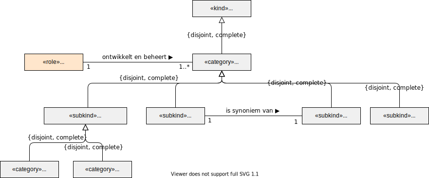
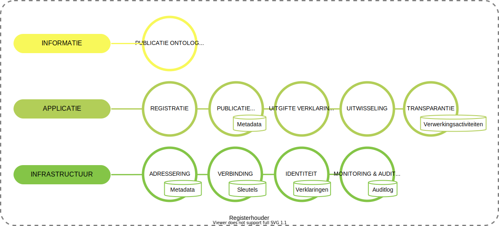

# Registerhouder
In het ecosysteem zijn meerdere soorten registers te onderkennen. We onderkennen:

- Registers met basisgegevens waarin organisaties geregistreerd zijn en een identificerend kenmerk hebben verkregen. We onderkenen binnen deze groep aan registers het wettelijk stelsel van basisregisters en de sectorale registers. In deze sectorale registers zijn organisaties geregistreerd zoals zorgaanbieders, zorgverzekeraars, zorgkantoren, overheidsinstanties, onderzoeksinstituten en belangenbehartigers. Voorbeelden van bestaande sectorale registers zijn: Landelijk register Zorgaanbieders en het AGB-register.
- Patiëntenregister of kwaliteitsregister is een registratie van gegevens over een welomschreven patiëntenpopulatie, gedefinieerd door een bepaalde aandoening, zorgtype of complicatie dan wel combinaties daarvan, die is opgezet om de kwaliteit van zorg te meten, verbeteren en verantwoorden. De patiëntenpopulatie wordt gedefinieerd door een bepaalde aandoening, zorgtype of complicatie dan wel combinaties daarvan. (bron: https://www.zorginzicht.nl/ontwikkeltools/overwegen/leidraad-kwaliteitsregistraties)
- Een beroepsregister waarin beoefenaren van beroepen zijn ingeschreven met als doel de kwaliteit van de beroepsbeoefening te bevorderen en te handhaven (gebaseerd op definitie in Jeugdwet). Voorbeeld van een beroepsregister in de zorg is het BIG-register.

Registers met basisgegevens en beroepsregisters hebben als eigenschap dat zij kenmerken registreren die identificerend zijn voor een onderwerp en soms ook autoriserende kenmerken. Een AGB-register identificeert een zorgaanbieder en het handelsregister een onderneming. Een BIG-registratie registreert welke medische handelingen een zorgverlener mag uitvoeren. Deze kenmerken kunnen gebruikt worden in het ecosysteem om (zorg)organisaties en zorgverleners te identificeren en te autoriseren. Het register moet daarvoor een verklaring uitgeven waarmee zij verklaard dat een (zorg)organisatie of zorgverlener met de betreffende kenmerken geregistreerd zijn.

In onderstaand figuur zijn de functies opgenomen voor een register.

Een registerhouder is verantwoordelijk voor:

- het publiceren van haar ontologie. Hierin staat beschreven wat de betekenis is van de data in haar registratie.
- het voeren van een registratie.
- het publiceren van het register zodat deze vindbaar is.
- het uitgeven van verklaringen zoals een bewijs van registratie of een bewijs van bevoegdheid.
- het kunnen ontvangen van gegevens voor registratie of het uitwisselen van (basis)gegevens met organisaties, bijvoorbeeld vanuit een wettelijke verplichting.
- het realiseren van transparantie over de verwerking van persoonsgegevens. Een registerhouder moet voldoen aan haar verantwoordingslicht. Hiervoor moet zij een logboek onderhouden met de verwerkingsactiviteiten.
- het adresseren van data en services op basis van een identificatie van een organisatie.
- het realiseren van een veilige verbinding met actoren in het ecosysteem.
- het kunnen ontvangen en presenteren van identiteitskenmerken door middel van verklaringen (voor het realiseren van een keten van vertrouwen).
- het vastleggen van alle relevante gebeurtenissen voor monitoring en auditing.