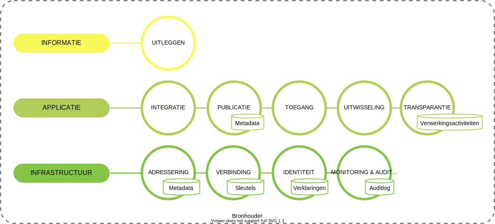

# Bronhouder
In het ecosysteem van het informatiestelsel zijn rechtspersonen (organisatie) bronhouders van data en services. Hierbij is het uitgangspunt dat een organisatie zelf verantwoordelijk is voor het beschikbaar stellen van gegevens aan de actoren in het ecosysteem. In onderstaand figuur zijn de functies opgenomen die een organisatie moet implementeren om mee te kunnen doen als bronhouder in het informatiestelsel.

Een bronhouder is verantwoordelijk voor:

- het uitleggen van de betekenis van de data in haar informatiesystemen. Dit in de termen van een gemeenschappelijke ontologie van een domein.
- integratie met haar applicatielandschap, de informatiesystemen die gebruikt worden voor de reguliere processen. Mensen maken gebruik van deze informatiesystemen.
- het publiceren van de datasets zodat deze vindbaar zijn.
- het identificeren en toegang geven van een afnemer tot de gegevens en services.
- het kunnen uitwisselen van gegevens c.q. beschikbaar stellen van services. Met gegevens worden ook documenten bedoeld.
- het realiseren van transparantie over de verwerking van persoonsgegevens. Een registerhouder moet voldoen aan haar verantwoordingslicht. Hiervoor moet zij een logboek onderhouden met de verwerkingsactiviteiten.
- het adresseren van data en services op basis van een identificatie van een organisatie.
- het realiseren van een veilige verbinding met actoren in het ecosysteem.
- het kunnen ontvangen en presenteren van identiteitskenmerken door middel van verklaringen (voor het realiseren van een keten van vertrouwen).
- het vastleggen van alle relevante gebeurtenissen voor monitoring en auditing.
