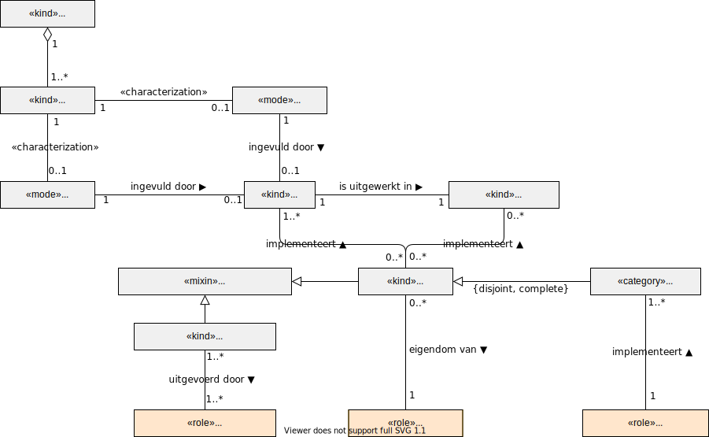

# Voorzieningenleverancier

Voor een goed begrip is het belangrijk om de termen gemeenschappelijke voorziening en nutsvoorzieningen goed te definiëren en ook hoe deze termen zich tot elkaar verhouden (en tot andere gerelateerde begrippen). Een nutsvoorziening heeft tot doel om onder meer de vindbaarheid, toegankelijkheid, interoperabiliteit en beschikbaarheid van gegevens voor de actoren in het ecosysteem te vereenvoudigen. Wanneer een gemeenschappelijke voorziening cruciaal is voor de werking van het stelsel, als er sprake is van een gezamenlijke verantwoordelijkheid omdat het alleen gezamenlijk en niet zelfstandig gerealiseerd kan worden, dan is sprake van een nutsvoorziening.

De volgende begrippen zijn gehanteerd:

- **Generieke functie**: een functie die zorgbreed voor meerdere toepassingsgebieden nodig is om vindbaarheid, toegankelijkheid, interoperabiliteit of hergebruik van gegevens te kunnen realiseren. Een generieke functie is in te vullen met een set van zorgbrede afspraken, protocollen en open (waar mogelijk internationale) standaarden. Deze afspraken kunnen in een stelselstandaard worden vastgelegd. Voorbeeld van een zorgbrede generieke functie is de toegankelijkheid tot data met een protocol voor autorisatie en authenticatie. 

- **Generieke norm**: een norm die een generieke functie beschrijft. De norm beschrijft de afspraken voor de functie in functionele en niet-functionele eisen. Een generieke norm bestaat naast de specifieke normen, zoals de norm voor medicatieveiligheid.

- **Technische afspraak**: een technische afspraak bevat de afspraken over het hanteren en invullen van technische standaarden. Een technische afspraak kan gelezen worden als het technische ontwerp van functionele afspraken (al dan niet vastgelegd in een norm).

- **Gemeenschappelijke voorziening**: een softwareproduct of een dienst in de vorm van een ontwikkel- en beheerproces gericht op het ondersteunen van een generieke functie. De gemeenschappelijke voorziening kan door een organisatie zelfstandig binnen haar span of control worden geïmplementeerd (al of niet via de diensten van een dienstverlener) of worden gekozen, maar bevat afhankelijkheden met andere organisaties (en haar dienstverleners) waardoor gemeenschappelijke afspraken noodzakelijk zijn. 
  Wanneer een gezamenlijke voorziening cruciaal is en niet zelfstandig door een organisatie binnen haar eigen span of control kan worden geïmplementeerd of gekozen, dan kan deze in aanmerking komen om tot nutsvoorziening te worden betiteld. 

- **Nutsvoorziening**: een softwareproduct die een functie invult die essentieel is voor de werking van het duurzaam informatiestelsel, die voldoet aan een generieke norm, die gebruik maakt van open (waar mogelijk internationale) standaarden en waarvan het gebruik niet ter discussie staat en non-concurrentieel is. Een nutsvoorziening kan niet door een enkele zorgorganisatie geïmplementeerd worden binnen haar eigen span of controle. Het ontstijgt met andere woorden de verantwoordelijkheid van een enkele organisatie. 

  Het gaat om het zonder (prijs)belemmeringen toegankelijk en beschikbaar maken van een infrastructurele service.  De organisatie van een nutsvoorziening kan op verschillenden manieren gebeuren: hetzij publiek dan wel uitbesteed aan een private organisatie.

