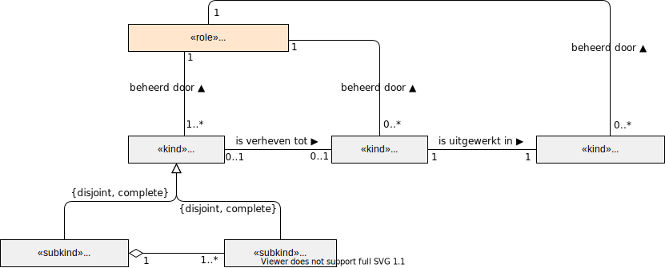
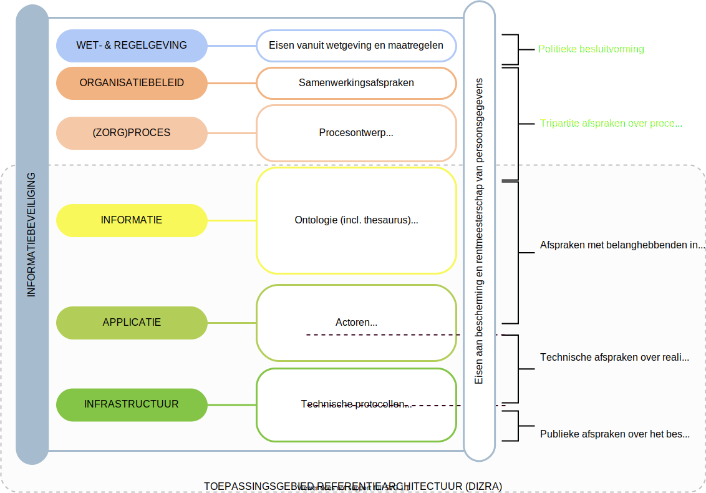

# Standaardisatieorganisatie
Een standaardisatieorganisatie is verantwoordelijk voor het ontwikkelen en beheren van een standaard, een norm of een technische afspraak. In termen van NEN7522:2020 is een standaardisatoeorganisatie de houder (of eigenaar) van een standaard. In specifieke gevallen kan een standaardisatieorganisatie als functioneel beheerder aangesteld zijn om een standaard in opdracht van een houder te ontwikkelen en te beheren.

De NEN7522:2020 is de norm voor het ontwikkelen en beheren van standaarden. De norm onderkent individuele standaarden en stelsels van standaarden en beschrijft de eisen aan de processen van ontwikkeling en beheer. De norm beschrijft geen inhoudelijke eisen voor de bouwblokken van een standaard.  

Onderstaand figuur geeft de bouwblokken van een standaard weer.

Een kwaliteitsstandaard omvat samenwerkingsafspraken, een procesontwerp, richtlijnenen en kritieke prestatie-indicatoren om de kwaliteit en continuïteit van zorg te borgen. Dit wordt tripartite afgesproken tussen vertegenwoordigers van patiënten, cliënten, zorgaanbieders en zorgverzekeraars. Daarnaast moet in stelselstandaarden de volgende bouwblokken worden afgesproken:

1. Een **ontologie** uitgewerkt op logisch niveau.
2. Medische of administratieve **gebeurtenissen** die gedeeld moeten kunnen worden in het ecosysteem. 
3. **Documenten** die gedeeld moeten kunnen worden
4. **Verklaringen** die de basis vormen voor identificatie, autorisatie en vertrouwen, de elektronische ondertekenaar verklaart zich verantwoordelijk met een verklaring. Een verklaring is veelal een verantwoordelijkheidsverklaring voor een document.
5. **Gegevensbronnen** die gedeeld moeten kunnen worden.
6. **Metadata** voor het beschrijven van datasets zodat deze gevonden kunnen worden.
7. **Autorisatiematrix** waarin de toegang tot gegevens is gespecificeerd.
8. **Actoren** die op applicatieniveau een rol spelen.
9. **Functionele eisen** aan applicaties.
10. **Niet-functionele eisen** voor applicaties.
11. De technische **componenten** die geïdentificeerd zijn.
12. Technische **protocollen** in de interactie met de componenten.
13. De gehanteerde **cryptografie** voor versleuteling en elektronische ondertekening.
14. **Nutsvoorzieningen** die noodzakelijk zijn voor de werking van het ecosysteem.

