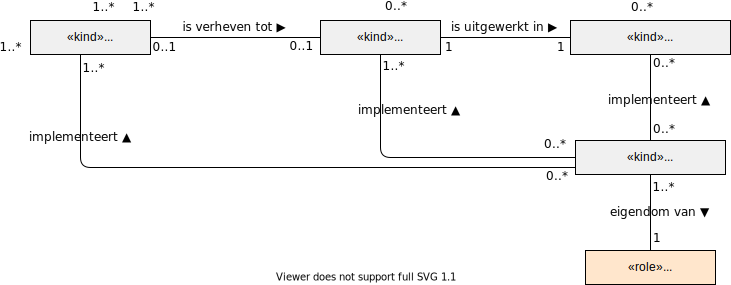

# Softwareleverancier

In het informatiestelsel speelt software een centrale rol. Zonder software kan een zorgverlener, een cliënt of iedere andere eindgebruiker geen gebruik maken van het informatiestelsel. Softwareleveranciers maken deze software.

Softwareleveranciers implementeren in het informatiestelsel een stelselstandaard of een norm en een technische afspraak.