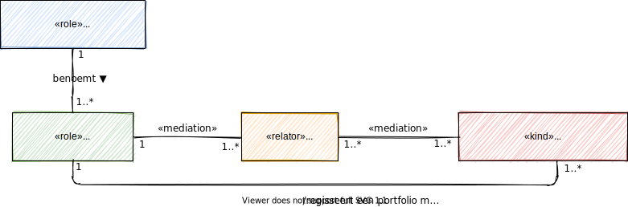

# Rollen en verantwoordelijkheden

## Stelselhouder
De stelselhouder is een organisatie die eindverantwoordelijk is voor het zorgstelsel en daarom ook eindverantwoordelijk voor het informatiestelsel, dat onderdeel is van het zorgstelsel om continuïteit en kwaliteit van zorg te borgen. De stelselhouder is een rol van een rechtspersoon. In het zorgstelsel en daarom ook in het informatiestelsel is het Ministerie van Volksgezondheid, Welzijn en Sport (VWS) de stelselhouder. 

De stelselhouder heeft in lijn met NEN7522:2020 de volgende verantwoordelijkheden:

- De stelselhouder is houder van het Informatiestelsel Zorg en voert als zodanig de **governance** uit voor het stelsel.
- De stelselhouder ontwikkelt een **visie** over de richting van de ontwikkeling van het stelsel. 
- De stelselhouder benoemt een (of meerdere) stelselbeheerder.
- De stelselhouder voert het **rechtenbeleid** en stelt kaders vast. De houder erkent vanuit deze verantwoordelijkheid één of meerdere standaardisatieorganisaties en laat voorzieningenleveranciers toe. De stelselhouder heeft de mogelijkheid de toegang tot het informatiestelsel wettelijk te reguleren. Dit betekent dat de toegang tot de markt van nutsvoorzieningen via wet- en regelgeving tot stand komt. Als er geen regulering is, dan gelden de regels van de vrije markt en heeft iedere voorzieningenleverancier een gelijk speelveld.
- De stelselhouder kan een register erkennen.
- De stelselhouder kan een auditor accrediteren voor het uitvoeren van audits op stelselstandaarden (mogelijk via de Raad van Accreditatie).

De erkenningen en benoemingen kunnen op voordracht van de stelselbeheerder zijn en kunnen geautoriseerd worden door de autorisator.

## Stelselbeheerder
De stelselbeheerder is een organisatie die verantwoordelijk is voor het goede verloop van de processen voor ontwikkeling en het beheer van het portfolio aan standaarden voor het informatiestelsel.

Het informatiestelsel is een stelsel van stelselstandaarden. Een stelsel heeft echter samenhang nodig om als ecosysteem te kunnen functioneren. Samenhang om bijvoorbeeld te weten wat waar wordt gebruikt, waar standaarden ontbreken en welke standaarden gerealiseerd en geïmplementeerd zijn. Voor deze samenhang is stelselmanagement nodig (zie NEN7522:2020) en een portfolio van stelselstandaarden. De stelselbeheerder moet voor deze samenhang zorgdragen.

De stelselhouder heeft in lijn met NEN7522:2020 de volgende verantwoordelijkheden:

- De stelselhouder is verantwoordelijk voor het activeren van communityleden en het bewaken en bevorderen van de samenstelling van de **community**: het is essentieel dat alle belanghebbenden participeren in de community. De community is iedere groep of gemeenschap die zich richt op de ontwikkeling en het beheer van een specicieke of generieke stelselstandaard vanuit een expliciete gezamenlijke behoefte. 
- De stelselhouder is verantwoordelijk voor de **architectuur** en de roadmapping van het stelsel: uitzetten en toetsen van de inhoudelijke lijnen en op hoofdlijnen bewaken van de samenhang tussen de stelselstandaarden van de community.  Bijzondere aandacht verdient de relatie met internationale standaarden en internationale trends. 
- De stelselhouder is verantwoordelijk voor het **kwaliteitsbeleid en het benchmarken** van de stelselstandaarden.
- De stelselbeheerder is verantwoordelijk voor het **portfolio management**.

Het portfolio management bevat de volgende verantwoordelijkheden:

- De stelselhouder is verantwoordelijk voor het in beeld brengen en het bewaken van de samenhang tussen alle nieuwe ideeën (initiaties), wensen en eisen voor stelselstandaarden;
- De stelselhouder is verantwoordelijk voor het realiseren van een roadmap: de inhoudelijke lijn uitzetten in een standaardisatieagenda voor de komende jaren. 

## Financier
De financier is verantwoordelijk voor het financieren van de governance, de ontwikkeling en het beheer van de standaarden in het informatiestelsel. De financier is een rol van een rechtspersoon, het Ministerie van Volksgezondheid, Welzijn en Sport (VWS).  De financier heeft in lijn met NEN7522:2020 de volgende verantwoordelijkheden:

- De financier besluit tot duurzame financiering van het stelsel.

## Standaardisatieorganisatie
Een standaardisatieorganisatie is verantwoordelijk voor het ontwikkelen en beheren van een standaard, een norm of een technische afspraak. In termen van NEN7522:2020 is een standaardisatieorganisatie de houder (of eigenaar) van een standaard. In specifieke gevallen kan een standaardisatieorganisatie als functioneel beheerder aangesteld zijn om een standaard in opdracht van een houder te ontwikkelen en te beheren.

De NEN7522:2020 is de norm voor het ontwikkelen en beheren van standaarden. De norm onderkent individuele standaarden en stelsels van standaarden en beschrijft de eisen aan de processen van ontwikkeling en beheer. De norm beschrijft geen inhoudelijke eisen voor de bouwblokken van een standaard. 

## Autorisator
De autorisator autoriseert een individuele standaard of een stelsel van standaarden en erkent deze als stelselstandaard. De autorisator is een rol van een gremium, het Informatieberaad Zorg. De autorisator heeft in lijn met NEN7522:2020 de volgende verantwoordelijkheden:

- De autorisator besluit over ontwikkeling, over het opnemen en bijsturen van nieuwe ideeën en over wensen en eisen voor stelselstandaardenen in de portfolio;
- De autorisator besluit voor het vrijgeven van versies van de referentiearchitectuur;
- De autorisator besluit over uitgangspunten, principes en toelatingscriteria van het informatiestelsel;
- De autorisator besluit over kwaliteitsbeleid;
- De autorisator besluit over adoptie en erkenning van stelselstandaarden.

## Auditor
Een auditor is een organisatie die verantwoordelijk is voor het uitvoeren van een audit op een product van een softwareleverancier. Een auditor voert een audit uit voor een norm en/of een technische afspraak. Het resultaat van een positieve audit is een derdenverklaring waarmee de softwareleverancier kan aantonen dat haar product voldoet aan de norm. De auditor moet geaccrediteerd zijn om een audit te mogen uitvoeren.

Een auditor heeft de volgende verantwoordelijkheden:

- De auditor voert audits uit op een versie van een norm en/of een technische afspraak.
- De auditor geeft een derdenverklaring waarmee zij een softwareproduct certificeert. 
- De auditor zelf is onderhevig aan accreditatie door een accreditatie-instantie, bijvoorbeeld de Raad voor Accreditatie of de stelselhouder.

## Distributeur
De distributeur is verantwoordelijk voor het distribueren van artefacten. De distributeur is een rol van een rechtspersoon, vaak gecombineerd met de rol van stelselbeheerder. De distributeur heeft in lijn met NEN7522:2020 de volgende verantwoordelijkheden:

- De distributeur distribueert artefacten die binnen het stelselmanagement vallen.

## Expert
Een expert brengt specifieke noodzakelijke expertise in voor besluitvorming en het bewaken van de samenhang. De expert is een rol van een gremium, de Architectuurboard Zorg. De expert heeft in lijn met NEN7522:2020 de volgende verantwoordelijkheden:

- De expert adviseert de autorisator, vooral over de samenhang en de richting van de ontwikkelingen.

## Gebruiker
De softwareleveranciers zijn de gebruikers van de standaarden. Een softwareleverancier is een organisatie die een softwareproduct levert waarin stelselstandaarden zijn of worden geïmplementeerd. Veelal wordt de software als dienst aangeboden met aanvullende dienstverlening voor onderhoud en ondersteuning. De gebruiker heeft in lijn met NEN7522:2020 de volgende verantwoordelijkheden:

- De gebruiker implementeert een standaard en borgt dat haar softwareproduct voldoet aan de eisen van de standaard.