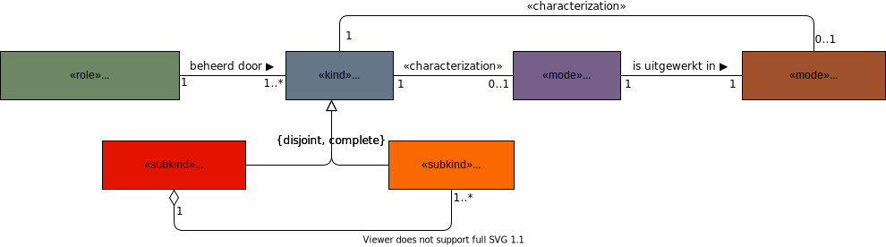

# Standaardisatieorganisatie
Een standaardisatieorganisatie is verantwoordelijk voor het ontwikkelen en beheren van een standaard, een norm of een technische afspraak. In termen van NEN7522:2020 is een standaardisatieorganisatie de houder (of eigenaar) van een standaard. In specifieke gevallen kan een standaardisatieorganisatie als functioneel beheerder aangesteld zijn om een standaard in opdracht van een houder te ontwikkelen en te beheren.

De NEN7522:2020 is de norm voor het ontwikkelen en beheren van standaarden. De norm onderkent individuele standaarden en stelsels van standaarden en beschrijft de eisen aan de processen van ontwikkeling en beheer. De norm beschrijft geen inhoudelijke eisen voor de bouwblokken van een standaard. 
