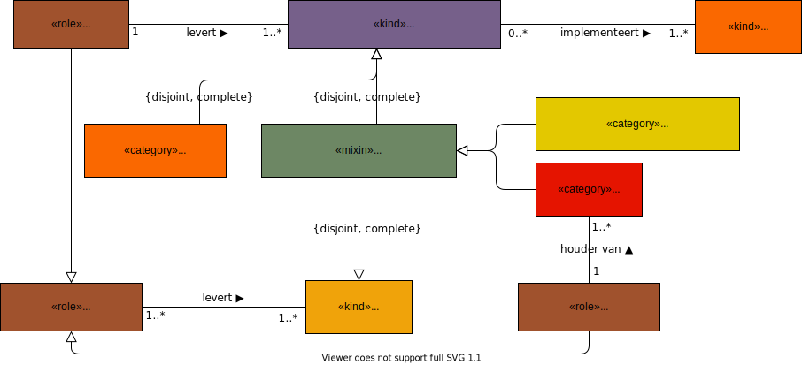

# Gebruikers van de standaarden in het informatiestelsel

## Softwareleverancier

Een softwareleverancier is een organisatie die een softwareproduct levert waarin stelselstandaarden zijn of worden geïmplementeerd. Softwareleveranciers zijn daarmee de directe gebruikers van de stelselstandaarden. Veelal wordt de software als dienst aangeboden met aanvullende dienstverlening voor onderhoud en ondersteuning. 

In het informatiestelsel speelt software een centrale rol. Zonder softwareproducten kan een zorgverlener, een cliënt of iedere andere eindgebruiker geen gebruik maken van het informatiestelsel. Softwareleveranciers maken deze software.

We onderkennen verschillende soorten softwareproducten:

- Een softwareproduct voor een register: een register met basisgegevens, een patiëntenregister of kwaliteitsregister en een beroepsregister;
- Een softwareproduct gericht op de uitwisseling van gegevens: een uitwisselingssysteem;
- Een softwareproduct als gemeenschappelijke voorziening of publieke infrastructurele voorziening waarbij een publieke voorziening een wettelijk gereguleerde voorziening is.

## Voorzieningenleverancier

Een softwareleverancier kan uiteraard ook een voorzieningenleverancier zijn. Een voorzieningenleverancier levert een platform voor bijvoorbeeld authenticatie, autorisatie etc. Het zijn gemeenschappelijke voorzieningen die via een platform aangeboden kunnen worden.

## Operationeel beheerder

Naast de dienstverlening van een softwareleverancier kan in een keten ook behoefte zijn aan aanvullende voorzieningen, bijvoorbeeld voor operationeel beheer van een keten met procesbewaking. Hiervoor kan een dienst zijn ingericht als gemeenschappelijke voorziening. Ook voor deze dienstverlening kunnen stelselstandaarden zijn afgesproken, zowel voor de dienst zelf als voor de software waarvan de dienst gebruik maakt en die door een softwareleverancier geleverd is.

## Registerhouder

Een voorzieningenleverancier is registerhouder als zij een register als dienst levert.

## Indirecte gebruikers

De stelselstandaarden voor het informatiestelsel kennen vele indirecte gebruikers. Zij ervaren de waarde van het informatiestelsel door een betere informatievoorziening via de softwareproducten. Om de werkelijke waarde te ervaren is echter een grote afhankelijkheid met de geboden functionaliteit en mate van integratie in de softwareproducten.

Voor de definities volgen we de Wet marktordening gezondheidszorg, Wet kwaliteit, klachten en geschillen zorg (Wkkgz), de Wet op de geneeskundige behandelovereenkomst (WGBO) en de Wet toelating zorginstellingen (WTZi). 

### Cliënt

Een cliënt is een natuurlijk persoon die zorg vraagt of aan wie zorg wordt verleend.

Een andere term is patiënt. De term cliënt zien we als de generieke term en patiënt als een specialisatie van cliënt. Er is sprake van patiënt als de cliënt een geneeskundige behandelovereenkomst heeft met de hulpverlener. Dit overeenkomstig de definitie in de Wet op de geneeskundige behandelingsovereenkomst: "*Degene op wiens persoon de handelingen rechtstreeks betrekking hebben wordt verder aangeduid als de patiënt.*"

Een cliënt is in het informatiestelsel een eindgebruiker van software die gebruik maakt van het informatiestelsel.

### Zorgorganisatie

Een organisatorisch verband die bedrijfsmatig zorg verleent en als rechtspersoon in het Handelsregister is geregistreerd.

### Zorgaanbieder

Een zorgaanbieder is 1) een natuurlijke persoon of rechtspersoon die beroeps- of bedrijfsmatig zorg verleent en 2) de natuurlijke persoon of rechtspersoon voor zover deze tarieven in rekening brengt namens, ten behoeve van of in verband met het verlenen van zorg door een zorgaanbieder als bedoeld onder 1.

Een instelling dan wel een solistisch werkende zorgverlener.

### Zorgverlener

Een natuurlijke persoon die beroepsmatig zorg verleent.

Een zorgverlener is in het informatiestelsel een eindgebruiker van een softwareproduct.

### Instelling

Specialisatie van zorgorganisatie voor een organisatorisch verband dat een toelating heeft als bedoeld in [artikel 5, eerste lid](https://wetten.overheid.nl/BWBR0018906/2020-01-01#HoofdstukIII_Artikel5) uit de Wet toelating zorginstellingen (WTZi).

### Hulpverlener

Een natuurlijke persoon of een rechtspersoon, zie zorgaanbieder.

