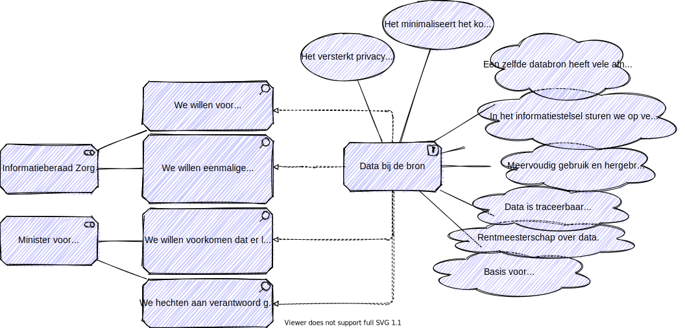

# Data bij de bron

## Waarom data bij de bron?

Met data bij de bron geven we invulling aan een decentrale informatiehuishouding. De minister stelt dat hij hecht aan verantwoord gebruik van data en het - waar mogelijk - voorkomen van landelijke dataverzamelingen. Bron: [Bijlage Kamerbrief over data laten werken voor gezondheid - Data laten werken voor gezondheid](https://www.rijksoverheid.nl/documenten/brieven/2018/11/15/data-laten-werken-voor-gezondheid), 15 november 2018. Daarnaast is het de basis voor meervoudig gebruik van gegevens vanuit het netwerkperspectief.

## Wat is data bij de bron?

Data bij de bron betekent dat we data bij de bron ophalen en niet doorkopiëren. Soms is een kopie noodzakelijk vanuit wettelijke verplichtingen, maar het principe is dat we zo weinig mogelijk kopiëren en zoveel mogelijk data direct bij de bron ophalen. Data bij de bron betekent dat we dezelfde databron hebben voor meerdere ketens. Hierdoor ontstaat een netwerk van data en services. Iedere deelnemer in het netwerk kan zowel afnemer als aanbieder van data en services zijn. Data kan hergebruikt en meervoudig gebruikt worden omdat de betekenis van data formeel en machineleesbaar is beschreven. Iedere keten kan op basis van de betekenis bepalen wat zij nodig heeft in haar keten. Een zelfde databron heeft daardoor vele afnemers in vele ketens.

Data bij de bron betekent ook dat data traceerbaar is naar de bron. Voor vertrouwen in data is het noodzakelijk dat een afnemer de herkomst van de data kan zien, bijvoorbeeld door een elektronische handtekening. Al verkrijgt de afnemer de data indirect, dan nog weet de afnemer op basis van de herkomst dat de data betrouwbaar is en hergebruikt kan worden.

### Verantwoord beheer en gebruik van data

[De minister stelt](https://www.rijksoverheid.nl/documenten/kamerstukken/2018/11/15/kamerbrief-over-data-laten-werken-voor-gezondheid) dat elke bronhouder zich verantwoordelijk dient te gedragen als rentmeester. Maar wat is een rentmeester in de context van persoonsgegevens? Een rentmeester is verantwoordelijk voor de bescherming van een persoon. De persoon die het onderwerp is van de data. De rentmeester heeft deze data in beheer gekregen van de persoon. Een rentmeester handelt als zodanig. Een rentmeester draagt zorg voor een verantwoord beheer en gebruik van data. Dit in brede zin.

De rentmeester handelt niet alleen in het belang van een persoon. Zij handelt met toestemming van de persoon ook in het algemeen belang van gezonde mensen en vanuit het maatschappelijk nut. De rentmeester doet dit door data verantwoord en gecontroleerd beschikbaar te stellen. Hierdoor wordt kennis gedeeld en waarde gecreëerd voor alle mensen. Data wordt alleen beschikbaar gesteld als de persoon toestemming heeft gegeven. Dit moet in het ontwerp van de data zijn opgenomen \("consent by design"\).

Een duurzaam rentmeesterschap is de basis voor diverse technologische toepassingen.


**Wat betekent rentmeesterschap?**

Een bronhouder mag zich rentmeester noemen als zij voldoet aan de volgende regels:

1. Een rentmeester denkt vanuit het belang van de persoon en het maatschappelijk belang.
2. Het rentmeesterschap omvat beleidsrichtlijnen, organisatievisie, -missie en –strategie en een aangepaste inrichting van processen, technologie en governance.
3. Een rentmeester voert een of meer delen van het rentmeesterschap uit.
4. Een rentmeester heeft persoonlijke data in beheer gekregen volgens vastomlijnde afspraken en beginselen, met het oog op persoonlijk en maatschappelijk welzijn en gezondheid. Data in vertrouwen.
5. Een rentmeester weet dat met betrouwbare data waarde kan worden gecreëerd.
6. Een rentmeester zorgt ervoor dat de persoon regie heeft en behoudt op zijn of haar gegevens \("consent by design"\).
7. De rentmeester beheert de data zodat waarde kan ontstaan. In eerste instantie voor de zorg en het welzijn van de persoon zelf en verder voor de zorg en het welzijn van de gemeenschap en het collectief belang.
8. De rentmeester hanteert diverse algemeen aanvaarde principes zoals zeggenschap, interoperabiliteit, FAIR-data \(zowel technisch als functioneel\), datasolidariteit en digitale inclusie. Het zijn principes voor een op waarde gestuurde gezondheidszorg.
9. De rentmeester zorgt ervoor dat een persoon altijd toegang heeft tot zijn of haar data. Uitgangspunt is en blijft dat waar data ter beschikking wordt gesteld, dit onder regie en zeggenschap van de betrokken persoon zelf gebeurd.


Zoals de minister in zijn [brief](https://www.rijksoverheid.nl/documenten/kamerstukken/2018/11/15/kamerbrief-over-data-laten-werken-voor-gezondheid) heeft aangegeven is voor het gebruik van data [vertrouwen](vertrouwensinfrastructuur.md) nodig en [regie op gegevens](regie-op-gezondheidsdata.md) door de persoon. Het vertrouwen dat door het proces rentmeesterschap en de rol van rentmeester wordt bewaakt.
