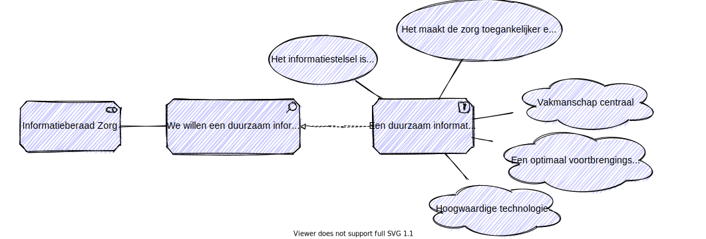

# Duurzaam

## Waarom duurzaam?

Een van de gewenste uitkomsten is een duurzaam informatiestelsel in de zorg. Met als reden dat de zorg toegankelijk en betaalbaar moet zijn. Maar wat is duurzaam in een wereld die continue veranderd? Dat is de verandering zelf. Om verandering tot een succes te maken zijn drie ingrediënten belangrijk: mensen met vakmanschap, een optimaal voortbrengingsproces en de technologie die je gebruikt.

## De ingrediënten voor duurzaamheid

Een duurzaam stelsel gaat niet alleen over gegevensuitwisseling en de standaarden die we daarvoor gebruiken. Duurzaamheid bereik je alleen als we ook de informatiesystemen weten te integreren en weten zorg te dragen voor een optimale informatievoorziening. Om dat mogelijk te maken moeten mensen, processen en technologie op elkaar zijn afgestemd.

De ingrediënten:

- Mensen met kennis en ervaring die continu willen leren, met een passie voor hun vak, voor vakmanschap.
- Een optimaal voortbrengingsproces van een stelselstandaard voor diensten, voor toegang tot de kennis van een organisatie en voor integratie met informatiesystemen.
- Hoogwaardige technologie waar gedreven en vakkundige mensen mee kunnen innoveren om de informatievoorziening te verbeteren en automatiseren.
