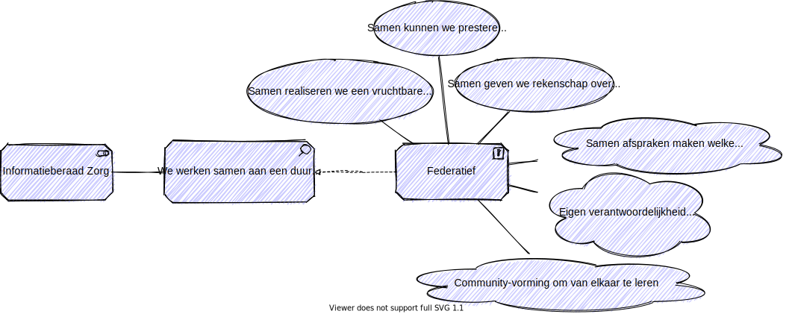

# Federatief

## Waarom samen afspraken maken?

Het Informatiestelsel Zorg heeft geen formele eigenaar. Het is van iedereen. We noemen dat een federatief stelsel. Binnen een federatief stelsel moeten we samen afspraken maken over de standaarden en de voorzieningen die we gebruiken. 

We maken afspraken om het volgende te realiseren:

1. Samen maken we afspraken over de richting, een visie en missie, en we tonen het leiderschap om deze richting uit te dragen en het dialoog aan te gaan.
2. Samen maken we afspraken over de ruimte die iedereen heeft om eigen doelen na te streven, de ruimte om te doen wat ieder belangrijk vind. We moeten er samen voor zorgen dat eigen doelen en richting samen vallen.
3. Samen maken we afspraken over de resultaten, wat we presteren en wat we leren.
4. Samen geven we rekenschap over de richting, over de ruimte die we nemen en over de resultaten. 