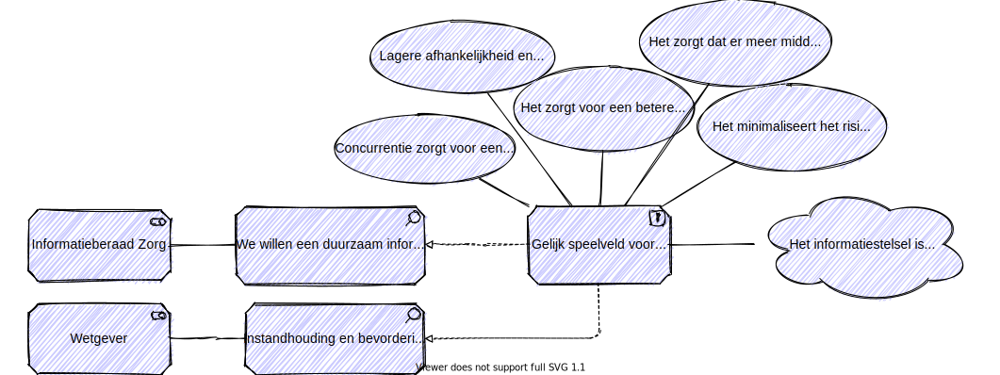

# Gelijk speelveld

## Wat is een gelijk speelveld?

Volgens de Autoriteit Consument en Markt is een eerlijk speelveld een speelveld waarin de kansen en keuzes van consumenten en andere bedrijven niet worden belemmerd. Een gelijk speelveld zien we ook als een marktsituatie \(een speelveld\) waar dezelfde regels gelden voor alle leveranciers, waardoor zij een gelijke uitgangspositie hebben om met elkaar te concurreren. Een gelijk speelveld waarin ook voor nieuwe toetreders kansen bestaan om te concurreren.

DIZRA hanteert de richtlijn dat er alleen afspraken mogen worden gemaakt over het gebruik van open \(internationale\) standaarden, maar niet over het gebruik van producten of diensten van een leverancier. We bedoelen hier de standaarden, producten en diensten die in de technische zorginfrastructuur afgesproken worden.

Een keuze voor een product of dienst van een leverancier als afspraak belemmert de vrijheid van keuze van natuurlijke personen en rechtspersonen binnen de gezondheidszorg. In de afspraken mogen geen belemmeringen worden opgelegd. Een zorgaanbieder moet een vrije keuze hebben voor een leverancier en geen gedwongen keuze.

### Waarom is een gelijk speelveld belangrijk?

De [Mededingingswet](https://wetten.overheid.nl/BWBR0008691/2019-01-01#Hoofdstuk3) verbiedt afspraken waardoor de mededinging op de Nederlandse markt of een deel daarvan wordt verhinderd, beperkt of vervalst. Een keuze voor een leverancier in een stelsel van afspraken mag daarom niet als daar geen wettelijke grondslag voor is. Naast dat het niet mag willen we het ook niet. We herkennen de situaties dat de macht bij de leveranciers ligt maar al te goed. We weten welke gevolgen dat heeft.

Een eerlijk speelveld tussen leveranciers moet de concurrentie stimuleren en voorkomen dat de macht bij de leverancier komt te liggen. Concurrentie is de prikkel tot doelmatig en doeltreffend werken. Concurrentie moet leveranciers inwisselbaar maken en aanzetten tot nieuwe en betere dienstverlening.

Een eerlijk speelveld moet het informatiestelsel minder kwetsbaar maken voor vertrouwensproblemen, bijvoorbeeld als een leverancier in opspraak is gekomen of als het vertrouwen geschaad is.

Een eerlijk speelveld moet zorgen voor een breed veld van leveranciers die innovatie brengen. Dit is nodig om tot innovatie te komen voor nieuwe en betere dienstverlening. Een monocultuur van leveranciers betekent dat innovatie steeds vanuit dezelfde leveranciers moet komen. We weten dat dit het vermogen tot innoveren verlaagt. Het is namelijk een beperking van kennis en capaciteit. Een monocultuur is daarom niet gewenst.
