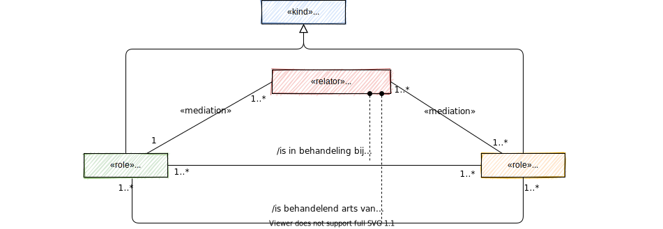
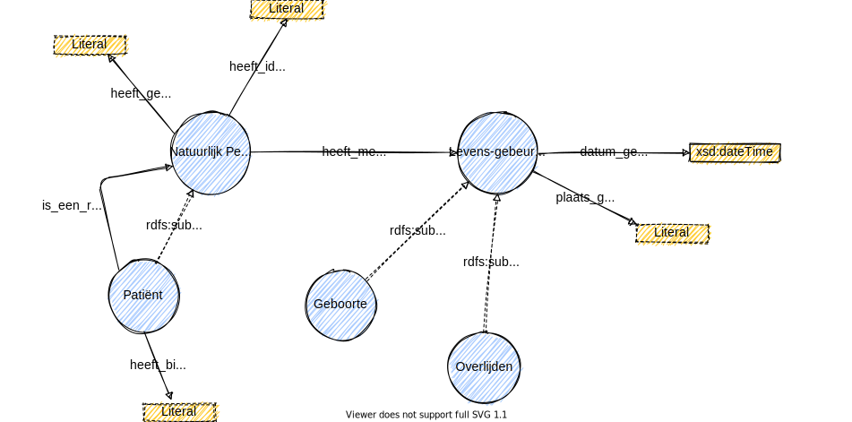

# Gemeenschappelijke taal

## Waarom gemeenschappelijke taal?

Een gemeenschappelijke taal is nodig voor het realiseren van interoperabiliteit. Interoperabiliteit van gegevens betekent dat we dezelfde betekenis geven aan gegevens. Dat we bijvoorbeeld genderidentiteit niet verwarren met de registratie van het geslacht in het basisregister personen, dat we herkennen dat het ook iets anders is dan het biologische geslacht. Hierdoor kunnen we gezondheidsrisico's verminderen en kunnen we het juiste gegeven in de juiste keten hergebruiken.

## Wanneer spreek je een gemeenschappelijke taal?

Een gemeenschappelijke taal spreken betekent dat je elkaar begrijpt binnen de context van een onderwerp. Een gemeenschappelijke taal spreek je als we binnen een context een ontologie hebben en een vocabulaire. In de onderstaande beschrijving maken we gebruik van: [Ontological Foundations for Structural Conceptual Models](https://ris.utwente.nl/ws/portalfiles/portal/6042428/thesis_Guizzardi.pdf) van Giancarlo Guizzardi.

Semantische interoperabiliteit betekent dat mensen de betekenis van gegevens op eenzelfde manier interpreteren. In de digitale wereld hebben we het onszelf moeilijk gemaakt. We praten over de manier van vastlegging en communiceren met attribuutnamen die een machine niet begrijpt. En vervolgens is er een mismatch in de manier van vastlegging waardoor we elkaar niet meer begrijpen. Om dit probleem op te lossen, moeten we de kern van het probleem aanpakken. Mensen praten namelijk niet in attributen, maar gebruiken concepten. 

We begrijpen allemaal wat koffie drinken is, we hebben daar een beeld van. We kunnen in een database gegevens vastleggen hoe we koffie kunnen drinken. De wijze waarop is irrelevant, zolang we maar uitleggen wat het betekent. Zo kun je kiezen voor vastlegging van {Z, ZS, ZM, ZSM} of voor {42, 43, 44, 45}. Ook kun je voor de vastlegging een andere logica volgen, bijvoorbeeld {100=Zwart, 1=Melk, 2=Suiker}. Als mensen begrijpen we dat deze drie manieren hetzelfde zijn. De betekenis is namelijk hetzelfde. Als mensen herkennen we de concepten 'koffie zwart', 'koffie met melk', 'koffie met suiker' en 'koffie met melk en suiker'. Reden waarom we ook in de informatietechnologie moeten communiceren in concepten en niet in gegevens. We hebben informatie nodig en geen ruwe data.

Een gemeenschappelijk taal spreek je als we de gegevens op een semantisch consistente manier kunnen interpreteren. Hiervoor is een ontologie nodig waarin de betekenis van een concept is uitgelegd. Machineleesbaar, zodat ook de machine in concepten kan communiceren en informatie kan geven.

### Betekenis is contextueel

Het afspreken van een gemeenschappelijke taal en terminologie vereist een contextueel kader. De context bepaalt namelijk de taal en de terminologie die we hanteren. Een context zien we in DIZRA als een situatie waarover afspraken worden gemaakt en wat betrekking heeft op een persoon of haar omgeving.

Voorbeelden van context:

* Fysieke context \(locatie, tijd etc.\)
* Omgevingscontext \(temperatuur, hoogte, licht etc.\)
* Informatiecontext \(geneesmiddel, diagnose, personeel etc\)
* Persoonlijke context \(gezondheid, gesteldheid, activiteiten etc.\)
* Sociale context \(groepsactiviteit, sociale relaties etc.\)
* Applicatiecontext \(e-mail, bezochte websites etc.\)
* Systeemcontext \(netwerkverkeer, status van de printer etc.\)

DIZRA hanteert als uitgangspunt dat we concepten modelleren voor een informatiecontext. De andere contexten zijn onderdeel van het model. Voorbeelden van een informatiecontext zijn medicatie, verpleging, zwangerschap en geboorte en beelden. De informatiecontext vormt het kader waarvoor we de ontologie ontwikkelen. Dat zorgt ervoor dat we grenzen stellen aan wat we modelleren. Maar ook dat we modelleren wat bij elkaar hoort. Maar de grens goed bepalen is complex. We zullen daarin moeten leren en moeten kunnen veranderen.

### Wat is een ontologie en vocabulaire?

Om informatie uit data te halen is een interpretatie nodig. De interpretatie geeft betekenis aan data. Ontologie geeft betekenis aan data, aan de concepten die we in de werkelijkheid zien. Een ontologie is een beschrijving van het domein in de taal van het domein. We willen de ontologie beschrijven in een standaard die machineleesbaar is, bijvoorbeeld in Web Ontology Language. Een vocabulaire is de verzameling woorden die we gebruiken in de ontologie. 


**Ontologie in de praktijk**

Als we "14-2" zien dan kunnen we denken aan 14 februari, aan Valentijnsdag. In beide gevallen denken we echter aan het concept van een datum als de we data bekijken. Het concept datum kan op verschillende manieren worden weergegeven. Met een datumnotatie, maar ook als een dag met betekenis. Met de representatie geven we de wijze aan waarop de data wordt opgeslagen of wordt weergegeven. 

"14-2" is data. We hebben onderkend dat het een datum is. Maar nu willen we weten wat "14-2" betekent. Het moet informatie worden. Is het de verjaardag van een persoon, de datum waarop zij met vakantie gaat of de begindatum van haar nieuwe baan?

Ontologie is zinsontleding. We moeten eerst de zin beschrijven. Een zin is opgebouwd uit een onderwerp, een predicaat \(of gezegde\) en het voorwerp. We beschrijven daarom: Alice is jarig op "14-2".  Hiermee geven we betekenis aan "14-2" en kunnen we de data interpreteren. Maar daarmee zijn we er nog niet. Als mens weten we wat een verjaardag is, maar een machine weet dat niet. We zullen het concept "verjaardag" moeten uitleggen aan de machine. Je kunt zeggen dat iemand geboren is op die datum. Maar kent een machine het concept "geboren"? 


Data meervoudig kunnen gebruiken en machineleesbaar maken betekent dat we de huidige data moeten schonen. Het moet met name geschoond worden van arbitraire definities van data. De concepten moeten eenduidig geïnterpreteerd kunnen worden. De data zal onze kennis moeten beschrijven van concepten.

#### Weergave op conceptueel niveau

Voor het weergeven van concepten uit een ontologie kan een conceptueel model worden gebruikt. Een conceptueel model is een abstractie van de ontologie. Dit betekent dat elementen uit de ontologie buiten beschouwing zijn gelaten om zo tot de kern te komen van wat iemand wil communiceren.

De betekenis van een concept komt in een conceptueel model tot uitdrukking door de samenhang met andere concepten. Bijvoorbeeld het concept patiënt zoals in bovenstaand figuur: een patiënt is gedefinieerd als een natuurlijk persoon die een medische behandeling krijgt van een arts.

In een taxanomie kunnen we de concepten classificeren en een hiërarchie aanbrengen. 

#### Weergave op logisch niveau

Een logisch model geeft de eigenschappen en datatypes weer van een concept. Net als een conceptueel model is het logische model een abstractie van de ontologie. Het is gericht op communicatie van de eigenschappen die voor een concept kunnen of moeten worden vastgelegd. Het onderstaande voorbeeld is een visuele weetgave van een ontologie voor Linked Data. 

**Ontologie en zorginformatiebouwstenen \(zibs\)**

Een zorginformatiebouwsteen beschrijft een zorginhoudelijk concept in termen van de gegevenselementen waaruit dat concept bestaat, de datatypes van die gegevenselementen etc. Het is met andere woorden een abstractie van de ontologie op logisch niveau.

#### Weergave op fysiek niveau

Een fysiek model toont de gegevens zoals deze in een bericht, een bestand of in een database zijn opgenomen. Voor berichten en bestanden worden open internationale standaarden gebruikt, bijvoorbeeld XML of JSON.  Om de verbinding met ontologie te houden moet een formaat gehanteerd worden die dat ondersteund, bijvoorbeeld een standaard uit het W3C Resource Description Framework. 