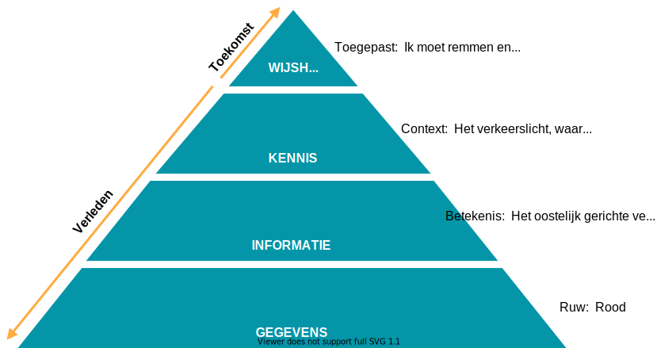
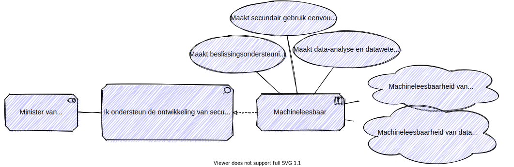

# Machineleesbaar

## Waarom is machineleesbaarheid belangrijk?

Leesbaarheid door machines en de mogelijkheid voor machines om betekenis te geven aan gegevens is noodzakelijk. Het vormt de basis om gegevens te kunnen analyseren, om te redeneren en tot wijsheid te komen. 

Gegevensanalyse en -wetenschap is noodzakelijk om bijvoorbeeld patiënten en zorgprofessionals samen over de gewenste uitkomsten te laten beslissen, om door machines ondersteuning te geven aan deze beslissingen en om detectie en voorspellingen te doen die helpen bij de preventie en behandeling van aandoeningen.

