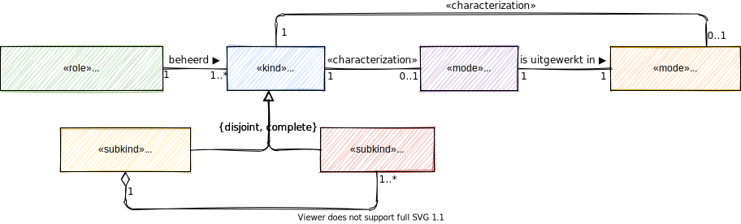

# Rollen en verantwoordelijkheden

## Stelselhouder

De stelselhouder is een organisatie die eindverantwoordelijk is voor het zorgstelsel en daarom ook eindverantwoordelijk voor het informatiestelsel, dat onderdeel is van het zorgstelsel om continuïteit en kwaliteit van zorg te borgen. De stelselhouder is een rol van een rechtspersoon. In het zorgstelsel en daarom ook in het informatiestelsel is het Ministerie van Volksgezondheid, Welzijn en Sport (VWS) de stelselhouder. 

## Stelselbeheerder

De stelselbeheerder is een organisatie die verantwoordelijk is voor het goede verloop van de processen voor ontwikkeling en het beheer van het portfolio aan standaarden voor het informatiestelsel.

Het informatiestelsel is een stelsel van stelselstandaarden. Een stelsel heeft echter samenhang nodig om als ecosysteem te kunnen functioneren. Samenhang om bijvoorbeeld te weten wat waar wordt gebruikt, waar standaarden ontbreken en welke standaarden gerealiseerd en geïmplementeerd zijn. Voor deze samenhang is stelselmanagement nodig (zie NEN7522:2020) en een portfolio van stelselstandaarden. De stelselbeheerder moet voor deze samenhang zorgdragen.

## Financier

De financier is verantwoordelijk voor het financieren van de governance, de ontwikkeling en het beheer van de standaarden in het informatiestelsel. De financier is een rol van een rechtspersoon, het Ministerie van Volksgezondheid, Welzijn en Sport (VWS).  

## Standaardisatieorganisatie

Een standaardisatieorganisatie is verantwoordelijk voor het ontwikkelen en beheren van een standaard, een norm of een technische afspraak. In termen van NEN7522:2020 is een standaardisatieorganisatie de houder (of eigenaar) van een standaard. In specifieke gevallen kan een standaardisatieorganisatie als functioneel beheerder aangesteld zijn om een standaard in opdracht van een houder te ontwikkelen en te beheren.

De NEN7522:2020 is de norm voor het ontwikkelen en beheren van standaarden. De norm onderkent individuele standaarden en stelsels van standaarden en beschrijft de eisen aan de processen van ontwikkeling en beheer. De norm beschrijft geen inhoudelijke eisen voor de bouwblokken van een standaard. 

## Autorisator

De autorisator autoriseert een individuele standaard of een stelsel van standaarden en erkent deze als stelselstandaard. De autorisator is een rol van een gremium, het Informatieberaad Zorg.

## Auditor

Een auditor is een organisatie die verantwoordelijk is voor het uitvoeren van een audit op een product van een softwareleverancier. Een auditor voert een audit uit voor een norm en/of een technische afspraak. Het resultaat van een positieve audit is een derdenverklaring waarmee de softwareleverancier kan aantonen dat haar product voldoet aan de norm. De auditor moet geaccrediteerd zijn om een audit te mogen uitvoeren.

## Distributeur

De distributeur is verantwoordelijk voor het distribueren van artefacten. De distributeur is een rol van een rechtspersoon, vaak gecombineerd met de rol van stelselbeheerder.

## Expert

Een expert brengt specifieke noodzakelijke expertise in voor besluitvorming en het bewaken van de samenhang. De expert is een rol van een gremium, de Architectuurboard Zorg. 

## Gebruiker

De softwareleveranciers zijn de gebruikers van de standaarden. Een softwareleverancier is een organisatie die een softwareproduct levert waarin stelselstandaarden zijn of worden geïmplementeerd. Veelal wordt de software als dienst aangeboden met aanvullende dienstverlening voor onderhoud en ondersteuning.
