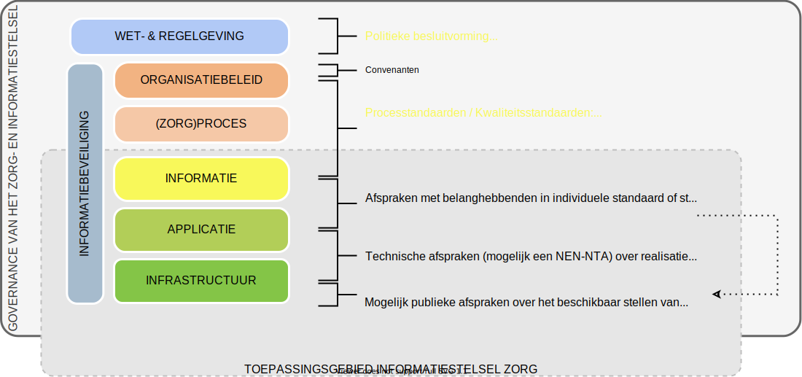

# Open standaarden

## Wat zijn open standaarden?

[Forum standaardisatie](https://www.forumstandaardisatie.nl/thema/open-standaarden) definieert een standaard als een afspraak die is vastgelegd in een specificatiedocument. Om gegevens uit te wisselen moeten ICT-systemen dezelfde standaard hebben geïmplementeerd. Voorwaarde is dan wel dat het specificatiedocument vrij te verkrijgen is.

Forum Standaardisatie hanteert vier kenmerken waaraan een standaard moet voldoen om als 'open standaard' aangemerkt te worden.

* De benodigde documentatie moet laagdrempelig beschikbaar zijn.
* Er mogen geen hindernissen zijn op het terrein van intellectueel eigendomsrecht.
* Er moeten voldoende inspraakmogelijkheden zijn voor stakeholders tijdens de \(door\)ontwikkeling van de standaard.
* De onafhankelijkheid en duurzaamheid van de standaardisatieorganisatie moeten verzekerd zijn.

Voor de publieke sector hanteert Forum standaardisatie een lijst van open standaarden. We zijn van mening dat voor de gezondheidszorg ook een lijst zou moeten worden onderhouden met de open standaarden die voor de zorg van toepassing zijn.

## Waarom open standaarden?

We willen open standaarden hanteren omdat we een gelijk speelveld willen tussen alle softwareleveranciers. Open standaarden zijn noodzakelijk zodat iedere leverancier over de specificaties van de standaard kan beschikken.

## Waarom internationale standaarden?

Wanneer we als IT-Architecten spreken over open standaarden, dan spreken we over de standaarden die gebruikt worden voor het realiseren van semantische en technische interoperabiliteit. Het gebruik van internationale standaarden is hierbij het uitgangspunt.

* **Internationale standaarden zijn nodig omdat zorg niet gebonden is aan Nederland**. Zeker niet als iemand dicht bij de grens woont. Maar ook toeristen en patiënten met complexe aandoeningen. Zij kunnen in andere landen worden behandeld dan het thuisland. Het uitwisselen van gegevens moet dan ook internationaal worden gedaan. Niet voor niets worden ook in Europees verband standaarden gedefinieerd.
* **Internationale standaarden zijn nodig omdat we gebruik willen maken van de internationale innovatiekracht** op het gebied van informatietechnologie. Het moet voor internationale leveranciers technisch eenvoudig zijn om de Nederlandse markt te betreden. We willen de innovatiekracht, het vermogen tot innoveren optimaliseren. Dat betekent dat we geen beperkingen willen leggen op innovatie door de standaarden die we gebruiken.

