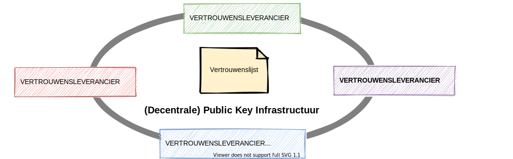
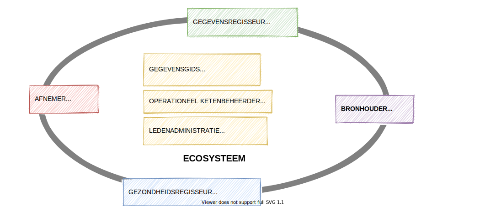

# Technologisch

Het informatiestelsel is een stelsel van standaarden omdat we kiezen voor een gelijk speelveld tussen alle leveranciers. De technische standaarden beschrijven de generieke en specifieke functies van het ecosysteem. Het zijn functies die geïmplementeerd zijn in een van de diensten van een deelnemer aan het ecosysteem. De diensten worden gebruikt door de andere deelnemers van het ecosysteem.

Voor de werking van het ecosysteem zijn verschillende actoren \(organisaties of personen in een systeemrol\) te onderkennen. Naast de deelnemers zijn er ook actoren voor bijvoorbeeld registraties. Het zijn registraties die noodzakelijk zijn voor het vertrouwen in het ecosysteem. In onderstaande paragrafen beschrijven we de actoren om het ecosysteem als geheel te kunnen laten functioneren.

## Een cryptografische basis voor vertrouwen

De basis voor het vertrouwen in het ecosysteem is een cryptografische basis. Het toepassen van cryptografie vereist een public key infrastructure \(PKI\). Traditioneel is een PKI geïmplementeerd met certificaten van een certificaatautoriteit \(CA\), bijvoorbeeld PKIOverheid. Een alternatief is een decentrale public key infrastructure \(DPKI\). Hierin zijn de publieke sleutels gepubliceerd in een blockchain, in een gedistribueerd grootboek, een decentraal bestandssysteem of in ieder andere voorziening waarmee het noodzakelijke vertrouwen kan worden geborgd.

Een **vertrouwensleverancier** levert samen met andere vertrouwensleveranciers de \(decentrale\) public key infrastructure voor de cryptografische basis van het ecosysteem. De vertrouwensleveranciers maken samen afspraken over de standaarden die zij hanteren.

De \(decentrale\) public key infrastructuren zijn bestaande infrastructuren waarvoor afgesproken moet zijn dat ze vertrouwd zijn. Door middel van een **vertrouwenslijst** \(trusted list\) worden de infrastructuren \(en daarmee de vertrouwensleveranciers\) gepubliceerd die vertrouwd zijn. Het publiceren van deze lijst is een verantwoordelijkheid van de **stelselbeheerder** \(zie besturing\) waarbij eventueel hergebruik kan worden gemaakt van de Europese Unie Trusted Lists \(EUTL\), zie [https://webgate.ec.europa.eu/tl-browser/\#/](https://webgate.ec.europa.eu/tl-browser/#/).

## Veilige gegevensuitwisseling tussen actoren

De communicatie tussen actoren moet veilig zijn. Dat wordt gerealiseerd door enerzijds afspraken over standaarden voor bijvoorbeeld de versleuteling van het berichtenverkeer en anderzijds door afspraken over de softwareleveranciers die voldoen aan de afspraken. Een **derdenverklaring** van een **auditor** \(zie besturing\) moet dit vertrouwen geven.

De registratie en publicatie van derdenverklaringen is een verantwoordelijkheid van de **stelselbeheerder**.

## Betrouwbare verklaringen

Gegevens moeten betrouwbaar zijn om hergebruikt te kunnen worden. Daarom zijn afspraken nodig om een actor als gegevensautoriteit te erkennen. Maar ook om de betrouwbaarheid te blijven verzekeren.

1. Een **gegevensautoriteit** is een rol van een organisatie of een persoon. Het is een erkenning dat zij geautoriseerd is om een verklaring te mogen uitgeven. Zo kan een voorschrijver een recept uitgeven en het BIG-register een bewijs van registratie. De verklaringen kunnen in de diverse operationele en beheerprocessen gebruikt worden.
2. In het ecosysteem moet een **verzekeraar van betrouwbaarheid** borgen dat **gegevensautoriteiten** geregistreerd zijn voor de verklaringen die zij mogen uitgeven. De verzekeraar voert hiervoor de **registratie**.

De autorisatie voor het uitgeven van een verklaring kan overigens ook gebaseerd zijn op een andere verklaring. Een voorschrijver kan bijvoorbeeld geautoriseerd zijn tot het voorschrijven van een recept omdat zij een BIG-registratie heeft als arts en deze als bewijs \(een bewijs van registratie\) elektronisch kan overhandigen. Elektronische handtekeningen op basis van cryptografie borgen dat de herkomst van een verklaring naar een gegevensautoriteit getraceerd kan worden en daarmee dat de verklaring verifieerbaar betrouwbaar is.

## De deelnemers aan het ecosysteem

De deelnemers spelen in het ecosysteem een systeemrol. We onderkennen twee systeemrollen voor organisaties die deelnemer zijn en twee systeemrollen voor cliënten. Daarnaast zijn gemeenschappelijke voorzieningen nodig die een ondersteunende systeemrol spelen, bijvoorbeeld voor de vindbaarheid van data en services. Cliënten zijn deelnemer omdat ze geregistreerd zijn bij een organisatie. Voor registerhouders, zorgorganisaties en secundaire deelnemers geldt dat ze erkend moeten zijn. Dit is eveneens van toepassing voor de actoren die gemeenschappelijke voorzieningen leveren. Ze moeten allen erkend zijn als lid van het ecosysteem in een **ledenadministratie**.

De **stelselbeheerder** is verantwoordelijk voor het aanwijzen van de ledenadministratie voor de deelnemers en de leveranciers van gemeenschappelijke voorzieningen. Reeds bestaande registers kunnen hierbij aangewezen worden als **ledenadministratie**, bijvoorbeeld het Landelijk Register Zorgaanbieders \(LRZa\) voor de ledenadministratie van zorgorganisaties.

We onderkennen de volgende actoren in het ecosysteem voor de deelnemers:

1. Een **bronhouder** is een rol van een deelnemende organisatie die data en services in het ecosysteem vindbaar, interoperabel en toegankelijk maakt voor hergebruik. Cliënten hebben niet de rol van bronhouder, zij zijn gegevensregisseur.
2. Een **afnemer** is een rol van een deelnemende organisatie die data en services afneemt van een bronhouder. Cliënten hebben niet de rol van afnemer, zij zijn gegevensregisseur of gezondheidsregisseur.
3. De **gegevensregisseur** is een rol van een cliënt. De locatie van de gegevens van een persoon, veelal weergegeven in een tijdlijn, worden via de cliënt toegankelijk gemaakt. Toegang kan verkregen zijn door gegevensuitwisseling via de cliënt of door gegevensuitwisseling met toestemming van de cliënt. Een gegevensregisseur moet ook de mogelijkheid hebben om vooraf gegevens klaar te zetten in het geval van spoedeisende hulp.
4. De **gezondheidsregisseur** is eveneens een rol van een cliënt. De nadruk bij de gezondheidsregisseur ligt op het gebruik van gegevens voor je persoonlijke gezondheid \(regie op gezondheid\) terwijl de nadruk van een gegevensregisseur ligt op regie op gegevens.

Daarnaast onderkennen we de volgende ondersteunende systeemrollen \(voor gemeenschappelijke voorzieningen\):

1. Een **gegevensgids** is een leverancier van een index van datacatalogussen voor de vindbaarheid van gegevens en services. Samen met andere leveranciers van indexen maakt zij afspraken over de standaarden voor het vinden van data en services. Een bronhouder van het ecosysteem moet haar datacatalogus laten indexeren om vindbaar te zijn.
2. De **operationeel ketenbeheerder** bewaakt een keten in het ecosysteem. Een operationeel ketenbeheerder kan ook een gezamenlijke helpdesk vormen. De operationeel ketenbeheerder kan voor een keten of samenwerkingsverband worden ingericht indien daar behoefte en een business case voor is.

