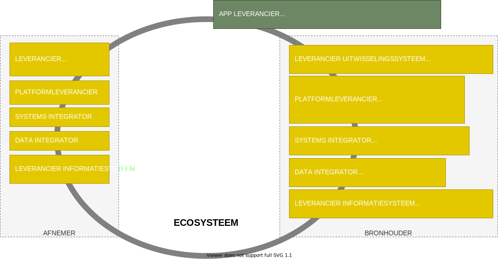
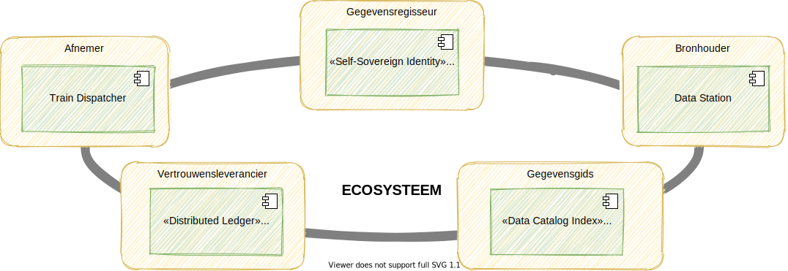

# Leveranciers

## Voorzieningen voor deelnemers

De deelnemers van het ecosysteem hebben technologische voorzieningen nodig om gebruik te kunnen maken van het ecosysteem. Deze voorzieningen worden geleverd door softwareleveranciers. Ze maken software voor diverse toepassingen zoals in onderstaand figuur is weergegeven.

Er kunnen vele soorten softwareleveranciers zijn. We hebben niet de intentie om daarin volledig te zijn. We hebben ook niet de intentie om aan te geven welke rol iedere leverancier moet vervullen, om een scheiding in verantwoordelijkheden te geven. Onze intentie van deze pagina is dat we een aantal leveranciers willen noemen om een impressie te geven van wat nodig is voor het informatiestelsel.

Voor een goede informatievoorziening is er namelijk niet één dienstverlener die alles levert. Het is een optelsom van alle softwaresystemen die samenwerken, geïntegreerd zijn en samen een ecosysteem vormen.

We noemen de volgende softwareleveranciers als impressie:

1. Een **leverancier van een uitwisselingssysteem** levert software voor gegevensuitwisseling op basis van een use case die beschreven is in een van de stelselstandaarden.
2. Een **platformleverancier** levert een platform voor een aantal generieke functies van het ecosysteem.
3. Zowel een **systems integrator** als een **data integrator** zijn integratiespecialisten. De focus voor een systems integrator ligt echter op het integreren van het applicatielandschap door een gegevensstroom van procesgebeurtenissen te realiseren waardoor de informatiesystemen integraal als één systeem kunnen functioneren. De gegevensstroom kan gebruikt worden voor data integratie en gegevensuitwisseling \(bijvoorbeeld notificaties\).
4. Een **data integrator** verzamelt de gegevens uit de informatiesystemen om het als geheel te presenteren en/of toegankelijk te maken voor bijvoorbeeld gegevensanalyse of gegevensuitwisseling.
5. Een **leverancier van een informatiesysteem** verwerkt de gegevens uit het ecosysteem en presenteert deze aan de eindgebruikers overeenkomstig de ontologie. Eindgebruikers zoals zorgverleners gebruiken de gegevens via het informatiesysteem en moeten de gegevens correct kunnen interpreteren.
6. Een **app leverancier** is een leverancier van een mobiele app of internetportaal gerricht op cliënten en/of zorgverleners. Het zijn toepassingen waarmee een cliënt de rol van gegevensregisseur bijvoorbeeld kan uitvoeren.

## Gelijk speelveld voor alle leveranciers

Softwareleveranciers hebben recht op een gelijk speelveld. Met een gemeenschappelijk open source platform, gebaseerd op de standaarden van het informatiestelsel, kun je dat bereiken. En mogelijk ook een gemeenschappelijk open source uitwisselingssysteem. Non-concurrentieel samenwerken aan digitale zorg. Software waar we gemeenschappelijk aan kunnen ontwikkelen.

