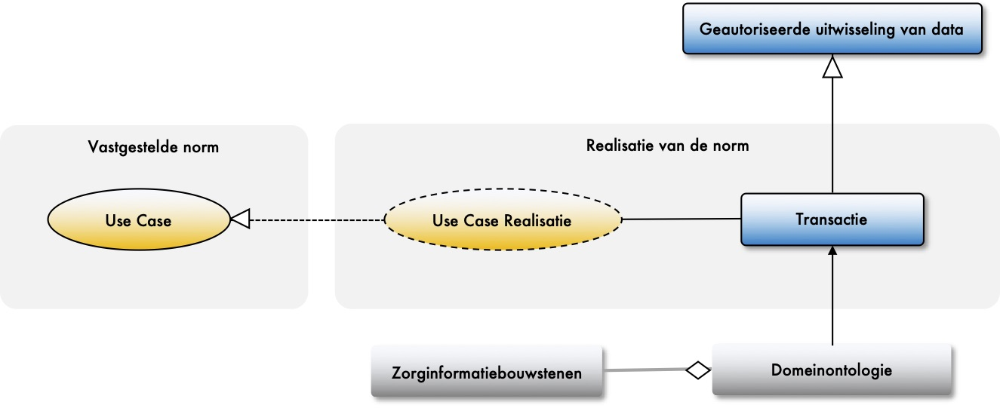

# A3 Netwerkactor

## Inleiding

Wat is een netwerkactor? Ben kijkt een beetje vies als hij het woord uitspreekt. Amber moet erom lachen. Netwerkactor is inderdaad een erg abstracte naam. Ben en Amber voeren samen een gesprek over de rollen en richtlijnen. In dit hoofdstuk over de netwerkactor.

Een netwerkactor is iets of iemand. Het zijn alle dingen die een rol spelen in het netwerk en de data die we produceren. Het kunnen rechtspersonen zijn, natuurlijke personen, apparaten, machines en applicaties. Alles wat data produceert of het onderwerp is van data. Maar ook iedereen of alles wat bronhouder is van data of afnemer is van data zegt Amber. Een netwerkactor is niet alleen een organisatie of een mens dus.


Iedere netwerkactor heeft een eigen identiteit in het netwerk. Als we data produceren willen we weten wie het geproduceerd heeft. Bijvoorbeeld om te weten met welk apparaat een bloeddruk is gemeten. Het apparaat heeft daarom een eigen identiteit nodig zodat we de kennis over het apparaat kunnen beschrijven.


## Dienst voor publicatie van data en services

DIZRA gaat uit van datagestuurd werken. Dit betekent dat we data modelleren en publiceren. Een bronhouder van data is de uitgever van de data. We gaan uit van data die beschikbaar is bij de bron en waarvan bekend is dat publicatie waardevol is. Deze data willen we FAIR maken.

De aanpak komt voort vanuit onze aanname dat we vooraf niet kunnen bedenken wat de vragen zullen zijn. Niet voor niets is het gezegde dat één gek meer kan vragen dat tien wijzen kunnen beantwoorden. Dit is van invloed op de afspraken die we met elkaar maken.

Met een datagestuurde aanpak willen we de volgende doelen bereiken:

* Het publiceren van data moet bijdragen aan een versnelling van regie op gegevens. Een bronhouder heeft de data beschikbaar. De data kan via de betrokken persoon of met toestemming van de betrokken persoon worden uitgewisseld.
* Het publiceren van data moet bijdragen aan verlaging van de administratieve lasten door eenmalige registratie in de primaire en ondersteunende registraties van een organisatie en meervoudig gebruik van deze gegevens in de administratieve processen, voor het verkrijgen van inzicht en voor het uitvoeren van toezicht \(afgeleide stromen: stuur-, beleid-, verantwoording, toezicht- en kwaliteitsinformatie\). 
* Het publiceren van data moet bijdragen aan verlaging van de rapportagelasten door zelfverantwoordelijk rapporteren op basis van de beschikbare data en services. Iedere organisatie kan door de aanpak zelfstandig uitvoering geven aan data-science en data-analyse, waarbij de organisatie zelf verantwoordelijk is voor zowel de vraagstelling als de beantwoording op basis van de voor haar beschikbare gegevens. 
* Het publiceren van vindbare, toegankelijke, uitwisselbare en herbruikbare data in het netwerk moet leiden tot nieuwe toepassingen die nu veelal nog niet voorzien kunnen worden.

#### Semantische en technische afspraken maken

We  maken afspraken over het beschikbaar stellen van data vertelt Amber. Data FAIR maken noemen we dat. Hiervoor moeten we afspraken maken over de onderstaande onderwerpen.

De onderwerpen die we onderkennen zijn:

* Afspraken over de indeling van het domein naar **informatiecontexten**. Het domein doet dit al door een verdeling te maken naar onderwerpen zoals: medicatie, verpleging, zwangerschap en geboorte en beelden.
* Afspraken over een **ontologie** \(zie ook het thema over een g[emeenschappelijke taal](../thema/gemeenschappelijke-taal.md)\). In de ontologie specificeren we de concepten. Op basis van de ontologie kunnen we een attest specificeren.
* Afspraken over de te hanteren **plateaus** voor het vindbaar, toegankelijk en interoperabel maken van data. Een plateau zegt iets over de **volwassenheid** van een organisatie met betrekking tot data. Het plateau is van invloed op de mate van [regie op gegevens](../thema/regie-op-gezondheidsdata.md) die de betrokken persoon heeft. 
* Afspraken over de **metadata** die beschikbaar worden gesteld en de ontologie van de metadata.
* Afspraken over het publiceren van data via een **interface** \(zoals HL7 FHIR API\), het **dataformaat** en het **transportprotocol**. Dit is afhankelijk van de volwassenheid van een organisatie. Een organisatie kan door een interface data toegankelijk maken. Een hoger niveau van regie op gegevens wordt door een organisatie gerealiseerd als zij een interface biedt voor het uitgeven en ontvangen van attesten.
* Afspraken maken over het publiceren van **services** op data, bijvoorbeeld om via querytalen of via algoritmes data beschikbaar te stellen. Dit is afhankelijk van de volwassenheid van een organisatie. Als een organisatie data via een ontologie beschikbaar kan stellen, dan kunnen ze deze toegankelijk maken via een querytaal. Het beschikbaar stellen van een algoritme op de data is weer een stap verder.
* Afspraken maken over het proces en de ontwikkeling van **geautoriseerde uitwisselingen** van data**.**


**Wat is een ontologie?**

Je gebruikt woorden die ik niet ken klaagt Ben. Wat is bijvoorbeeld een ontologie? Vroeger maakten we gewoon een datamodel. Bedoel je dat? Het lijkt er inderdaad op zegt Amber. Een ontologie is een conceptueel model. Er worden concepten beschreven en de betekenis van die concepten. Uiteraard gebruiken we woorden om het concept te omschrijven. Met een ontologie zorgen we ervoor dat machines onze logica gaan begrijpen. Kun je een voorbeeld noemen vraagt Ben. Ik vind het nogal vaag wat je vertelt. 

Als mens weten we wat een patiënt is zegt Amber. Maar een machine weet dat niet. We moeten een machine kunnen uitleggen wat een patiënt is. We moeten de machine uitleggen dat een patiënt een mens is. Maar wat maakt een mens tot een patiënt. Wanneer is een mens een patiënt? We moeten dat specificeren. Dat betekent dat we eerst moeten afspreken wat een concept betekent. De definitie van het concept patiënt moeten we specificeren op een manier die voor mensen en machines te begrijpen is. Dat is een ontologie.

**Afspraken over interoperabiliteit, maar ook over vindbaarheid, toegankelijkheid en herbruikbaarheid**

Voordat we verder gaan wil ik eerst nog even iets weten zegt Ben. Je hebt het nu over het beschikbaar stellen van data. Maar het gaat toch over interoperabiliteit? We moeten dus afspraken maken tussen organisaties op alle lagen van interoperabiliteit. Uiteindelijk moeten we berichten specificeren op basis van de data die een zorgprofessional nodig heeft. 

We moeten inderdaad OOK afspraken maken over interoperabiliteit zegt Amber. Maar ook over vindbaarheid, toegankelijkheid en herbruikbaarheid. We willen data FAIR beschikbaar stellen per informatiecontext. Daarmee willen we niet alleen de informatiebehoefte van een zorgprofessional invullen, maar ook andere vragen kunnen beantwoorden. Meervoudig gebruik van data noemen we dat.

**Geautoriseerde vragen**

Semantische interoperabiliteit bereiken we door het afspreken van een ontologie zegt Amber. Vervolgens kunnen we vragen en antwoorden formuleren op basis van de specificaties in de ontologie. We matchen vraag en aanbod. Voor de verwerking van persoonsgegevens moeten we van een netwerkactor weten waar zij van is en wat zij wel en niet mag. Iedere uitwisseling van persoonlijke data moet verantwoord kunnen worden vanuit een van de grondslagen van de Algemene verordening gegevensbescherming.

Een uitwisseling van gegevens op basis van een grondslag noemen we een geautoriseerde uitwisseling.


## Dienst voor toegankelijkheid data en services

Een bronhouder publiceert enerzijds data en maakt anderzijds data toegankelijk voor gegevensafnemers. Data kan openbaar toegankelijk zijn als open data of of kan beperkt toegankelijk zijn. Persoonsgegevens zijn beperkt toegankelijk voor gegevensafnemers met een rechtmatige grondslag. Een gegevensafnemer moet met andere woorden geautoriseerd zijn voor de uitwisseling van data. 

Bronhouders en gegevensafnemers maken afspraken voor het toegankelijk maken van data. De afspraken worden gezamenlijk vastgelegd in een norm waaronder afspraken over juridische en organisatorische interoperabiliteit. Voor iedere uitwisseling worden de processtappen beschreven. Iedere gegevensoverdracht in het proces noemen we een transactie. 

Voor iedere transactie worden minimaal de volgende afspraken gemaakt:

* Afspraken over de **validatie van rechtmatige ontvangst**. Een bronhouder moet valideren dat verstrekte data bij de gegevensafnemer op basis van de juiste autorisaties door de juiste persoon ontvangen wordt. Er zijn afspraken nodig om deze validatie gemeenschappelijk te doen voor alle bronhouders, bijvoorbeeld door een audit.
* Afspraken over het **loggen** en de **traceerbaarheid** van de transactie naar de natuurlijke persoon die de verwerking initieerde. De traceerbaarheid moet gerealiseerd worden in de log van de transactie. Het is een afspraak die bij voorkeur gemeenschappelijk wordt gemaakt voor alle transacties.
* Afspraken over het **doel** of doelbinding. Het doel is een verantwoording waarom de transactie is uitgevoerd. Het doel moet herleid kunnen worden naar een grondslag, naar de activiteiten van de verwerker en de natuurlijke persoon die de verwerking initieerde. Iedere transactie moet geregistreerd worden in een log.
* Afspraken over de **data** van de transactie en dan met name de relatie tussen de persoonlijke data die wordt verstrekt en het doel. Een geautoriseerde vraag moet voldoen aan het wettelijke principe van dataminimalisatie. Gezamenlijk met de dataformaten en het protocol vormt dit de interface. De data wordt samengesteld vanuit de concepten die in de ontologie zijn vastgelegd.
* Afspraken over de **betrouwbaarheid** van de data ten aanzien van herkomst, integriteit en geldigheid.
* Afspraken over de **dataformaten** die ondersteund worden, zoals JSON of XML.
* Afspraken over de **protocollen** die ondersteund worden, zoals het HTTP-protocol. 

De normen kunnen paralel worden ontwikkeld aan de ontwikkeling van de ontologie en het beschikbaar stellen van data. DIZRA hanteert als uitgangspunt dat een techniekleverancier de techniek levert voor technische afspraken. 

#### Afspraken maken over rentmeesterschap van data

In navolging van Minister Bruins \(Medische Zorg en Sport\) zeggen we dat rentmeesterschap op data nodig is. De rol van rentmeester moet daarom worden afgesproken. Om data te laten werken voor gezondheid is vertrouwen nodig. 

* Een persoon moet erop kunnen vertrouwen dat er zorgvuldig met zijn/haar data wordt omgegaan 
* De zorgverlener moet erop kunnen vertrouwen dat data-analyses valide resultaten opleveren. 

Het is de basisgedachte voor het maken van afspraken. Zie het thema [data bij de bron](../thema/data-bij-de-bron.md).

#### Afspraken maken over digitale inclusie

Een afsprakenstelsel moet afspraken maken over digitale inclusie. Dit betekent dat geautoriseerde vragen mogelijk ook op een andere manier beantwoord moeten kunnen worden dan digitaal of elektronisch. 

Zie ook: [https://www.digitaleoverheid.nl/overzicht-van-alle-onderwerpen/toegankelijkheid/digitale-inclusie/](https://www.digitaleoverheid.nl/overzicht-van-alle-onderwerpen/toegankelijkheid/digitale-inclusie/) 

## Richtlijnen voor de netwerkactor

De onderstaande richtlijnen zijn van toepassing voor de netwerkactor.

### A3.1: Het afsprakenstelsel _MOET_ voorzien in afspraken voor een bronhouder over vindbaarheid, toegankelijkheid en interoperabiliteit van data en services.

Een bronhouder moet vindbaar, toegankelijk en interoperabel zijn. Het zijn afspraken over onder andere het realiseren van een ontologie, het beschikbaar stellen van data en metadata en de afspraken over protocollen en dataformaten voor toegang.

### A3.2: Het afsprakenstelsel _MOET_ voorzien in afspraken over de ontwikkeling en toepassing van geautoriseerde uitwisselingen.

Voor een afsprakenstelsel moeten afspraken worden gemaakt welke rollen worden onderkend voor bronhouders en gegevensafnemers, waar iemand van is, wat die mag en wat die moet doen. Voor ieder van de rollen moet afgesproken worden wat de minimale dataset is die mag worden uitgewisseld.

### A3.3: Het afsprakenstelsel _MOET_ voldoen aan de NEN-normen voor medische informatica \(NEN-75xx\).

De NEN-normen voor medische informatica stellen de functionele en niet-functionele eisen vast voor interoperabiliteit tussen netwerkactoren.  

### A3.4: Het afsprakenstelsel _MOET_ afspraken maken over digitale inclusie.

Met de digitalisering willen we niemand uitsluiten. Voor meer informatie over digitale inclusie, zie het thema [regie op gezondheidsdata](../thema/regie-op-gezondheidsdata.md).

### A3.5: Het afsprakenstelsel _MOET_ voorzien in afspraken over de inrichting van rentmeesterschap van data bij een bronhouder.

In navolging van Minister Bruins \(Medische Zorg en Sport\) zeggen we in DIZRA dat we rentmeesterschap op data nodig hebben. Om data te laten werken voor gezondheid is vertrouwen nodig. De patiënt moet erop kunnen vertrouwen dat er zorgvuldig met zijn/haar data wordt omgegaan en de zorgverlener moet erop kunnen vertrouwen dat data-analyses valide resultaten opleveren. Zie ook het thema [data bij de bron](../thema/data-bij-de-bron.md).

