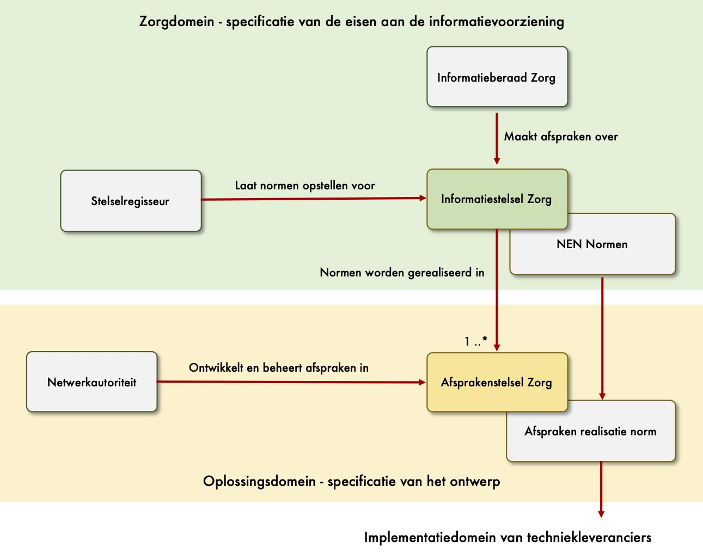
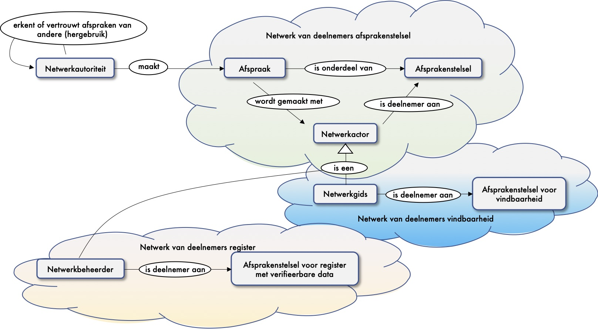
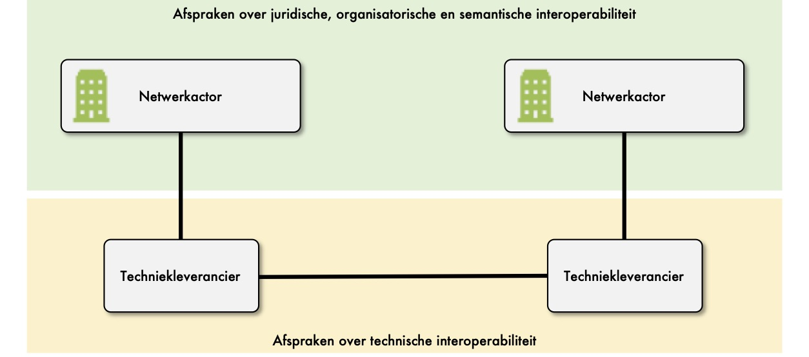

# A1 Netwerkautoriteit

## Inleiding

Dit hoofdstuk beschrijft de rol van een netwerkautoriteit. De netwerkautoriteit is een governance autoriteit die afspraken ontwikkelt en beheert voor een netwerk van deelnemers. Deze verzameling aan afspraken noemen we een afsprakenstelsel. Binnen de zorg zijn meerdere domeinen te onderkennen en daarom zullen er ook meerdere afsprakenstelsels zijn. Ieder met haar eigen netwerkautoriteit. 

In onderstaand figuur is de context van een netwerkautoriteit en een afsprakenstelsel weergegeven.

#### Nederlandse normen voor de zorg

De Nederlandse norm voor gegevensuitwisseling in de zorg wordt afgesproken in het informatiestelsel. Het is een norm die begeleid en ontwikkeld wordt door NEN. 

De normen beschrijven eisen voor gegevensuitwisseling door middel van:

* use cases \(zoals medicatieproces, verpleegkundige overdracht en beelduitwisseling\);
* aspecten van use cases \(zoals toestemming en vindbaarheid van data en diensten\); 
* of als aanvullende eisen \(zoals identiteit, authenticatie en beveiliging\).

De stelselregisseur geeft opdracht tot het specificeren van een norm. 

#### Afspraken realisatie norm

Een norm beschrijft de eisen voor een gegevensuitwisseling in de zorg. Hierin zijn de organisatorische en semantische eisen voor een gegevensuitwisseling beschreven. De realisatie \(het ontwerp\) van de eisen is onderdeel van de afspraken in een afsprakenstelsel. Een afsprakenstelsel beschrijft het koppelvlak voor de uitwisseling van berichten \(request-response\) met een zorgaanbieder.

De rol die we beschrijven in dit hoofdstuk is de netwerkautoriteit. De netwerkautoriteit voert de governance over de afspraken van een afsprakenstelsel en borgt het vertrouwen in het netwerk. 

## Wat is een netwerk?

DIZRA beschouwt ieder afsprakenstelsel als een netwerk van deelnemers. We hanteren als aanname dat er meerdere afsprakenstelsels zullen zijn. Een afsprakenstelsels kan specifiek zijn voor de zorg \(zoals kwaliteitsinformatie of medicatie\), maar ook sectoroverstijgend zijn \(zoals voor toestemming of identificatie en authenticatie\).

De netwerkautoriteit maakt met haar deelnemers afspraken over de netwerken die vertrouwd worden waardoor deze afspraken hergebruikt  worden.

## Dienst voor governance op afspraken

De netwerkautoriteit is een rol voor het uitvoeren van de governance op de afspraken in het afsprakenstelsel. Maar wat betekent governance voor jou vraagt Amber aan Ben. Ben en Amber zijn met elkaar in gesprek over de rollen en richtlijnen in DIZRA. Ben is programmamanager voor een afsprakenstelsel en Amber is de IT-Architect van het programma. 

Er zijn vele definities voor governance in omloop vertelt Ben. Wij beschrrijven governance als het geheel van processen voor het besturen van de afspraken. Het zijn afspraken tussen actoren in een netwerk. Een afspraak is een afspraak over de verantwoordelijkheden van een actor. Governance heeft met name betrekking op de processen van interactie en besluitvorming tussen de netwerkactoren in een afsprakenstelsel. Afspraken worden gemaakt over de volgende onderwerpen \(niet uitputtend\):

* **Uitgangspunten en randvoorwaarden** voor de afspraken;
* **Juridisch kader** van de afspraken;
* Afspraken over de **ontwikkeling en het beheer** van de afspraken;
* De **governance structuur** voor de afspraken met de rollen en verantwoordelijkheden;
* De **financiering** voor de governance, de ontwikkeling en het beheer van de afspraken;
* Afspraken voor het **vertrouwen**. Wie wordt in het netwerk vertrouwd voor het uitgeven van een attest en hoe kan dit geverifieerd worden?
* Afspraken over technische **interoperabiliteit**. 

Er zijn inmiddels goede voorbeelden beschikbaar voor governance op afspraken.

#### Afspraken op alle lagen van interoperabiliteit

Interoperabiliteit vereist dat er afspraken worden gemaakt op alle lagen van interoperabiliteit. Het is echter mogelijk een scheiding te maken in governance op afspraken over juridische en organisatorische interoperabiliteit, over semantische interoperabiliteit en governance op technische interoperabiliteit. In onderstaand figuur is het 4-cornermodel getekend. Dit is het model dat gehanteerd wordt door de afsprakenstelsels.

Voor de lagen van interoperabiliteit hanteren we de lagen uit het European Interoperability Framework \(EIF\). Dat is de Europese standaard voor afspraken over interoperabiliteit.

#### Registratie van deelnemers

Een deelnemer moet voldoen aan de afspraken en behoren tot de groep waarvoor de afspraken van toepassing zijn. Door middel van een audit kan een netwerkactor dit bewijzen. 

#### Accreditatie van auditors

Onderdeel van de governance op afspraken is toezicht en handhaving van de afspraken. Door middel van audits kan een netwerkautoriteit valideren dat een netwerkactor, een netwerkbeheerder, een techniekleverancier of een netwerkgids zich houdt aan de afspraken. De derdenverklaring is eveneens het deelnamebewijs voor het netwerk.

## Dienst voor vertrouwen in het netwerk

De netwerkautoriteit is verantwoordelijk voor het verkrijgen en behouden van het vertrouwen in het netwerk. Vertrouwen is nodig om data te gebruiken en te hergebruiken. Het is het vertrouwen van een netwerkactor dat de uitgever van een attest te vertrouwen is. Dat een voorschrijver van medicatie daarvoor bevoegd was, dat een bloeddruk op een juiste manier is gemeten etc.


**Een kwestie van vertrouwen**

Laten we het concreet maken zegt Amber. Stel dat ik naar mijn huisarts ga. De huisarts doet onderzoek, laat mijn bloed onderzoeken en besluit vervolgens om mij door te verwijzen naar een medisch specialist. Hoe kan een medisch specialist de data van de huisarts vertrouwen? De data van het bloedonderzoek? Hoe weet de medisch specialist dat ik doorverwezen ben door een echte huisarts? De medisch specialist moet de data kunnen vertrouwen.

Door middel van een elektronsche handtekening kunnen we de herkomst van de data vaststellen vertelt Amber. We kunnen achterhalen wie de auteur en de uitgever van de data is. Maar dan weten we nog niet dat de auteur een huisarts is. Daarvoor is een verklaring uit het BIG-register nodig. De medisch specialist kan daardoor zien dat de auteur een BIG-geregistreerde arts is. Het CIBG als uitgever van het BIG-register moet echter vertrouwd worden door de medisch specialist. 

Zo kun je nog wel even doorgaan zegt Ben. Digitaal kun je niemand vertrouwen, maar je moet uiteindelijk iemand vertrouwen. Klopt zegt Amber. Daarom is een vertrouwenslijst nodig van uitgevers die in het netwerk vertrouwd worden. Bijvoorbeeld het CIBG. Een attest kan vertrouwd worden als deze afkomstig is van een uitgever die geregistreerd is in de vertrouwenslijst. Dat is in het afsprakenstelsel afgesproken.


#### Vertrouwde uitgevers

Om een attest te vertrouwen moet een actor de uitgever vertrouwen. De netwerkautoriteit van een netwerk maakt afspraken over de uitgevers die zij vertrouwt. Andere netwerken kunnen deze afspraken overnemen oftewel hergebruiken.

De netwerkautoriteit voert het beheer op de vertrouwenslijst van vertrouwde uitgevers. De uitgevers die geregistreerd zijn in de vertrouwenslijst worden door de netwerkactoren vertrouwd. Dat is een afspraak in het afsprakenstelsel. Met een selectief aantal vertrouwde uitgevers in de vertrouwenslijst kan een ketting van vertrouwen worden gerealiseerd in het netwerk.

#### Vertrouwde netwerkbeheerders

Voor het functioneren van het netwerk zijn verschillende vertrouwensdiensten nodig. Met name vertrouwensdiensten voor de identiteit van een persoon \(zowel rechts- als natuurlijk personen\) of ding. Netwerkbeheerders leveren deze diensten en netwerkactoren moeten weten welke netwerkbeheerders door het netwerk vertrouwd worden. De netwerkautoriteit moet daarom een  lijst beheren met vertrouwde netwerkbeheerders.

#### Vertrouwde netwerkgids

Netwerkactoren en haar data en services moeten vindbaar zijn. Dat is een van de uitgangspunten van het informatiestelsel \(FAIR-data\). Een netwerkautoriteit moet daarom een lijst maken van vertrouwde actoren die de rol van netwerkgids uitvoeren.

## Richtlijnen voor de netwerkautoriteit

De onderstaande richtlijnen zijn van toepassing voor de netwerkautoriteit.

### A1.1: Het afsprakenstelsel _MOET_ voldoen aan de principes.

Het is uitgangspunt dat een afsprakenstelsel de principes hanteert zoals beschreven in het manifest en uitgewerkt in de thema's. Een netwerkautoriteit moet deze principes bewaken en borgen.

### A1.2: Het afsprakenstelsel _MOET_ voorzien in afspraken over de governance van de afspraken.

We onderkennen twee lagen van afspraken. Afspraken voor de verschillende rollen over vertrouwen, vindbaarheid, toegankelijkheid, interoperabiliteit en herbruikbaarheid. Daarnaast zijn er afspraken over de governance van de afspraken. De netwerkautoriteit moet voorzien in afspraken over governance van de afspraken voor de verschillende rollen in het raamwerk.

### A1.4: Het afsprakenstelsel _MOET_ borgen dat een natuurlijk persoon een vrije keuze heeft bij het geven van toestemming.

Een toestemming moet altijd een vrije keuze zijn. Hiervoor zijn afspraken nodig omtrent gedrag en ethiek van deelnemers. Ook zijn afspraken noodzakelijk over een meldpunt en sanctiemaatregelen als afspraken niet worden worden nagekomen.

### A1.5: Het afsprakenstelsel _ZOU MOETEN_ voorzien in een PDCA-cyclus.

Kwaliteitsbeheersing, kwaliteitsborging, kwaliteitsverbetering zijn voorbeelden van een een continu proces wat vertaald is naar Plan-Do-Check-Act cyclus, oftewel een PDCA-cyclus \(kwaliteitscirkel van Deming\). Implementatie en beheer zijn onderdeel van deze cirkel.

