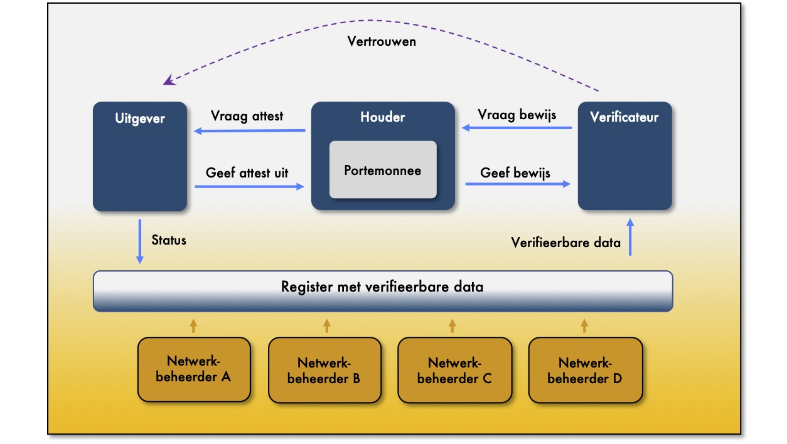

# A5 Netwerkbeheerder

## Inleiding

Verantwoord beheer en gebruik van data begint met vertrouwen. Vertrouwen in de actoren die gebruik willen maken van data. Daarom is een vertrouwd netwerk van actoren nodig. Om het vertrouwde netwerk te implementeren zijn de vertrouwensdiensten nodig die een netwerkbeheerder levert. 

## Dienst voor verificatie van een attest

Een netwerkbeheerder stelt een verificateur in staat een attest te verifiëren. Een attest moet namelijk geverifieerd kunnen worden op identiteit, geldigheid \(status\), integriteit \(van attributen\) en herkomst. Uitgevers moeten daarentegen de status van een attest kunnen onderhouden. De netwerkbeheerder zorgt voor de registratie van de data die nodig is voor verificatie.

De netwerkbeheerders voeren gezamenlijk een register voor verifieerbare data. 

#### Register met verifieerbare data

Het register met verifieerbare data legt de data vast die nodig is om identiteit, geldigheid \(status\), integriteit \(van attributen\) en herkomst te verifiëren. De data in het register maakt het mogelijk om een elektronische handtekening \(voor natuurlijke personen\) of een elektronische zegel \(voor rechtspersonen\) te verifiëren. Dat zijn namelijk de middelen die gebruikt worden voor verificatie. 

De middelen moeten gebruikt kunnen worden overeenkomstig de Europese Verordening \(EU\) nr. 910/2014 van het Europees Parlement en de Raad van 23 juli 2014 betreffende elektronische identificatie en vertrouwensdiensten voor elektronische transacties. 


Hoe verhoudt een netwerkbeheerder zich tot een netwerkautoriteit. Wat moet als netwerk worden gezien en welke rol speelt het register daarin? Ben staat met grote vraagtekens in zijn ogen naar Amber te kijken. Jeetje, ik snap er niks van. Het is misschien ook wel complex zegt Amber lachend. Maar als stelregel kun je hanteren dat ieder afsprakenstelsel een netwerk van deelnemers is. We zien echter dat er specifieke en generieke afsprakenstelsels zijn. De netwerkbeheerders met hun register vormen een generiek afsprakenstelsel. Daarom zien we de netwerkbeheerders als separaat netwerk. 

Een netwerkautoriteit in een specifiek afsprakenstelsel moet afspraken met haar deelnemers maken welke generieke afsprakenstelsels worden \(her\)gebruikt. Maar een netwerkautoriteit kan uiteraard ook afspraken maken om hergebruik te maken van afspraken uit een ander specifiek afsprakenstelsel. 


#### Beleid ten aanzien van toegang tot het register

De netwerkbeheerders kunnen voorwaarden stellen voor toegang tot het register. Het register kan bijvoorbeeld geimplementeerd zijn voor een specifiek afsprakenstelsel of juist openbaar zijn voor iedereen. De netwerkbeheerders maken afspraken over de governance en de toegang tot het register in een onderling afsprakenstelsel. De netwerkautoriteit besluit welke afsprakenstelsels van netwerkbeheerders vertrouwd worden. 

Een aanname is dat er meerdere registers zijn. Uitgangspunt is dat netwerkactoren zich kunnen aanmelden bij het register en de netwerkbeheerder van hun keuze. We denken bijvoorbeeld aan een netwerk voor gemeenten,  aan een netwerk voor dingen, aan regionale netwerken en aan netwerken voor natuurlijke personen. Een netwerk kan met of zonder winstoogmerk zijn opgezet.


**Vertrouwen en regie op gegevens**

Een netwerkbeheerder levert vertrouwensdiensten. Het is een vertrouwensdienst waarmee de identiteit van een netwerkactor wordt geregistreerd. Maar alleen voor actoren waarvan de identiteit herleid moeten kunnen worden. Publieke actoren noemen we deze, in tegenstelling tot private actoren. Een actor is bijvoorbeeld publiek omdat de herkomst van data geverifieerd moet kunnen worden. Authenticatie dus zegt Ben. Het is inderdaad een vorm van authenticatie zegt Amber. 

Met de dienst voor elektronische ondertekening kunnen we bijvoorbeeld regie op gegevens realiseren. Het maakt het mogelijk dat je als persoon een bewering doet \(ik ben 18, ik heb mijn rijbewijs, ik heb een zorgindicatie\) en een bevoegde instantie deze bewering attesteert door de bewering elektronisch te ondertekenen. De bewering is verifieerbaar geworden omdat de bevoegde instantie een geregistreerde netwerkactor is.


## Richtlijnen voor de netwerkbeheerder

Een netwerkbeheerder levert diensten aan personen. Dit zijn zowel rechtspersonen als natuurlijke personen. De netwerkbeheerder stemt haar diensten af op haar klanten en de vraag van haar klanten.

### A5.1: Het afsprakenstelsel _MOET_ afspraken bevatten voor een dienst voor het registreren van een identiteit.

Een persoon moet in het netwerk een identiteit kunnen verkrijgen. Met persoon bedoelen we zowel rechtspersonen als natuurlijke personen. De persoon is met die identiteit bekend in het netwerk. De identiteit wordt onder andere gebruikt voor het uitgeven van een attest. Een persoon wordt alleen geregistreerd als iemand of iets de betrouwbaarheid van de identiteit van de persoon moet kunnen verifiëren. Hiermee ontstaat een netwerk van vertrouwde deelnemers.

Het verkrijgen van een identiteit in het netwerk kan aan voorwaarden gebonden zijn. Een netwerk kan bijvoorbeeld besloten zijn voor een specifieke groep uitgevers of kan eisen stellen aan de technische infrastructuur van een uitgever.


**Centrale, federatieve en zelf-soevereine identiteiten**

Identiteit en toegangsbeheer kan op verschillende manieren worden ingevuld. We zien centrale, federatieve en decentrale oplossingen. 

Centrale en federatieve oplossingen gaan uit van een identiteit bij een organistie met een authenticatiemiddel als product. Het product moet door iedereen gebruikt gaan worden. Een persoon heeft daardoor een veelheid aan producten. We zien producten zoals DigiD, eHerkenning en iDin. Het zijn producten gebaseerd op een identiteit van een persoon bij een organisatie.

We denken dat het stapelen van producten niet houdbaar is en niet duurzaam. We zijn van mening dat er vanuit een actor gedacht moet worden, iemand of iets met een eigen identiteit. Een actor moet soeverein zijn in het maken van haar eigen identiteit.

**Identificatie en authenticatie**

We specificeren identificatie en authenticatie omdat het vaak tot verwarring leidt. Met een identiteit doelen we op een \(betekenisloos\) nummer waarmee iemand of iets geïdentificeerd kan worden. Authenticatie is de verificatie dat iemand of iets de controle heeft over de identiteit. Voor het bewijzen is een authenticatiemiddel nodig.

Naast de identiteit zijn er de eigenschappen oftwel attributen. Bijvoorbeeld een klantnummer. Met authenticatie bedoelen we ook het bewijs dat iemand een eigenschap heeft en bijvoorbeeld het klantnummer mag gebruiken. Het is een verificatie van een bewering. Daarom is authenticatie veelal gelijk aan het verifiëren van een attest.


### A5.2: Het afsprakenstelsel _MOET_ een open internationale standaard hanteren als methode voor de registratie van een identiteit.

DIZRA hanteert als uitgangspunt dat er meerdere netwerken naast elkaar bestaan. Iedere uitgever moet echter herkenbaar zijn als een uitgever die erkend is en vertrouwd is in een netwerk. De methode van registratie moet borgen dat het netwerk van de uitgever bekend is. Een Uniform Resource Name \(URN\) is bijvoorbeeld de meest gehanteerde methode om het netwerk te herkennen.

### A5.3: Het afsprakenstelsel _MOET_ een authenticatiemiddel afspreken met een hoog identiteitsbetrouwbaarheidsniveau.​

Met de identiteit verkrijgt de rechtspersoon een middel waarmee zij kan bewijzen eigenaar te zijn van de identiteit. De rechtspersoon moet kunnen aantonen dat zij de controle heeft over de identiteit. De identiteit en het middel moeten op een hoog identiteitsbetrouwbaarheidsniveau kunnen worden toegepast.

Voor het vaststellen van het identiteitsbetrouwbaarheidsniveau hanteren we de regels uit verordening \(EU\) 910/2014 van het Europees Parlement en de Raad van 23 juli 2014.

### A5.4: Het afsprakenstelsel _MOET_ een middel afspreken voor het plaatsten van gekwalificeerde elektronische handtekeningen en zegels. 

Door de elektronische handtekening/zegel kan een uitgever van een attest data elektronisch ondertekenen en daarmee de herkomst van de data vastleggen. Een verificateur kan op basis van de elektronische handtekening/zegel de herkomst vaststellen.

Een gekwalificeerde elektronische handtekening/zegel is een elektronische handtekening/zegel die voldoet aan de eisen van Verordening \(EU\) nr. 910/2014 \(eIDAS Verordening\). Kwalificatie van het middel is optioneel en alleen van toepassing als de herkomst van data onweerlegbaar moet worden bewezen. 

### A5.5: Het afsprakenstelsel _MOET_ een dienst afspreken voor het intrekken en het verifiëren van de geldigheid van een attest.

Met de verificatie moet een verificateur van een attest  kunnen verifiëren dat data afkomstig is van een vertrouwde uitgever. Een netwerkbeheerder moet daarom registreren welke uitgever vertrouwd wordt voor het uitgeven van welke attesten. De verificateur van het attest moet eveneens kunnen verifiëren dat het attest geldig is, en niet is ingetrokken.

