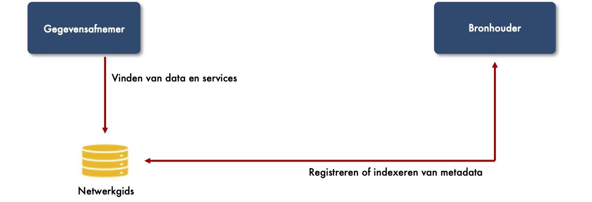

# A6 Netwerkgids

## Inleiding

Dit hoofdstuk beschrijft de rol van de netwerkgids. De netwerkgids zorgt dat data en services in het netwerk vindbaar zijn.


**Wat is vindbaarheid?**

Netwerkactoren moeten vindbaar zijn vertelt Amber. Wat bedoel je met vindbaar? Beodel je dat een huisarts vindbaar moet zijn? Zodat ik op consult kan gaan?

We bedoelen vindbaarheid om gebruik te maken van digitale data en services vertelt Amber. Als ik bijvoorbeeld met mijn huisarts gegevens wil uitwisselen, dan moet ik het digitale adres hebben. De eenvoudige manier is om naar de website van de huisarts te gaan en met mijn mobiel een QR-code te scannen. Maar je kunt je voorstellen dat dat voor zorgprofessionals in een ziekenhuis niet echt werkt. Zij kunnen niet iedere keer naar een website gaan om een huisarts op te zoeken. De netwerkgids zorgt ervoor dat adressen elektronisch doorzoekbaar zijn op basis van verschillende zoekcriteria. Hierdoor kan de huisarts digitaal gevonden worden.


## Dienst voor het vinden van data en services

Binnen het netwerk moeten data en services gevonden kunnen worden. Het is één van de principes van FAIR-data. De netwerkgids is de rol binnen het netwerk die de services biedt voor het vinden. In onderstaande figuur zijn de services weergegeven.

## Richtlijnen voor de netwerkgids

De onderstaande richtlijnen zijn van toepassing voor de netwerkgids.

### A6.1: Het afsprakenstelsel _MOET_ een dienst afspreken voor het vinden van data en services.

De netwerkgids biedt een service aan voor het zoeken van een technisch adres. Het zoeken en vinden van de data en services wordt uitgevoerd op basis van de metadata die beschikbaar is gesteld. Een voorbeeld van een technisch adres is een Uniform Resource Locator \(URL\). Het is het adres waarop data dan wel een service toegankelijk is.

De principes van FAIR-data laten een keuze tussen registratie en indexatie van metadata. De metadata is de brondata voor het zoeken en vinden van data en services. De metadata wordt geregistreerd of geïndexeerd in doorzoekbare bron.

