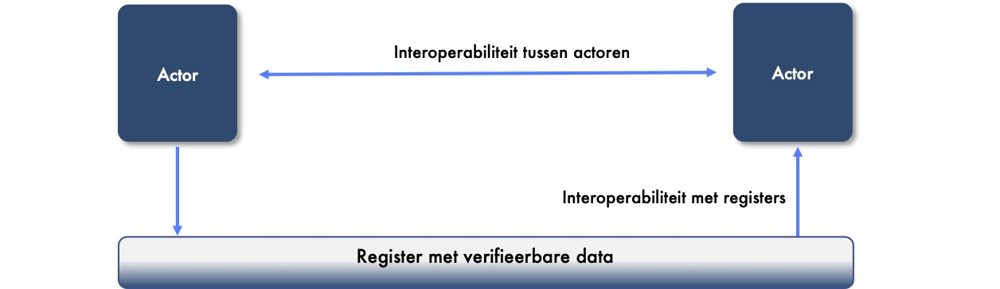

# A4 Techniekleverancier

## Inleiding

We hebben heel veel leveranciers die iets met techniek doen vertelt Amber. Ben en Amber voeren samen een gesprek over de rollen en richtlijnen. In dit hoofdstuk over de techniekleverancier. Kijk maar hoeveel apparaten en applicaties er zijn in de gezondheidszorg. Maar ook hoeveel diensten voor informatietechnologie er zijn. En al deze dingen en diensten worden geleverd door leveranciers. We noemen ze techniekleveranciers. 

Moeten we met al deze leveranciers van techniek afspraken maken en ze gaan certificeren vraagt Ben. Dat is een gigantische klus en ik ben niet overtuigd dat het nodig is. Dat weten we niet zegt Amber. We weten alleen dat we betrouwbare data nodig hebben uit betrouwbare en vertrouwde techniek. 

Betrouwbare data begint bij de bron. Afspraken gaan daarom niet alleen om extramurale communicatie van data vervolgt Amber. We moeten ook kijken naar intramurale communicatie van data. Ben kijkt een beetje beteuterd. Het zal een continue ontdekkingstocht zijn om te leren welke data we nodig hebben verzucht hij. Dat klopt zegt Amber. We moeten leren welke data we kunnen en willen hergebruiken, wat relevant is en welke afspraken nodig zijn. 

### Een techniekleverancier en de dienstverlener zorgaanbieder

Nog een vraag zegt Ben. Is een dienstverlener zorgaanbieder hetzelfde als een techniekleverancier? Bedoel je daar hetzelfde mee? Nee zegt Amber. Een dienstverlener zorgaanbieder is een rol in het afsprakenstelsel MedMij. Het is een leverancier van techniek die de technologie en diensten levert om een persoonlijke gezondheidsomgeving aan te sluiten op de systemen van een zorgaanbieder. Het is een specialisatie binnen de verzameling techniekleveranciers.

## Dienst voor het leveren van techniek

Een rechtspersoon, natuurlijk persoon, apparaat of ding maakt gebruik van software en hardware om elektronisch verbinding te maken met andere personen, apparaten of dingen. Maar ook om verbinding te maken met de services van een netwerkbeheerder. Leveranciers van techniek leveren de software en de hardware die dit mogelijk maakt. Iedere rechtspersoon en/of natuurlijk persoon kiest haar eigen leveranciers in een gelijk speelveld.


**Wat betekent dit?**

Bob is apotheker. Hij wisselt met verschillende zorgverleners \(voorschrijvers\) gegevens uit om geneesmiddelen te verstrekken. Maar ook met patiënten. Om met iedereen elektronisch te kunnen communiceren heeft Bob software aangeschaft.

Bob heeft voor zijn patiënten een apparaat op de balie staan waarmee berichten kunnen worden uitgewisseld met de telefoon van de patiënt. Via het apparaat kunnen ook berichten naar de telefoon worden verzonden.

Bob heeft verschillende toepassingen aangeschaft van verschillende soft- en hardwareleveranciers. Dit zijn allemaal leveranciers van techniek. Zijn apotheek heeft zelf geen IT-afdeling, maar maakt gebruik van een dienstverlenende organisatie voor informatietechnologie. Deze organisatie implementeert de toepassingen in zijn apotheek en is daarmee ook een leverancier van techniek.


We moeten met leveranciers afspraken maken om compliant te zijn aan de afspraken voor semantische en technische interoperabiliteit. Met een derdenverklaring van een auditor kan de software en hardware van de leverancier gecertificeerd worden voor gebruik.

## Richtlijnen voor de techniekleverancier

De onderstaande richtlijnen zijn van toepassing voor de techniekleverancier.

### A4.1: Het afsprakenstelsel _MOET_ voorzien in afspraken dat producten van techniekleveranciers personen in staat stellen regie te nemen op gegevens.

De producten van een techniekleverancier moeten personen in staat stellen regie te nemen op zijn of haar gegevens. Het product moet daarom functionele ondersteuning geven aan het uitgeven, het houden dan wel het verifiëren van een attest. Voor het verifiëren van een attest moet het product interoperabel zijn met de diensten van een netwerkbeheerder. 

### A4.2: Het afsprakenstelsel _MOET_ voorzien in afspraken dat producten van techniekleveranciers gegevenselementen kunnen interpreteren overeenkomstig de ontologie van het domein.

Voor eenheid van taal en interpretatie hanteren bronhouders een gemeenschappelijke ontologie \(zie het thema [gemeenschappelijke taal](../thema/gemeenschappelijke-taal.md)\). Een ontologie wordt afgesproken binnen een informatiecontext in een domein. De data is uitwisselbaar en machineleesbaar doordat de data gepubliceerd is in de ontologie. Een product van een techniekleverancier moet haar gegevenselementen kunnen interpreteren overeenkomstig de ontologie.

### A4.3: Het afsprakenstelsel _MOET_ voorzien in afspraken dat producten van techniekleveranciers data kunnen extraheren en laden overeenkomstig de ontologie van het domein. 

DIZRA gaat uit van FAIR-data waarbij data hergebruikt kan worden. Eenmalige registratie, meervoudig gebruik is het doel. Hiervoor is het noodzakelijk dat producten open zijn voor het extraheren en laden van data. Zodat we de data kunnen hergebruiken.

### A4.4: Het afsprakenstelsel _MOET_ voorzien in afspraken dat producten van techniekleveranciers voldoen aan de toegankelijkheidsstandaard EN 301 549 \(waaronder de WCAG webrichtlijnen\) indien gebruik wordt gemaakt van een eindgebruikersinterface op een mobiel apparaat of webinterface.

In het tijdelijk besluit digitale toegankelijkheid overheid is EN 301 549 aangewezen als verplicht toe te passen standaard voor organisaties met een wettelijke taak. Voor de toepassingen in de zorg stelt DIZRA het als richtlijn vast. Regie op gegevens kan namelijk pas bestaan als we bruikbare toepassingen hebben om regie mee te voeren.

### A4.6: Het afsprakenstelsel _MOET_ voorzien in afspraken dat producten van techniekleveranciers open internationale standaarden hanteren voor interoperabiliteit.

We hanteren standaarden voor interoperabiliteit, geen producten. Een product van een techniekleverancier kan niet de standaard zijn volgens de principes van DIZRA. Daarom moeten de producten open internationale standaarden hanteren voor het publiceren, toegankelijk maken en uitwisselen van data. Voor meer informatie, zie het thema [open standaarden](../thema/open-standaarden.md).

