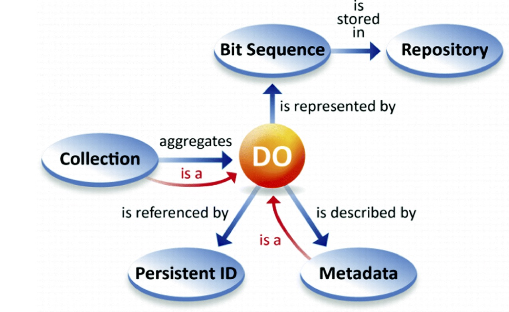

# Duurzaam

## Wat is duurzaam?

Een van de gewenste uitkomsten is een duurzaam informatiestelsel in de zorg. Maar wat is duurzaam in een wereld die continue veranderd? Dat is de verandering zelf. Om duurzaam te zijn moeten we een hoog vermogen tot veranderen realiseren. We weten uit ervaring dat het vermogen tot veranderen wordt verhoogd als we het aantal afhankelijkheden verlagen. 

### Onafhankelijke informatiestandaarden

Duurzaamheid gaat over de inrichting van het informatiestelsel en de wijze waarop standaarden worden gehanteerd. Een duurzaam informatiestelsel wordt gerealiseerd als we vanuit autonome onderdelen denken. 

Een informatiestandaard beschrijft het proces voor een domein en de gegevenselementen die in het proces worden vastgelegd en uitgewisseld. Iedere informatiestandaard moet autonoom zijn om te kunnen veranderen.

### Onafhankelijke ontologie

DIZRA hanteert als uitgangspunt dat we niet alle data gemeenschappelijk kunnen beschrijven in een ontologie. Een ontologie zal in veel gevallen worden meegeleverd door een leverancier. Een leverancier van een röntgenapparaat levert de ontologie van dat apparaat. Hopelijk gestandaardiseerd in een samenwerking tussen leveranciers van röntgenapparaten. 

Uitgangspunt is dat iedereen een ontologie kan leveren. De ontologie moet gebruikt kunnen worden in het informatiestelsel. Iedere ontologie is autonoom en kan zelfstandig veranderen in een proces die we zelf niet onder controle hebben. We hebben alleen de controle over het toepassen van een ontologie en de manier waarop we zelf data beschikbaar stellen aan anderen. Dat willen we zoveel mogelijk doen op basis van een gemeenschappelijke ontologie. 

### Onafhankelijkheid in het gebruik van standaarden

We zijn van mening dat we niet kunnen standaardiseren naar één standaard. Met standaarden bedoelen we de standaarden die in de technische zorginfrastructuur worden gehanteerd \(zie ook het thema [open  standaarden](open-standaarden.md)\). We zullen in de tijd gezien altijd meerdere standaarden hebben. Een bronhouder moet daarom aangeven op welke manier data toegankelijk is en welke formaten beschikbaar zijn.

 We geven hieronder het voorbeeld van FAIR Digital Object als manier om onafhankelijkheid te verkrijgen.


**Het voorbeeld van een FAIR Digital Object**

Een digitaal object bestaat uit:

* Data als een verzameling bits.
* Een unieke vaste identiteit voor het object zodat naar het object kan worden gerefereerd.
* Formaten waarin de data kan worden weergegeven en de serialisaties waarmee de data kan worden omgezet naar het formaat. Data en representatie staan dus los van elkaar.
* Metadata waarin onder andere wordt aangegeven wie de bronhouder, wat de gehanteerde ontologie is is en hoe het object toegankelijk is. Onder toegankelijkheid verstaan we ook de verschillende standaarden en protocollen die voor het koppelvlak worden gehanteerd.

In onderstaand figuur is bovenstaande weergegeven.


Bron figuur 1: [https://link.springer.com/chapter/10.1007/978-3-030-23584-0\_1](https://link.springer.com/chapter/10.1007/978-3-030-23584-0_1)

