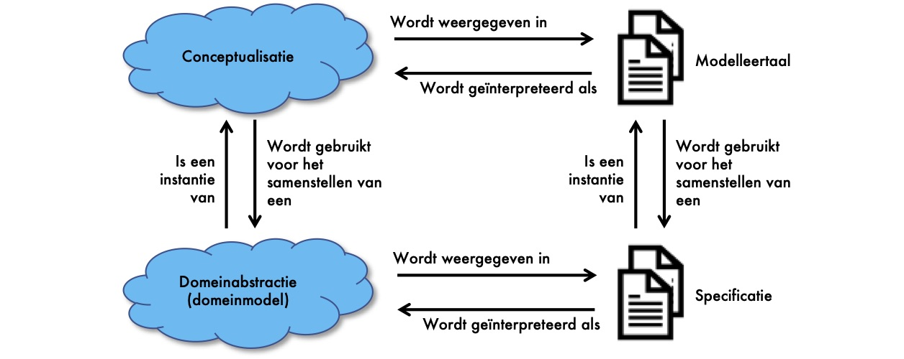

# Gemeenschappelijke taal

## Wanneer spreek je een gemeenschappelijke taal?

Een gemeenschappelijke taal spreken betekent dat je elkaar begrijpt binnen de context van een onderwerp. Een gemeenschappelijke taal spreek je als we binnen een context een ontologie hebben en een vocabulaire. In de onderstaande beschrijving maken we gebruik van: [Ontological Foundations for Structural Conceptual Models](https://ris.utwente.nl/ws/portalfiles/portal/6042428/thesis_Guizzardi.pdf) van Giancarlo Guizzardi.

### Wat is een context?

Het afspreken van een gemeenschappelijke taal en terminologie vereist een contextueel kader. De context bepaalt namelijk de taal en de terminologie die we hanteren. Een context zien we in DIZRA als een situatie waarover afspraken worden gemaakt en wat betrekking heeft op een persoon of haar omgeving.

Voorbeelden van context:

* Fysieke context \(locatie, tijd etc.\)
* Omgevingscontext \(temperatuur, hoogte, licht etc.\)
* Informatiecontext \(geneesmiddel, diagnose, personeel etc\)
* Persoonlijke context \(gezondheid, gesteldheid, activiteiten etc.\)
* Sociale context \(groepsactiviteit, sociale relaties etc.\)
* Applicatiecontext \(e-mail, bezochte websites etc.\)
* Systeemcontext \(netwerkverkeer, status van de printer etc.\)

DIZRA hanteert als uitgangspunt dat we data modelleren voor een informatiecontext. De andere contexten zijn onderdeel van het model. Voorbeelden van een informatiecontext zijn medicatie, verpleging, zwangerschap en geboorte en beelden. De informatiecontext vormt het kader waarvoor we de ontologie ontwikkelen. Dat zorgt ervoor dat we grenzen stellen aan wat we modelleren. Maar ook dat we modelleren wat bij elkaar hoort. Maar de grens goed bepalen is complex. We zullen daarin moeten leren en moeten kunnen veranderen.

### Wat is een ontologie en vocabulaire?

Om informatie uit data te halen is een interpretatie nodig. De interpretatie geeft betekenis aan data. Ontologie geeft betekenis aan data, aan de concepten die we in de werkelijkheid zien. Een ontologie is een beschrijving van het domein in de taal van het domein. Een vocabulaire is de verzameling woorden die we gebruiken in de ontologie. 


**Ontologie in de praktijk**

Als we "14-2" zien dan kunnen we denken aan 14 februari, aan Valentijnsdag. In beide gevallen denken we echter aan het concept van een datum als de we data bekijken. Het concept datum kan op verschillende manieren worden weergegeven. Met een datumnotatie, maar ook als een dag met betekenis. Met de representatie geven we de wijze aan waarop de data wordt opgeslagen of wordt weergegeven. 

"14-2" is data. We hebben onderkend dat het een datum is. Maar nu willen we weten wat "14-2" betekent. Het moet informatie worden. Is het de verjaardag van een persoon, de datum waarop zij met vakantie gaat of de begindatum van haar nieuwe baan?

Ontologie is zinsontleding. We moeten eerst de zin beschrijven. Een zin is opgebouwd uit een onderwerp, een predicaat \(of gezegde\) en het voorwerp. We beschrijven daarom: Alice is jarig op "14-2".  Hiermee geven we betekenis aan "14-2" en kunnen we de data interpreteren. Maar daarmee zijn we er nog niet. Als mens weten we wat een verjaardag is, maar een machine weet dat niet. We zullen het concept "verjaardag" moeten uitleggen aan de machine. Je kunt zeggen dat iemand geboren is op die datum. Maar kent een machine het concept "geboren"? 


Data meervoudig kunnen gebruiken en machineleesbaar maken betekent dat we de huidige data moeten schonen. Het moet met name geschoond worden van arbitraire definities van data. De concepten moeten eenduidig geïnterpreteerd kunnen worden. De data zal onze kennis moeten beschrijven van concepten.

### Ontologie en zorginformatiebouwstenen \(zibs\)

We zien zorginformatiebouwstenen als een specificatie die gemaakt is op basis van een ontologie. Een ontologie specificeert de betekenis van een concept. Het is een conceptualisatie van de werkelijkheid.

Een zorginformatiebouwsteen beschrijft een zorginhoudelijk concept in termen van de gegevenselementen waaruit dat concept bestaat, de datatypes van die gegevenselementen etc. Het is met andere woorden een abstractie van de ontologie.

