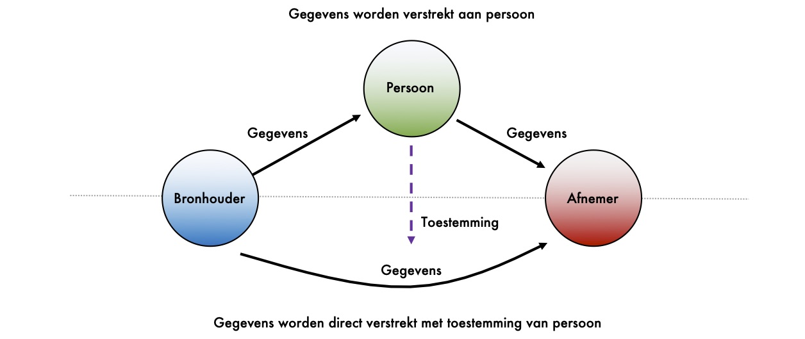

# Regie op gezondheidsdata

## Wat is regie op gezondheidsdata?

Regie op gezondheidsdata staat voor het vrije verkeer van persoonlijke gegevens onder regie van mensen zelf. We hanteren voor de zorg de term gezondheidsdata, maar het betreft regie op gegevens in het algemeen. We denken namelijk dat gezondheidsdata niet alleen medische gegevens betreft, maar alle gegevens die binnen de zorg relevant zijn. 

We kijken naar het programma regie op gegevens voor de definitie van regie op gegevens. In het programma regie op gegevens heeft de overheid samen met private en maatschappelijke organisaties uitgewerkt hoe dit plaats moet vinden \(zie: [https://kennisopenbaarbestuur.nl/thema/regie-op-gegevens/](https://kennisopenbaarbestuur.nl/thema/regie-op-gegevens/). 

Regie op gegevens als principe maakt onderdeel uit van het regeerakkoord, de digitalisering-strategie ‘Nederland Digitaal’ en de digitale agenda ‘NLDIGIbeter’.


_"Regie op gegevens hanteert als vertrekpunt dat mensen inzage moeten hebben in hun persoonlijke gegevens en het gebruik daarvan door derden, dat zij de mogelijkheid moeten hebben om gegevens te corrigeren of verwijderen en -niet in de laatste plaats- dat zij gegevens moeten kunnen \(her\)gebruiken, zowel binnen de overheid als daarbuiten. Hierdoor verbetert de transparantie, neemt de kwaliteit van gegevens toe en wordt de positie van de burger versterkt. Voor burgers en bedrijven zorgt het voor lastenverlichtingen en het optimaliseren van processen. Persoonlijk datamanagement draagt bij aan transparantie, inzage en correctie, digitale zelfbeschikking, privacy, dataminimalisatie, de kwaliteitsverbetering van gegevens en zelfredzaamheid van mensen. Daarmee is PDM tevens een uitwerking van de beginselen zoals die gehanteerd worden bij ‘privacy by design’ en ‘security by design’."_

Bron: [Greenpaper Regie op gegevens](https://kennisopenbaarbestuur.nl/media/255847/greenpaper-regie-op-gegevens-durf-te-doen.pdf), inleiding 

Toelichting: PDM staat voor Persoonlijk datamanagement


Vanuit het programma zijn de volgende principes gespecificeerd \(zie [infographic](https://rog.pleio.nl/file/download/57899761/IG-kader-regie-op-gegevens.pdf)\):

* **Inclusiviteit**: Mensen met persoonlijke verschillen in mogelijkheden, omstandigheden en culturen nemen vrijelijk deel aan het \(digitale\) maatschappelijk leven.
* **Mens centraal**: Mensen krijgen meer grip op het leven door regie op eigen persoonlijke gegevens.
* **Digitale autonomie**: Personen verstevigen hun positie door vergroten van inzicht in en invloed op persoonlijk gegevensverkeer.

Om de bovenstaande principes te realiseren is transparantie noodzakelijk. Transparantie over de intenties en het gedrag van personen, aanbieders van data en afnemers. Daarnaast vormen interoperabiliteit, vertrouwen en dataminimalisatie de ingrediënten voor regie op gegevens.

De principes voor regie op gegevens komen overeen met de uitgangspunten voor regie op gegevens die door de community van IT-Architecten zijn geuit en in eerdere publicaties zijn verwoord. 

### Vormen van regie

Er zijn twee vormen van regie op gegevens. De eerste vorm is dat de bronhouder de gegevens verstrekt aan de persoon. Het is vervolgens aan de persoon zelf om deze gegevens door te zenden naar afnemers. De tweede vorm is dat de bronhouder de gegevens direct verstrekt aan de afnemer, met toestemming van de persoon.

In maart 2019 is het [kader voor regie op gegevens](https://rog.pleio.nl/file/download/57899614/ICTU%20ROG%20Rapport%20Kader%20voor%20RoG.pdf) door het programma gepubliceerd. In het kader zijn drie horizonnen beschreven in de ontwikkeling van het principe ‘regie op gegevens’.

1. **Bronhouders stellen gegevens ter beschikking** waarbij een persoon een kopie ontvangt van een dataset.
2. **Bronhouders maken gegevens toegankelijk** voor een persoon. Ze werken mee aan de uitwisseling van gegevens onder regie van een persoon. Een persoon kan aangeven dat partij A een specifiek gegeven of een set van gegevens mag inzien bij partij B voor een bepaald doel en voor een bepaalde duur.
3. **Een persoon heeft volledig zelf de regie over zijn of haar eigen gegevens**. Als persoon doe je een bewering \(ik ben 18, ik heb mijn rijbewijs\) en een bevoegde instantie attesteert deze bewering.

DIZRA geeft in de richtlijnen ondersteuning aan regie op gegevens overeenkomstig de visie uit het kader.


**Wat betekent dit voor burgers, patiënten en cliënten?** 

Alice is gevallen op straat. Ze viel over een randje en kwam op straat lelijk ten val op haar schouder. Een aantal omstanders kwam haar te hulp. Super lief en het gaf haar een warm gevoel ondanks de pijn van haar val. De ambulance is gebeld en even later was ze onderweg naar het ziekenhuis. In het ziekenhuis bleek dat Alice haar schouder uit de kom was. Het werd snel gezet en ze mocht naar huis.

Zelf regie op gegevens hebben betekent voor Alice dat:

* Dat ze een attest ontvangt dat er een foto is gemaakt. Alice kan deze foto delen.
* Dat ze een attest ontvangt dat ze een doorverwijzing heeft. Met het attest kan ze naar de traumapoli in het ziekenhuis bij haar in de buurt. De bewering dat ze een doorverwijzing heeft is geattesteerd door een bevoegde arts.


## Wat als mensen digitaal niet mee kunnen of willen doen?

DIZRA gaat over digitale en elektronische vindbaarheid, toegankelijkheid, interoperabiliteit en hergebruik van data binnen de gezondheidszorg en regie. Vertrouwen en regie op gegevens zijn hierbij belangrijke uitgangspunten. Een belangrijk onderdeel van toegankelijkheid is: iedereen kan meedoen in de \(digitale\) samenleving. Dit noemen we ‘digitale inclusie’.

Voor meer informatie over digitale inclusie verwijzen we naar: [https://www.digitaleoverheid.nl/overzicht-van-alle-onderwerpen/toegankelijkheid/digitale-inclusie/](https://www.digitaleoverheid.nl/overzicht-van-alle-onderwerpen/toegankelijkheid/digitale-inclusie/)

