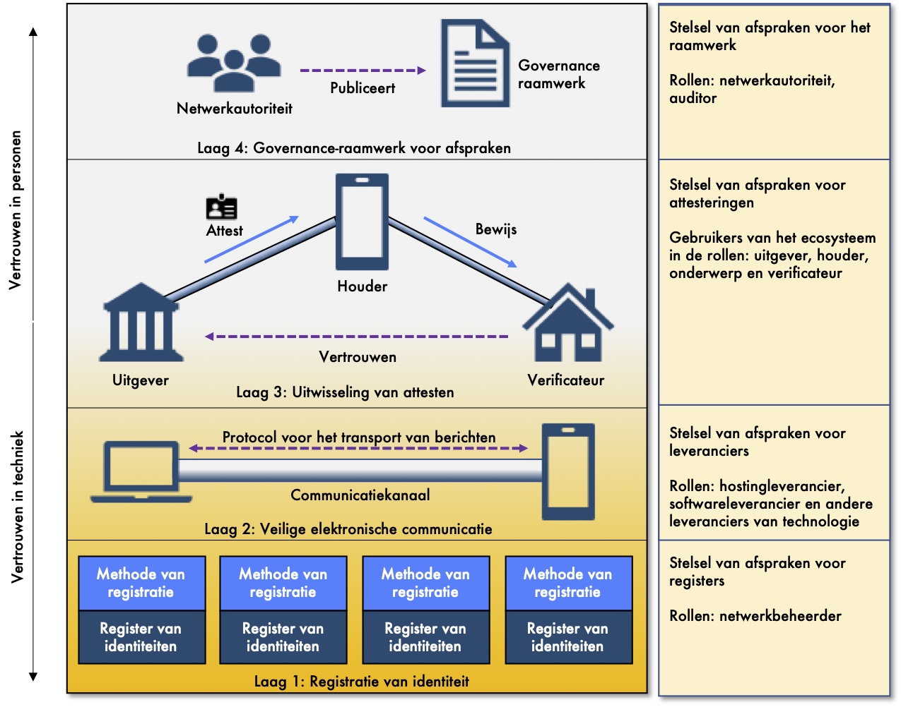
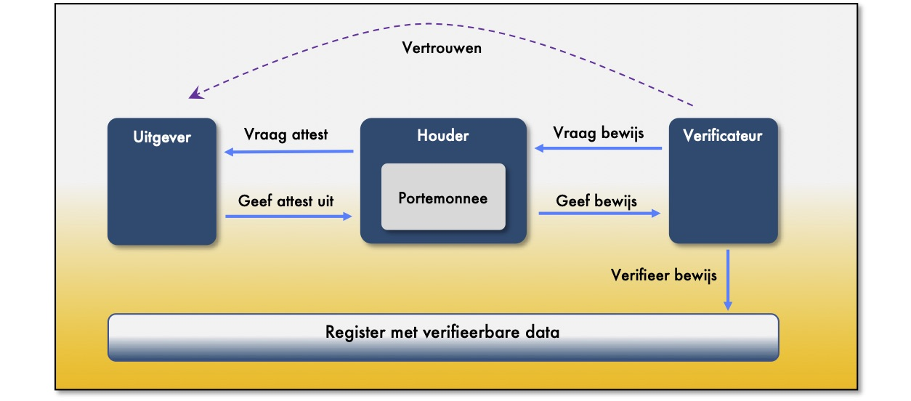

# Vertrouwensinfrastructuur

## Inleiding

Bob is apotheker. Hij heeft net een verstrekkingsverzoek ontvangen van Alice voor een geneesmiddel op recept. Hij kent de voorschrijver niet. Om het geneesmiddel te mogen verstrekken moet Bob verifiëren dat de voorschrijver bevoegd is om een recept voor te schrijven. Het informatiesysteem van Bob verifieert de bevoegdheid en meldt dat de voorschrijver bevoegd is. Hij verstrekt de medicatie daarom aan Alice.

Het vertrouwen van Bob is geen automatisme. Bob moet geloof hebben in het systeem van verifiëren. Aan de hand van de casus van Bob en Alice beschrijven we hieronder de stappen die nodig zijn om het vertrouwen in het systeem te verkrijgen. 

In het systeem onderkennen we 4 lagen waarmee het vertrouwen wordt opgebouwd. We tellen de lagen van beneden naar boven.

1. De eerste laag is de laag waarmee we personen, maar ook apparaten en dingen  kunnen identificeren. Zodat Bob en Alice elkaar kunnen identificeren, maar natuurlijk ook de voorschrijver. Dit is Caroline. De actoren moeten elkaar uniek kunnen identificeren. 
2. Met de tweede laag zorgen we ervoor dat Bob, Alice en Caroline berichten kunnen verzenden en veilig met elkaar kunnen communiceren.
3. In de derde laag moeten we ervoor zorgen dat Bob vertrouwen heeft dat Caroline een bevoegde voorschrijver is. Ook al verkrijgt Bob het verstrekkingsverzoek van Alice. 
4. Om het vertrouwen in de derde laag te verkrijgen is de vierde laag nodig, namelijk de laag met het raamwerk aan afspraken. Dat wat we ook wel een afsprakenstelsel noemen. Er zijn bijvoorbeeld afspraken nodig hoe we verifiëren dat we een persoon kunnen vertrouwen. 

De lagen zijn in het onderstaande figuur weergegeven en worden vervolgens hieronder beschreven. Het model is overgenomen uit de volgende specificatie: "[The Trust Over IP Stack](https://github.com/hyperledger/aries-rfcs/tree/master/concepts/0289-toip-stack)".

## Laag 1: Registratie van identiteit

In de eerste laag borgen we de identificatie. Hierbij is van toepassing dat alles een identiteit kan hebben. Meer en meer is de uitgever van een gegevenselement een apparaat. En kunnen apparaten of andere dingen ook het onderwerp zijn van gegevens. Bijvoorbeeld als we gegevens registreren over de betrouwbaarheid van een bloeddrukmeter of een ander apparaat. Het gaat met andere woorden niet alleen over de identiteit van personen. Iedere actor moet een identiteit kunnen krijgen. Dit is overigens een anonieme identificatie zonder betekenis. 

Een actor kan haar identiteit registreren. Alles wat uitgever is van data moet een identiteit registreren als de data van die uitgever verifieerbaar moet zijn. Het is dan ook een register voor verifieerbare data. We zien in de praktijk meerdere registers. Zo kan er een register zijn voor gemeenten, een register voor apparaten, een regionaal register of een onderzoeksregister. Iedereen kan zelf haar register kiezen. Eenieder heeft keuzevrijheid.


**Bob, Alice en Caroline hebben al vele identiteiten.** 

* Bob, Alice en Caroline hebben allen een Burgerservicenummer. 
* Bob als apotheker en Caroline als huisarts zijn beiden BIG-geregistreerd en hebben een BIG-nummer. 
* Bob en Caroline moeten kunnen declareren bij de zorgverzekeraar van Alice. Daarom hebben ze een AGB-nummer, evenals de apotheek en huisartsenpraktijk. 
* Daarnaast hebben de apotheek en de huisartsenpraktijk een KvK-nummer in het Handelsregister. 

We hebben dus al vele identiteiten als rechtspersoon en als natuurlijk persoon. 


### Denken vanuit de identiteit

Een identiteit ontvangen we meestal vanuit een organisatie, een rechtspersoon. We hebben als persoon daarom vele identiteiten. Organisaties kijken en denken namelijk vanuit hun eigen bedrijfsvoering naar de personen om hun heen. Zowel naar rechtspersonen als natuurlijke personen en identificeren die personen met een nummer. De organisatie staat in deze denkwijze centraal. Deze denkwijze is echter niet houdbaar als we naast personen ook een identiteit nodig hebben voor apparaten en andere dingen. Dan creëren we chaos door de vele identiteiten die in omloop zijn.

We willen een persoon centraal stellen, maar ook het apparaat en andere dingen. Het is veel natuurlijker om te zeggen dat iedere persoon, ieder apparaat en ding een eigen identiteit heeft. In de fysieke wereld is dit normaal. In de virtuele wereld moet het daarom ook normaal zijn om deze denkwijze te hanteren. De identiteit van een organisatie gebruiken we in de fysieke wereld contextueel. We authenticeren ons contextueel. Bijvoorbeeld via een paspoort of via een OV-kaart. In de virtuele wereld moeten we onszelf ook contextueel kunnen identificeren en authenticeren. Uitgangspunt is daarom dat alles een eigen identiteit heeft en dat eenieder contextueel andere elementen kan gebruiken.


**Wat betekent dit voor Bob, Alice en Caroline?**

We maken onderscheid tussen natuurlijke personen en rechtspersonen. Iedere persoon moet een register kiezen waarop zij hun identiteit aanmaken. Bob en Caroline maken in het voorbeeld gebruik van een register van zorgverleners waarin zij een identiteit hebben aangemaakt voor zichzelf, maar ook voor de apparaten die zij gebruiken en hun huisartsenpraktijk en apotheek. 

Een register wordt geïmplementeerd en operationeel gehouden door netwerkbeheerders. Iedere netwerkbeheerder heeft een eigen knooppunt \(node\) in het netwerk van netwerkbeheerders die gezamenlijk het register beheren. Het register rergistreert de elementen waarmee data kan worden geverifieerd op herkomst, integriteit en geldigheid. Het register registreert deze elementen onveranderbaar en gedistribueerd over alle knooppunten. Hiermee worden beveiligingsrisico's gespreid en de kwetsbaarheid van één registratie voorkomen. Deze structuur wordt een 'Identity Trust Fabric' genoemd \(bron: [Gartner](https://www.gartner.com/smarterwithgartner/the-beginners-guide-to-decentralized-identity/)\).

Bob en Caroline kiezen ieder een netwerkbeheerder als beheerder van hun publieke identiteit. Bob kiest voor Acme en Caroline voor Faber. Alice maakt gebruik van een applicatie van Stark. Zij registreert haar identiteit niet omdat ze deze privaat wil houden. Alleen uitgevers van een attest moeten een publieke identiteit hebben.

Ieder register heeft haar eigen stelsel van afspraken. Hierin wordt afgesproken:

* De governance op het register en de wijze van samenwerking. Met als uitkomst dat de netwerkbeheerders elkaar vertrouwen.
* De voorwaarden voor registratie van een identiteit. Een register kan open zijn voor iedereen, maar er kunnen ook voorwaarden gespecificeerd zijn waaraan een persoon moet voldoen. In het voorbeeld is een register geïmplementeerd voor zorgverleners waaraan alleen erkende zorgverleners mogen meedoen.


Een afspraak over de methode van registratie is noodzakelijk zodat bijvoorbeeld het register herkend kan worden waarin de identiteit is aangemaakt. Het moet ook borgen dat een identiteit uniek is.

## Laag 2: Veilige elektronische communicatie

Caroline is de voorschrijver van het geneesmiddel en heeft het verstrekkingsverzoek gemaakt. Caroline moet het bericht met het verstrekkingsverzoek veilig elektronisch kunnen communiceren met Alice, dan wel rechtstreeks met Bob. Veilige communicatie bestaat enerzijds uit een veilig communicatiekanaal en anderzijds uit een protocol voor het transport van berichten.

### Een veilig communicatiekanaal

Een communicatiekanaal is veilig als:

1. Berichten zijn versleuteld; 
2. Het communicatiekanaal is aangemaakt tussen de elektronische vertegenwoordigers van de actoren die met elkaar willen communiceren.

Een oplossing voor het versleutelen van berichten is het gebruik van Transport Layer Security \(TLS\). Dit protocol is gebaseerd op een Public Key Infrastructuur \(PKI\) met uitgifte en beheer van certificaten. Certificaten kunnen echter niet voor iedere toepassing worden gebruikt. Een toepassing met mobiele apparaten of met dingen in de context van "The Internet of Things" zijn niet mogelijk of zeer kostbaar als deze met PKI moeten worden opgelost. Een Decentralized Public Key Infrastructure \(DPKI\) heeft deze nadelen niet.

Zowel PKI als DPKI borgen dat met de juiste elektronische vertegenwoordiger wordt gecommuniceerd door aan te tonen dat de vertegenwoordiger controle heeft over de private sleutel van de persoon. DPKI heeft echter als voordeel dat het volledig anoniem is waar anonieme communicatie van berichten gewenst of noodzakelijk is.


**Wat betekent dit voor Bob, Alice en Caroline?**

Een veilig communicatiekanaal stelt Bob, Alice en Caroline in staat om met elkaar te communiceren. Zij zien niet of het veilig is of niet. Ze moeten vertrouwen dat het veilig is. Hiervoor zijn afspraken nodig tussen de technische leveranciers die de communicatiekanalen veilig moeten maken. Door certificering van de leveranciers die voldoen aan de afspraken kunnen Bob, Alice en Caroline zien dat de techniek die zij gebruiken veilig is. Voor deze certificering is een een stelsel van afspraken nodig voor leveranciers van techniek.


### Een protocol voor het transport van berichten

Voor het transport van berichten zijn er meerdere protocollen beschikbaar. Ieder protocol is gemaakt met een doel voor ogen. HTTP is een van de meest bekende protocollen, maar er zijn er meer. Naast het protocol zijn er standaarden nodig voor het transport van berichten. Zo zijn er meerdere standaarden die berichten verzenden over HTTP. Ten aanzien van het protocol en de standaard is er geen "One Size Fits All"-oplossing. Voor iedere toepassing moeten we op zoek gaan naar het juiste protocol en standaard.


**Wat betekent dit voor Bob, Alice en Caroline?**

Een protocol en een standaard voor het verzenden en ontvangen van berichten is iets wat Bob, Alice en Caroline niet zien. Zij willen gewoon met elkaar kunnen communiceren. Veilige communicatie moet echter niet beperkend zijn in de toepassingsmogelijkheden. In onderstaand voorbeeld beschrijven we een toepassing.

Bob heeft een apparaat op de balie staan. Alice houdt haar telefoon tegen het apparaat en bevestigt dat zij het verstrekkingsverzoek wil communiceren. Bob ziet dat zijn informatiesysteem het verstrekkingsverzoek heeft ontvangen. Het is een voorbeeld van een communicatiekanaal en een protocol voor transport van berichten die specifiek is voor de toepassing. 


## Laag 3: Uitwisseling van attesten

De eerste twee lagen zijn nodig voor de uitwisseling van gegevens. Pas in de uitwisseling van attesten wordt betekenis gegeven aan de data en aan de manier waarop de data kan worden geverifieerd. 

### Attest als elektronische verklaring die een bewering ondersteunt

Een attest is een elektronisch bewijs, een \(officiële\) verklaring die een mondelinge bewering versterkt, ondersteunt, wettigt \(Wikipedia\). We kunnen alle data als bewering zien. Alice beweert bijvoorbeeld dat zij een verstrekkingsverzoek heeft voor de verstrekking van geneesmiddelen. Bob moet deze bewering geloven. Naast de beweringen van anderen kunnen we ook zelf beweringen doen of kunnen dingen beweringen doen. De vraag is iedere keer of we de bewering moeten geloven. Kunnen we de bewering vertrouwen? Met een attest bedoelen we een verifieerbare bewering zodat we deze kunnen vertrouwen. 

In onderstaand figuur zijn de stappen voor het uitgeven van een attest en het overhandigen van bewijs weergegeven. 

1. De uitgever geeft het attest uit, al dan niet op basis van een vraag.
2. De verklaring wordt uitgegeven aan een de houder. De houder bewaart het attest in haar portemonnee.
3. Voor het uitvoeren van een transactie met de verificateur kan deze om bewijs vragen. De houder geeft het bewijs aan de verificateur. Het bewijs is gebaseerd op het attest, maar aangepast aan wat minimaal noodzakelijk is.
4. De verificateur moet de verklaring kunnen verifiëren. De verklaring is autonoom in haar bewijsvoering. Dit betekent dat bewijsvoering niet afhankelijk is van de wijze waarop de verklaring bezorgd is. Met behulp van het register met verifieerbare data \(laag 1\) kan de herkomst van het bewijs worden geverifieerd.

### Vertrouwen hebben in het bewijs

De verificateur moet besluiten of zij de verklaring aanneemt als bewijs. Zij zal de verklaring moeten geloven en vertrouwen. De manier waarop dit vertrouwen wordt verkregen moet zijn afgesproken. Vanuit de afspraken moet de uitgever zijn aangewezen als geloofwaardig. Een register met data waardoor beweringen verifieerbaar zijn ondersteunt hierin. Het biedt eveneens de mogelijkheid de geldigheid van een attest te verifiëren. Een register met verifieerbare data zien we als onderdeel van de vertrouwensdiensten van een netwerkbeheerder.

De techniek kan controleren dat een attest aan alle eisen voldoet. De techniek kan echter niet controleren dat de actor die het attest heeft ondertekend ook vertrouwd moet worden. Hiervoor zijn aanvullende afspraken nodig over de uitgevers die vertrouwd zijn, dan wel aan welke kenmerken zij moeten voldoen om vertrouwd te zijn. Zij kunnen bijvoorbeeld vertrouwd zijn omdat zij een attest van de netwerkautoriteit hebben ontvangen of van een andere autoriteit. Maar het blijft noodzakelijk dat minimaal één uitgever vertrouwd wordt in het netwerk van deelnemers aan de afspraken. 


**Wat betekent dit voor Bob, Alice en Caroline?**

Caroline is auteur en uitgever van het verstrekkingsverzoek. Het is een van de onderdelen van het recept dat ze aan Alice heeft voorgeschreven. Caroline heeft het recept uitgegeven aan Alice. Alice is daarmee de houder van het attest. Met het verstrekkingsverzoek gaat Alice naar een apotheek en overhandigt elektronisch het verstrekkingsverzoek.

Bob is apotheker. Hij heeft net het verstrekkingsverzoek ontvangen van Alice voor een geneesmiddel op recept. Hij kent Caroline niet. Om het geneesmiddel te mogen verstrekken moet Bob verifiëren dat de Caroline bevoegd is om een recept voor te schrijven. Het informatiesysteem van Bob controleert het volgende:

1. Dat het verstrekkingsverzoek elektronisch ondertekent is door de identiteit van de auteur en uitgever;
2. Dat de gegevenselementen in het verstrekkingsverzoek niet veranderd zijn gedurende het transport;
3. Dat de uitgever opgenomen is in het BIG-register;
4. Dat de uitgever is aangemerkt als bevoegde voorschrijver van geneesmiddelen.

Het informatiesysteem meldt dat Caroline bevoegd is. Bob verstrekt de medicatie aan Alice. 

In ons voorbeeld bezorgt Alice het verstrekkingsverzoek bij Bob. De bezorging kan echter ook rechtstreeks vanuit Caroline naar Bob. Het attest en de bewijsvoering is daarom onafhankelijk van het kanaal van bezorging. 


### Een verwerking verantwoorden

Bob zal de verwerking van persoonsgegevens moeten kunnen verantwoorden. Net als dat hij de verstrekking van een geneesmiddel moet kunnen verantwoorden. Ongeacht het kanaal waarmee het bericht bij hem terecht is gekomen zal hij de verantwoording moeten kunnen uitvoeren.   

## Laag 4: Governance-raamwerk voor afspraken

In een governance-raamwerk wordt het vertrouwen afgesproken. Ieder netwerk maakt afspraken en heeft een governance-structuur waarmee de afspraken worden beheerd. We spreken over een raamwerk omdat op iedere laag afspraken kunnen worden gemaakt die zelfstandig ontwikkeld, geïmplementeerd en beheerd worden. Het geheel aan afspraken borgt het vertrouwen.

1. **Afspraken met netwerkbeheerders.** Dit specificeert de afspraken voor de registers met de structuur voor het registreren van data waarmee een attest kan worden geverifieerd. 
2. **Afspraken met leveranciers van techniek**. Hierin wordt afgesproken hoe de leveranciers van de onderdelen in de vertrouwensinfrastructuur \(zoals hostingpartijen, leveranciers van software en hardware\) kunnen worden geverifieerd en worden gecertificeerd.
3. **Afspraken over het vertrouwen in uitgevers van attesten.** Het betreft afspraken over welke uitgevers

    worden vertrouwd en welke regels zij moeten hanteren bij het uitgeven en intrekken van attesten. 

4. **Afspraken voor het gehele ecosysteem** waarin afspraken  worden gemaakt om vertrouwen en interoperabiliteit tussen de netwerken te borgen.

