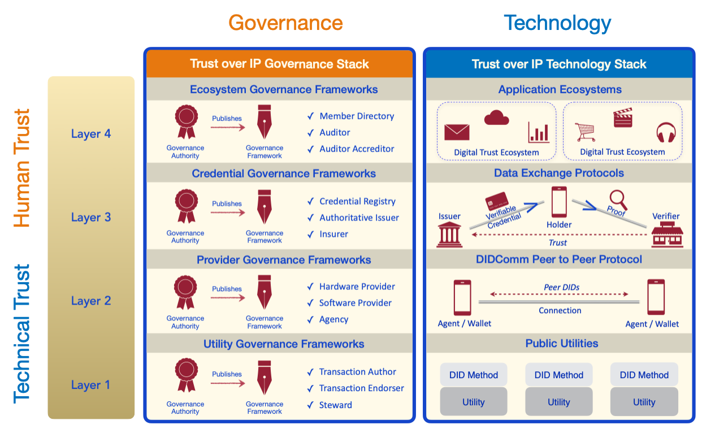

# Vertrouwensmodel

## Inleiding

Vertrouwen is geen automatisme. Mensen en organisaties moeten geloof hebben in het systeem. Aan de hand van een casus is hieronder een model beschreven om vertrouwen in het systeem te krijgen. Het is een vertrouwensmodel gebaseerd op de realiteit en de natuurlijke interactie tussen mensen en organisaties. Interactie en vertrouwen is in de werkelijke wereld 1-op-1 georganiseerd. Het is niet natuurlijk dat iemand tussen jou en je huisarts staat. Waarom dan wel in de digitale wereld? Het vertrouwensmodel gaat uit van vertrouwen tussen mensen onderling en met organisaties.

In het systeem zijn 4 lagen onderkend voor het vertrouwen. De lagen zijn van onder naar boven beschreven.

1. Met de eerste wordt een sterke cryptografische basis gelegd voor identificatie. Het legt een basis voor elektronische handtekeningen.
2. Met de tweede laag is communicatie mogelijk.
3. De derde laag borgt dat gegevens geverifieerd zijn op integriteit, herkomst en validiteit. De derde laag geeft nog geen vetrtouwen dat de gegevens juist zijn. Het is alleen dat de gegevens elektronisch zijn ondertekend door een persoon of organisatie.
4. Om het vertrouwen in de derde laag te verkrijgen is de vierde laag nodig, de laag met het raamwerk aan afspraken voor een ecosysteem. Er zijn namelijk afspraken nodig om een persoon of organisatie te vertrouwen. Zodat we weten dat de persoon of organisatie de verklaring mocht uitgeven en dat wij het kunnen vertrouwen.

De lagen zijn weergegeven in het onderstaande figuur en zijn vervolgens beschreven \(Bron: [Trust Over IP](https://trustoverip.org)\).

## Laag 1: Cryptografische basis

In de eerste laag wordt de cryptografische basis gelegd voor het vertrouwen. Software agents zijn hierdoor in staat om de herkomst en de integriteit van gegevens te verifiëren door middel van elektronische handtekeningen.

Het toepassen van cryptografie vereist een public key infrastructure \(PKI\). Traditioneel is een PKI geïmplementeerd met certificaten van een certificaatautoriteit \(CA\), bijvoorbeeld PKIOverheid. Een alternatief is een decentraal PKI oftewel DPKI. In een DPKI zijn de publieke sleutels gepubliceerd in een blockchain, in een gedistrubueerd grootboek, een decentraal bestandssysteem of in ieder andere voorziening waarmee het noodzakelijke vertrouwen kan worden geborgd.

De voorziening van een \(decentraal\) public key infrastructure vereist afspraken tussen de leveranciers die de infrastructuur als dienst aanbieden. Het zijn afspraken over bijvoorbeeld de betrouwbaarheid, de veiligheid en het gebruik van protocollen en standaarden voor zowel de interactie onderling als naar klanten.

## Laag 2: Elektronische communicatie

Software agents moeten berichten met elkaar kunnen communiceren. Het vertrouwen in een voorziening voor het transporteren van berichten vereist dat:

* Berichten veilig zijn \(door sterke encryptie\);
* Berichten privé zijn \(zodat derden niet kunnen meelezen en niet weten wie wat wanneer communiceert; het stelt afzender en ontvanger in staat om anoniem te zijn\).

Afspraken zijn nodig voor de implementatie van de protocollen en de standaarden voor het transport van berichten.

## Laag 3: Gegevensuitwisseling

Gegevens worden uitgewisseld in elektronische documenten \(zoals een recept, een doorverwijzing, bewijs van inschrijving of een indicatiebesluit\) van een gegevensbron. Voor het vertrouwen is vereist dat:

* een bronhouder verklaart dat de gegevens betrouwbaar, juist en geldig zijn;
* een bronhouder haar verklaring kan intrekken als de gegevens niet meer geldig zijn;
* een bronhouder geautoriseert is voor het uitgeven van het document \(omdat niet iedereen een recept mag voorschrijven bijvoorbeeld\);
* een document geverifieerd kan worden op volledigheid en formaat.

Afspraken zijn nodig voor het invullen van de bovenstaande punten. Het zijn afspraken voor het gebruik van standaarden waarmee deze punten worden geïmplementeerd.

## Laag 4: Een ecosysteem met afspraken

De afspraken in de drie onderste lagen zijn sectoroverstijgend. Het zijn afspraken die niet specifiek voor de zorg zijn, maar ook in andere sectoren gebruikt worden. Het is juist gewenst dat de zorg hergebruik maakt van deze afspraken. Het maakt de informatievoorziening in de zorg eenvoudiger en daardoor goedkoper omdat kennis over de afspraken, de prrotocollen en de standaarden breder gedeeld is dan alleen in de zorg.

De afspraken voor een ecosysteem zijn afspraken voor het informatiestelsel in de zorg. Bijvoorbeeld afspraken over wie mag meedoen \(bijvoorbeeld alle geregistreerde zorgaanbieders\) en wie welke documenten mag uitgeven.

