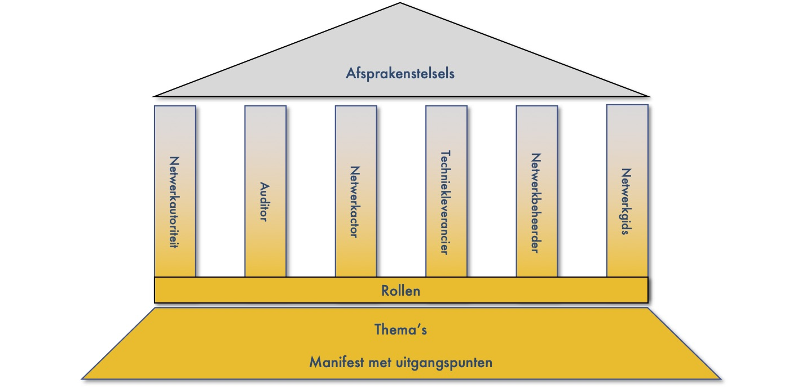
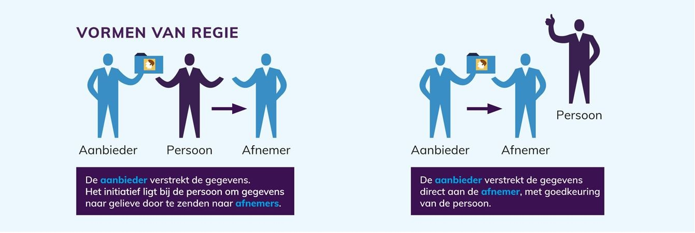
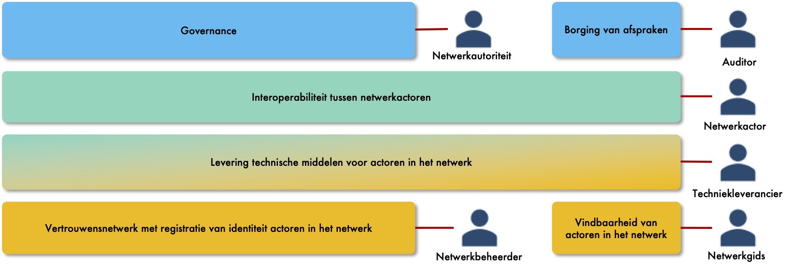

# Van start gaan

DIZRA is een referentiearchitectuur. Maar wat betekent dat? Kort gezegd kun je zeggen dat het een fundament is waarop anderen kunnen voortbouwen. Een gemeenschappelijke basis dus. Omdat we vanuit een zelfde basis vertrekken ontstaat er samenhang.

DIZRA heeft uitleg nodig om de uitgangspunten en de structuur te begrijpen. We moeten hiervoor met elkaar in gesprek gaan. In dit hoofdstuk beschrijven we hoe Amber in gesprek gaat met Ben en uitleg geeft over DIZRA. We zullen ze opnieuw tegenkomen bij de uitleg over de rollen in DIZRA. Met DIZRA gaan we je op weg helpen met het maken van afspraken. DIZRA hoopt je reisgenoot te zijn naar de bestemming van je afspraken. 


DIZRA wil je op weg helpen met het maken van afspraken. We beschrijven hoe Amber in gesprek gaat met Ben over de afspraken. Ben is programmamanager en Amber IT-Architect. We introduceren ze in dit hoofdstuk. In de beschrijving van de rollen zul je ze weer tegenkomen in hun gesprek over DIZRA en de afspraken die nodig zijn voor vertrouwen, vindbaarheid, toegankelijkheid, interoperabiliteit en hergebruik van data.


## Manifest en thema's

Ben is programmamanager voor het realiseren van afspraken. Afspraken om berichtjes uit te wisselen zoals hij het zelf noemt. Wat moet ik met het manifest vraagt hij aan Amber. Amber is IT-Architect van het programma. Het manifest bevat de principes, oftewel de uitgangspunten voor een duurzaam informatiestelsel in de zorg. Het zijn de principes voor de architectuur van het informatiestelsel. 

Het Informatieberaad Zorg heeft de principes vastgesteld vertelt Amber. We zijn niet het enige programma dat afspraken maakt. We realiseren samenhang tussen de afspraken omdat we dezelfde uitgangspunten hanteren.

Een aantal van de principes is uitgewerkt in een thema. Daarnaast is het thema vertrouwensinfrastructuur opgenomen. In dit thema wordt beschreven welke afspraken nodig zijn om vertrouwen te verkrijgen tussen de deelnemers van een netwerk.

### Regie op gegevens

Een van de principes van DIZRA is regie op eigen gezondheidsdata. Ik noem het, zegt Amber, omdat de vormen van regie richtinggevend zijn voor de richtlijnen. In onderstaand figuur zijn de twee vormen van regie weergegeven.

Regie op gegevens is van toepassing in alle sectoren waarin persoonsgegevens een rol spelen. Banken en telecombedrijven ontwikkelen bijvoorbeeld toepassingen voor hun klanten om regie op gegevens te verkrijgen. Voor de zorg kunnen we hergebruik maken van deze toepassingen. Graag zegt Ben. Anders krijgen we weer de situatie dat iedereen zijn eigen toepassing heeft. Staat mijn telefoon weer vol. Mensen willen inderdaad toepassingen waarmee ze bijvoorbeeld zowel bij hun bank als bij hun huisarts toestemming kunnen geven gaat Amber verder. Dat kunnen we bereiken door gebruik te maken van dezelfde standaarden. Dat is kostenefficiënt.

DIZRA houdt rekening met de vormen van regie op gegevens. In het raamwerk zijn de rollen opgenomen waarmee we beide vormen ondersteunen zegt Amber.

## Het raamwerk

Ben kijkt naar het plaatje met de rollen en de functies. Dat is best een ingewikkeld plaatje mompelt hij. Moet ik dat allemaal gaan regelen vraagt hij aan Amber. Kan het niet eenvoudiger? In het raamwerk zijn de rollen opgenomen begint Amber. Voor iedere rol moeten afspraken gemaakt worden. In het onderstaande plaatje staat kort wat iedere rol doet. 

Nou kom maar op zegt Ben. Het is inderdaad een heel verhaal vervolgt Amber. Het geheel moet werken als één systeem, een ecosysteem. Dat maakt het complex. Zeer zeker als je niet bekend bent met een afsprakenstelsel en met informatietechnologie. Het is ook heel abstract. Waarom is dat vraagt Ben. Kan het niet concreter? De toepassingen zijn concreet zegt Amber, maar het model is abstract. Je kunt het model op vele manieren toepassen. Dat is nodig omdat de zorg vele toepassingen kent.

Ik zal het model uitleggen op basis van de rollen. Ik zal ingaan op iedere rol en wat het betekent. Maar ook over de afspraken die we moeten maken voor die rol. Voor de afspraken is het het noodzakelijk dat we weten welke partij welke rol gaat spelen. Op ieder van de onderwerpen die we behandelen zijn boekenkasten vol geschreven. De uitleg die ik geef is daarom globaal zegt Amber. We hebt dus specialisten nodig om de afspraken te maken zegt Ben. Klopt zegt Amber.

De uitleg van Amber is te lezen in de sectie rollen.

