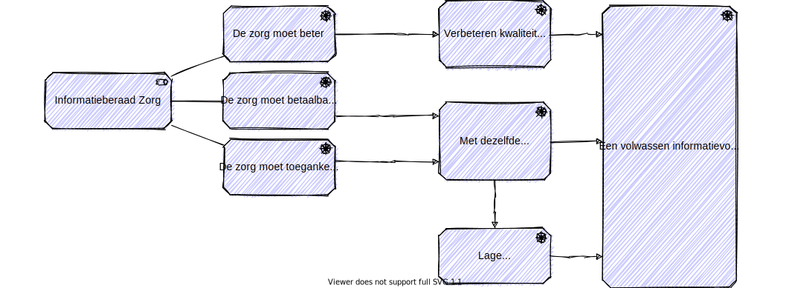
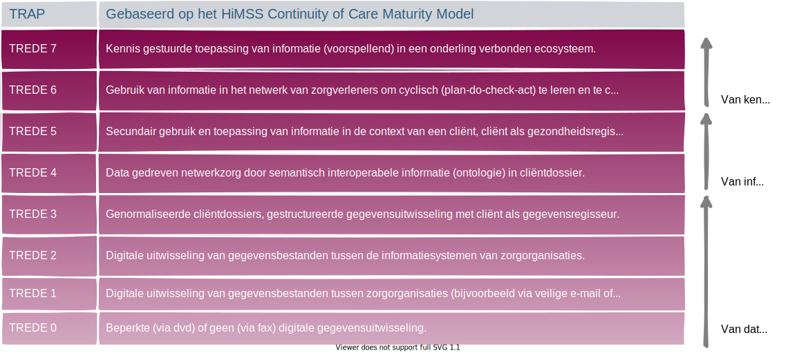

# De motivatie voor het informatiestelsel

## Een duurzaam informatiestelsel in de zorg

"*Om zorg beter, betaalbaarder en toegankelijker te maken werkt het Informatieberaad aan een duurzaam informatiestelsel voor de zorg, waarin zorggegevens veilig en betrouwbaar uitgewisseld worden. Hiervoor worden afspraken, standaarden en voorzieningen gemaakt samen met de deelnemers van het Informatieberaad*." Dit staat te lezen op https://www.informatieberaadzorg.nl. We hebben het in onderstaand figuur weergegeven. 

Het informatieberaad noemt het een duurzaam informatiestelsel. We hebben dit vertaald naar een volwassen informatiestelsel. Een volwassen informatiestelsel is duurzaam omdat het zich ontwikkelt. In onderstaand figuur zijn de traptreden van volwassenheid opgenomen die we voor het informatiestelsel onderkennen.

De principes ondersteunen in het volwassen zijn en worden van het informatiestelsel. 