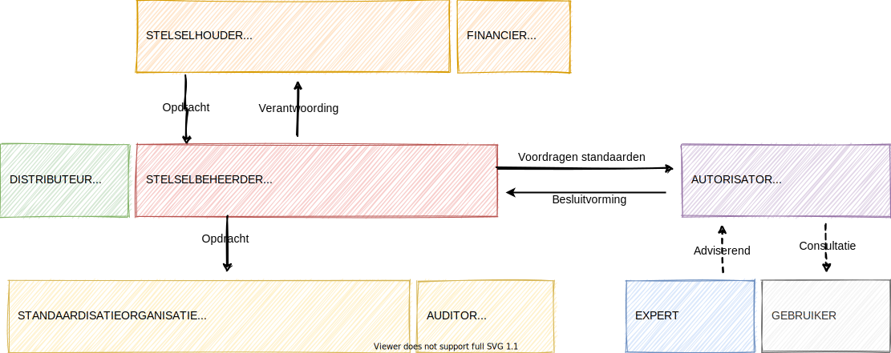
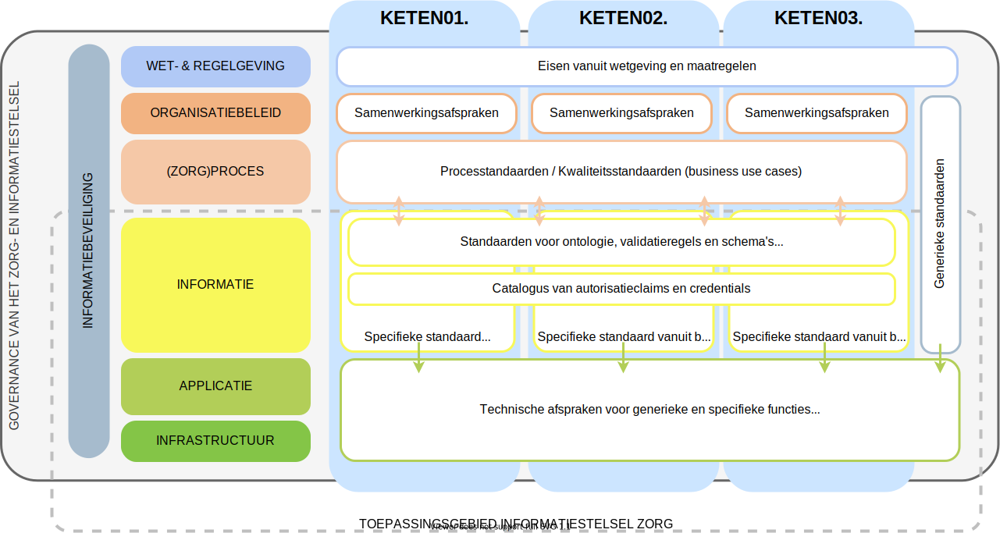
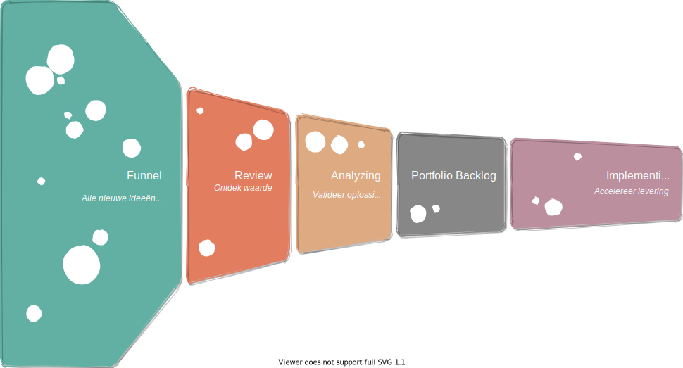

# De organisatie van het informatiestelsel

Het Informatiestelsel Zorg (hierna informatiestelsel) is een stelsel van standaarden. Iedere gegevensuitwisseling in de zorg is gebaseerd op een standaard. Hierdoor kunnen we een gelijk speelveld bieden aan alle voorzieningenleveranciers (zie manifest). De softwareproducten die deze standaarden implementeren vormen samen het ecosysteem voor gegevensuitwisseling in de zorg. Standaarden die voor het informatiestelsel zijn ontwikkeld noemen we stelselstandaarden.

In deze pagina beschrijven we de werkwijze om te komen tot standaardisatie van het informatiestelsel. Deze werkwijze is gebaseerd op NEN7522:2020, de Nederlandse norm voor het ontwikkelen en beheren van standaarden en stelsels van standaarden. We zien het informatiestelsel in de terminologie van NEN7522 als een stelsel van standaarden.

## Rollen voor de governance

De rollen zijn gebaseerd op de rollen beschreven in NEN7522:2020 en toegepast voor het informatiestelsel. Hieronder zijn deze rollen weergegeven en beschreven. Voor de eisen aan de rollen verwijzen we naar NEN7522:2020.

We onderkennen de volgende rollen:

1. **stelselhouder**: eindverantwoordelijk voor het ontwikkelen en beheren van het informatiestelsel van standaarden. De houder stelt de scope en het doel van het informatiestelsel vast evenals de principes en de uitgangspunten die worden gehanteerd bij ontwikkeling en beheer;
2. **stelselfinancier**: verantwoordelijk voor de financiering van de ontwikkeling en het beheer van het informatiestelsel;
3. **stelselautorisator**: keurt een stelselstandaard (waaronder normen en technische afspraken) goed door deze als bouwsteen van het informatiestelsel tet erkennen;
4. **stelselbeheerder** (in NEN7522 de stelsel functioneel beheerder): verantwoordelijk dat het proces van ontwikkelen en beheren verloopt volgens de gemaakte afspraken;
5. **technisch beheerder** is **standaardisatieorganisatie** genoemd in de referentiearchitectuur: verantwoordelijk voor het technisch beheren van individuele standaarden of stelsels van standaarden. Een standaardisatieorganisatie wordt in het informatiestelsel erkend door een stelselhouder en niet noodzakelijk benoemd;
6. **distributeur**: verantwoordelijk voor het distribueren van informatie over de ontwikkeling en het beheer van het informatiestelsel. Bijvoorbeeld een lijst met erkende standaardisatieorganisaties;
7. een **stelselexpert** brengt specifieke noodzakelijke kennis in, zoals domeinkennis.
8. in het informatiestelsel zijn **gebruikers** onderverdeeld in directe en indirecte gebruikers. Softwareleveranciers zijn directe gebruikers: zij moeten een stelselstandaard implementeren en zich conformeren aan de afspraken. Cliënten en zorgverleners zijn voorbeelden van indirecte gebruikers: zij ervaren de waarde van het informatiestelsel. De indirecte gebruikers worden als domeinexpert betrokken in het standaardisatieproces.
9. De rol van **auditor** is een aanvulling op de bovenstaande rollen: deze rol draagt zorg voor het kwalificeren en certificeren van softwareproducten, zowel voor applicaties als infrastructuur.

## Governance processen

Overeenkomstig NEN7522:2020 moet voor het informatiestelsel stelselmanagement worden uitgevoerd. Stelselmanagement omvat de processen 'beheren portfolio' en 'beheren catalogus van stelselstandaarden'. Deze processen beschrijven we hieronder kort.

### Beheren catalogus van stelselstandaarden

Het beheren van de catalogus omvat de stelselstandaarden en deze referentiearchitectuur. Het proces adviseert enerzijds over het gebruik van standaarden en anderzijds besluit het over selectie, (door)ontwikkeling en eventueel beheer van nieuwe stelselstandaarden. Dit op basis van de referentiearchitectuur om de samenhang te bewaken. Doel van het proces is hergebruik van standaarden te bevorderen zonder innovatie af te remmen en te borgen dat elementen die voldoen aan deze standaarden, kunnen samenwerken. Hiermee realiseren we het principe van een duurzaam informatiestelsel.

Het beheren van de catalogus omvat de stelselstandaarden voor het toepassingsgebied van het informatiestelsel zoals in onderstaand figuur is weergegeven.

Voor elke laag zijn de verschillende soorten afspraken hieronder beschreven.

- Vanuit **wet- en regelgeving** zijn eisen gesteld, beschreven in wetten en in algemene maatregelen van bestuur.
- Samenwerkingsafspraken worden beschreven in convenanten. We plaatsen deze op het niveau van **organisatiebeleid**, maar een convenant is vaak ook een afspraak op proces- en informatieniveau. Die afspraken zien we als stelselstandaard.
- Processtandaarden en kwaliteitsstandaarden zijn afspraken op het niveau van **organisatiebeleid**, **(zorg)proces** en **informatie**. In de informatieparagraaf zijn de processen en informatieobjecten gespecificeerd. Deze proces- en informatieanalyse is de basis voor de afspraken in de stelselstandaarden.
- Een business use case voor gegevensuitwisseling tussen deelnemers beschrijft de functionele en niet-functionele eisen op het niveau van **informatie**. Het wordt daarom een informatiestandaard genoemd.
- Op de lagen **applicatie** en **infrastructuur** beschrijft een technische afspraak de werking van het ecosysteem met de interactie tussen systeemactoren.

De opgave is om stelselstandaarden vanuit het netwerkperspectief in samenhang te ontwikkelen en niet alleen per keten. In onderstaand figuur is dit ter illustratie weergegeven.

### Beheren portfolio van business use cases

Het op stelselniveau beheren van een portfolio bevat de controles en processen om de strategische doelstellingen van het stelselmanagement te bereiken en is gebaseerd op ISO 38500.

Portfolio management is het regie voeren en managen van het geheel. Zonder portfolio management geen samenhang. Het is een zeer uitgebreid onderwerp die we in de referentiearchitectuur alleen benoemen omdat het een belangrijk instrument is in de ontwikkeling van stelselstandaarden. Voor meer informatie verwijzen we naar: <https://www.scaledagileframework.com/lean-portfolio-management/>.

In het bovenstaande figuur is een voorbeeld weergegeven van een kanban voor de ontwikkeling van stelselstandaarden in het informatiestelsel (bron: <https://www.scaledagileframework.com/portfolio-kanban/>). De stelselstandaarden komen tot stand omdat vanuit een business use case (opgenomen in een processtandaard of kwaliteitsstandaard) een informatieuitwisseling is geïdentificeerd. Het portfolio valt onder de verantwoordelijkheid van de stelselbeheerder. De implementatie zal uitgevoerd moeten worden door een of meerdere standaardisatieorganisaties.
