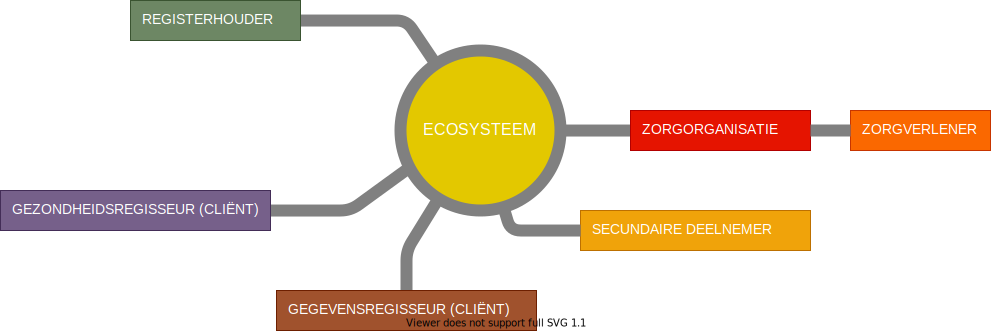

# Het informatiestelsel als ecosysteem

De informatiestandaarden beschrijven de diensten in het het informatiestelsel waarbij het informatiestelsel een ecosysteem is. Het is een ecosysteem omdat het als systeem moet kunnen functioneren zodat het voor de zorgverleners en cliënten als één systeem voelt waarin ze kunnen samenwerken en gegevens kunnen uitwisselen. De diensten worden aangeboden door de deelnemers.

In onderstaande paragraaf zijn de deelnemers van het ecosysteem beschreven.  

## De deelnemers aan het ecosysteem

In onderstaand figuur zijn de deelnemers weergegeven zoals we die onderkennen in het informatiestelsel als ecosysteem.

De deelnemers in het informatiestelsel zijn:

1. Een **zorgorganisatie** is een aanbieder of afnemer van gegevens en services. De gegevens en services worden primair gebruikt in het zorgproces en worden secundair gebruikt voor bijvoorbeeld onderzoek en kwaliteitsbewaking. We gebruiken hier de generieke term van een zorgorganisatie. In een informatiestandaard worden de specifieke rollen beschreven van de zorgorganisaties die betrokken zijn in een keten, bijvoorbeeld een verpleeghuis, huisarts, apotheker etc.
2. **Zorgverleners** maken gebruik van het ecosysteem via de informatiesystemen van een van de deelnemende zorgorganisatie.
3. Een **registerhouder** is een houder van een registratie van gegevens waarin gegevens over een onderwerp zijn verzameld. We onderkennen basisregisters (zoals Basisregister Personen),  sectorale registers (zoals LRZa en AGB), beroepsregisters (zoals BIG), patiëntenregistraties (zoals de ZonMw registraties) en kwaliteitsregistraties (zoals de HIPEC-registratie).
4. Een **cliënt** is een persoon die gebruik maakt van het ecosysteem voor regie op zijn of haar gezondheid dan wel voor regie op zijn of haar gegevens. 
6. Een **secundaire deelnemer** is een organisatie betrokken in een administratieve keten, een afnemer van kwaliteitsinformatie of een overige afnemer van data voor secundair gebruik. In de informatiestandaarden worden de rollen van deze organisaties specifiek beschreven.

### Wanneer is een persoon of organisatie deelnemer van het ecosysteem?

Cliënten zijn deelnemer omdat ze cliënt zijn van een zorgorganisatie. Voor registerhouders, zorgorganisaties en secundaire deelnemers geldt dat ze erkent moeten zijn. Een zorgorganisatie is bijvoorbeeld erkent omdat zij geregistreerd is in het landelijk register van zorgaanbieders (LRZa). Het bewijs van registratie maakt dat een zorgorganisatie deelnemer is. De registerhouder van het LRZa is een bekende en erkende organisatie (een gegevensautoriteit). Zo zal iedere deelnemer erkend moeten zijn als deelnemer: omdat zij bekend is, omdat zij een geregistreerde organisatie is in een bekend register of omdat zij door samenwerkingsafspraken erkend is.

### Gemeenschappelijke taal vanuit een netwerkperspectief

Iedere deelnemer in het ecosysteem biedt de diensten aan die horen bij haar domein en haar verantwoordelijkheid. Een deelnemer spreekt de taal van haar eigen domein. Deze abstracte woorden beschrijven we hieronder aan de hand van een concreet voorbeeld.


Een verpleeghuis en een ziekenhuis willen gegevens uitwisselen over een cliënt:

- Het verpleeghuis biedt diensten aan en spreekt de gemeenschappelijke taal van het domein verpleeghuiszorg. De gemeenschappelijke taal is zorgsectorspecifiek en niet ketenspecifiek. We gaan immers uit van een netwerkperspectief om meervoudig gebruik van data te verkrijgen. De taal kunnen we daarom niet koppelen aan een specifieke keten. De verpleeghuiszorg hebben we in het voorbeeld als domein genomen. 

  Binnen het domein kunnen we nog subdomeinen en contextuele kaders onderkennen om gemeenschappelijke taal af te spreken: taal is immers contextueel. Bijvoorbeeld de context van een specialisme binnen het verpleeghuis of voor de verzorging en verpleging. Een taal wordt dus afgesproken voor een contextueel kader in een domein waarbij ieder domein zelf bepaald wat haar contextuele kaders zijn. 

- Het ziekenhuis spreekt de gemeenschappelijk taal van de ziekenhuiszorg. Ook binnen de ziekenhuiszorg kunnen we nog subdomeinen en contextuele kaders onderkennen.

Voor interoperabiliteit is het noodzakelijk dat het verpleeghuis en het ziekenhuis elkaar begrijpen, dat vocabulaire en betekenis verbonden zijn. Hiervoor hebben beiden de volgende opties:

1. Beide deelnemers kunnen partners zijn in een contextueel kader en dezelfde taal spreken in dat kader.
2. De beide deelnemers kunnen kiezen voor een gemeenschappelijke kerntaal. Dit is van toepassing voor een contextueel kader. Verpleegkundigen uit beide domeinen spreken bijvoorbeeld voor een deel dezelfde taal. Zij kunnen gezamenlijk de kerntaal voor verpleegzorg afspreken die in beide domeinen gebruikt wordt.
3. Een deelnemer kan zich conformeren aan de taal van een andere deelnemer.
4. Een deelnemer kan kiezen om de taal van een andere deelnemer te vertalen naar haar eigen taal. Op basis van de betekenis van een concept kan zij de woorden vertalen naar haar eigen vocabulaire.

Randvoorwaarde is dat iedere deelnemer haar taal gepubliceerd heeft en daarmee toegankelijk heeft gemaakt voor andere deelnemers.
