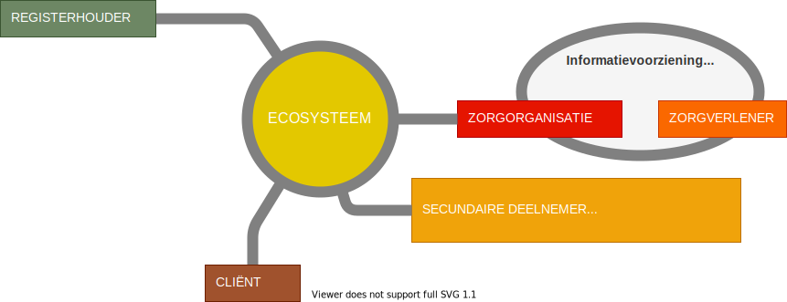

# Het informatiestelsel als ecosysteem

De standaarden beschrijven de generieke en specifieke functies van het ecosysteem. Het zijn functies die geïmplementeerd zijn in een informatiesysteem, een uitwisselingssysteem, in platformsoftware en/of in integratiesoftware. De functies worden gebruikt door de deelnemers aan het ecosysteem. Het is ecosysteem waarin gegevens worden uitgewisseld. 

In onderstaande paragraaf zijn de deelnemers van het ecosysteem beschreven. Vervolgens beschrijven we de voorzieningenleveranciers..  

## De deelnemers aan het ecosysteem

In onderstaand figuur zijn de deelnemers weergegeven zoals we die onderkennen in het operationele gebruik van het informatiestelsel. 

De gebruikers van het ecosysteem zijn:

1. Een **zorgorganisatie** is een aanbieder of afnemer van gegevens en services. De gegevens en services worden primair gebruikt in het zorgproces en worden secundair gebruikt voor bijvoorbeeld onderzoek en kwaliteitsbewaking. 
2. **Zorgverleners** maken gebruik van het ecosysteem via de informatiesystemen van een van de deelnemende zorgorganisatie.
3. Een **registerhouder** is een houder van een registratie van gegevens waarin gegevens over een onderwerp zijn verzameld. We onderkennen basisregisters (zoals Basisregister Personen),  sectorale registers (zoals LRZa en AGB), beroepsregisters (zoals BIG) en kwaliteitsregistraties (zoals de HIPEC-registratie).
4. De **gegevensregisseur** is de cliënt. Lokalisatie van zijn of haar gegevens, veelal weergegeven in een tijdlijn, worden via de cliënt toegankelijk gemaakt. Toegang kan verkregen zijn door gegevensuitwisseling via de cliënt of door gegevensuitwisseling met toestemming van de cliënt. Een gegevensregisseur moet ook de mogelijkheid hebben om vooraf gegevens klaar te zetten in het geval van spoedeisende hulp.
5. De **gezondheidsregisseur** is eveneens de cliënt. De nadruk bij de gezondheidsregisseur ligt op het gebruik van gegevens voor je persoonlijke gezondheid (regie op gezondheid) terwijl de nadruk van een gegevensregisseur ligt op regie op gegevens.
6. Een **secundaire deelnemer** is een organisatie betrokken in een administratieve keten, als afnemer van kwaliteitsinformatie of een overige afnemer van data voor secundair gebruik.