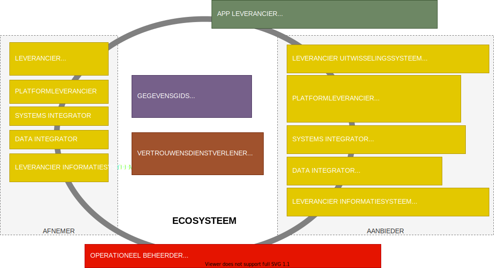

# De technologieleveranciers van het ecosysteem

De gebruikers van het ecosysteem hebben technologische voorzieningen nodig om gebruik te kunnen maken van het ecosysteem. Deze voorzieningenleveranciers zijn allen softwareleveranciers. Ze maken software voor diverse toepassingen zoals in onderstaand figuur is weergegeven. 

Er kunnen vele soorten voorzieningenleveranciers zijn. We hebben niet de intentie om daarin volledig te zijn, anders dat we een aantal willen noemen om een impressie te geven wat nodig is voor interoperabilteit.

1. Een **leverancier van een uitwisselingssysteem** levert software voor gegevensuitwisseling op basis van een uitwisselprofiel die beschreven is in een van de stelselstandaarden.
2. Een **platformleverancier** levert een platforrm voor een aantal generieke functies van het ecosysteem. 
3. Zowel een **systems integrator** als een **data integrator** zijn integratiespecialisten. De focus voor een systems integrator ligt echter op het integreren van het applicatielandschap door een gegevensstroom van procesgebeurtenissen te realiseren waardoor de informatiesystemen integraal als één systeem kunnen functioneren. De gegevensstroom kan gebruikt worden voor data integratie en gegevensuitwisseling (bijvoorbeeld notificaties).
4. Een **data integrator** verzamelt de gegevens uit de informatiesystemen om het als geheel te presenteren en/of toegankelijk te maken voor bijvoorbeeld gegevensanalyse of gegevensuitwisseling. 
5. Een **leverancier van een informatiesysteem** verwerkt de gegevens uit het ecosysteem en presenteert deze aan de eindgebruikers overeenkomstig de ontologie. Eindgebruikers zoals zorgverleners gebruiken de gegevens via het informatiesysteem en moeten de gegevens correct kunnen interpreteren.
6. Een **app leverancier** is een leverancier van een mobiele app of internetportaal gerricht op cliënten en/of zorgverleners. Het zijn toepassingen waarmee een cliënt de rol van gegevensregisseur bijvoorbeeld kan uitvoeren.
7. Een **gegevensgids** is een leverancier van een index van datacatalogussen voor de vindbaarheid van gegevens en services. Een gebruiker van het ecosysteem moet haar datacatalogus laten indexeren als zij een aanbieder van data is.
8. Een **vertrouwensdienstverlener** levert samen met andere vertrouwensdienstverleners een infrastructuur voor publieke sleutels en andere data voor de verificatie van de geldigheid en herkomst van gegevens.
9. De **operationeel beheerder** bewaakt het ecosysteem of een deel van het ecosysteem. Een operationeel beheerder kan ook een gezamenlijke helpdesk vormen. De operationeel beheerder zal veelal voor een keten of samenwerkingsverband worden ingericht indien daar behoefte aan is en een business case voor is.

