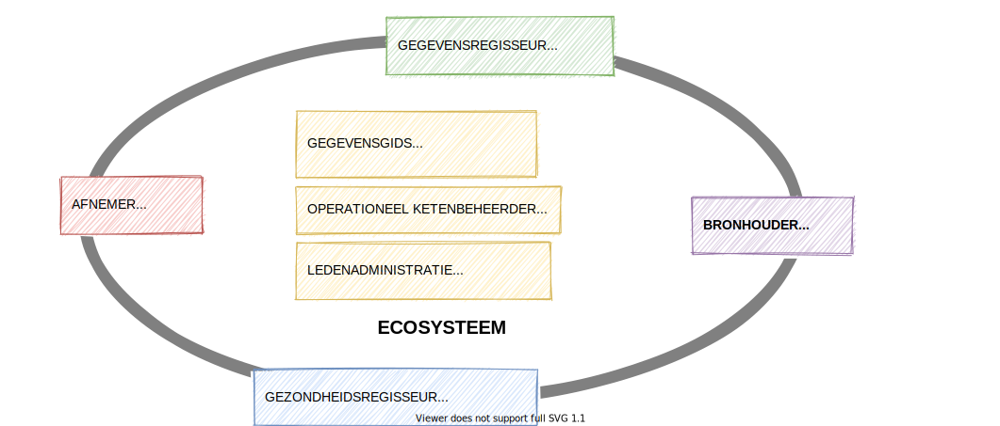

# De actoren van het ecosysteem
De standaarden beschrijven de generieke en specifieke functies van het ecosysteem. Het zijn functies die geïmplementeerd zijn in een informatiesysteem, een uitwisselingssysteem, in platformsoftware en/of in integratiesoftware. De functies worden gebruikt door de deelnemers aan het ecosysteem. Het is ecosysteem waarin gegevens worden uitgewisseld. 

De gebruikers van het ecosysteem hebben technologische voorzieningen nodig om gebruik te kunnen maken van het ecosysteem. Deze voorzieningenleveranciers zijn allen softwareleveranciers. Ze maken software voor diverse toepassingen zoals in onderstaand figuur is weergegeven. 

Er kunnen vele soorten softwareleveranciers zijn. We hebben niet de intentie om daarin volledig te zijn, anders dat we een aantal willen noemen om een impressie te geven van wat nodig is voor de informatievoorziening.

1. Een **aanbieder** van data is een rol van een organisatie die data en services in het ecosysteem vindbaar, interoperabel en toegankelijk maakt voor hergebruik.
2. Een **afnemer** is een rol van een organisatie die data en services afneemt van een aanbieder.
3. De **gegevensregisseur** is een rol van de cliënt. Lokalisatie van zijn of haar gegevens, veelal weergegeven in een tijdlijn, worden via de cliënt toegankelijk gemaakt. Toegang kan verkregen zijn door gegevensuitwisseling via de cliënt of door gegevensuitwisseling met toestemming van de cliënt. Een gegevensregisseur moet ook de mogelijkheid hebben om vooraf gegevens klaar te zetten in het geval van spoedeisende hulp.
4. De **gezondheidsregisseur** is eveneens een rol van de cliënt. De nadruk bij de gezondheidsregisseur ligt op het gebruik van gegevens voor je persoonlijke gezondheid (regie op gezondheid) terwijl de nadruk van een gegevensregisseur ligt op regie op gegevens.
5. Een **gegevensgids** is een leverancier van een index van datacatalogussen voor de vindbaarheid van gegevens en services. Samen met andere leveranciers van indexen maakt zij afspraken over de standaarden voor het vinden van data en services. Een aanbieder van het ecosysteem moet haar datacatalogus laten indexeren om vindbaar te zijn.
6. Een **vertrouwensdienstverlener** levert samen met andere vertrouwensdienstverleners een infrastructuur voor publieke sleutels en andere data voor de verificatie van de geldigheid en herkomst van gegevens. De vertrouwensdienstverleners maken samen afspraken over de standaarden die zij hanteren.
7. De **operationeel beheerder** bewaakt het ecosysteem of een deel van het ecosysteem. Een operationeel beheerder kan ook een gezamenlijke helpdesk vormen. De operationeel beheerder kan voor een keten of samenwerkingsverband worden ingericht indien daar behoefte en een business case voor is.

