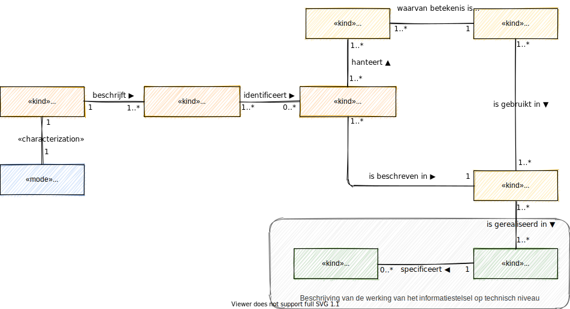

# De actoren van het ecosysteem

De technische standaarden beschrijven de generieke en specifieke functies van het ecosysteem. Het zijn functies die geïmplementeerd zijn in een van de diensten van een deelnemer aan het ecosysteem. De diensten worden gebruikt door de andere deelnemers van het ecosysteem. 

Voor de werking van het ecosysteem vervullen de deelnemers een systeemrol. Een deelnemer in een specifieke systeemrol noemen we een actor. In het onderstaande figuur zijn de actoren van het ecosysteem weergegeven. Naast de deelnemers zijn er ook andere actoren die een rol spelen. Het zijn actoren die een systeemrol spelen om het systeem als geheel te kunnen laten functioneren.

We onderkennen de volgende actoren in het ecosysteem voor de deelnemers:

1. Een **aanbieder** van data en services is een rol van een deelnemende organisatie die data en services in het ecosysteem vindbaar, interoperabel en toegankelijk maakt voor hergebruik. Cliënten hebben niet de rol van aanbieder, zij zijn gegevensregisseur.
2. Een **afnemer** is een rol van een deelnemende organisatie die data en services afneemt van een aanbieder. Cliënten hebben niet de rol van afnemer, zij zijn gegevensregisseur.
3. Een **gegevensautoriteit** is een rol van een organisatie. Het is een erkenning van die organisatie in het informatiestelsel dat zij de bron is voor een gegevensattribuut, bijvoorbeeld een identificatie of een kwalificatie (zoals de kwalificatie dat een organisatie een zorgaanbieder is). Het belang van een gegevensautoriteit en haar erkenning is met name van belang als de gegevens gebruikt worden voor authenticatie en autorisatie.
4. De **gegevensregisseur** is een rol van de cliënt. De locatie van de gegevens van een persoon, veelal weergegeven in een tijdlijn, worden via de cliënt toegankelijk gemaakt. Toegang kan verkregen zijn door gegevensuitwisseling via de cliënt of door gegevensuitwisseling met toestemming van de cliënt. Een gegevensregisseur moet ook de mogelijkheid hebben om vooraf gegevens klaar te zetten in het geval van spoedeisende hulp.
5. De **gezondheidsregisseur** is eveneens een rol van de cliënt. De nadruk bij de gezondheidsregisseur ligt op het gebruik van gegevens voor je persoonlijke gezondheid (regie op gezondheid) terwijl de nadruk van een gegevensregisseur ligt op regie op gegevens.

Daarnaast onderkennen we de volgende ondersteunende systeemrollen:

1. Een **gegevensgids** is een leverancier van een index van datacatalogussen voor de vindbaarheid van gegevens en services. Samen met andere leveranciers van indexen maakt zij afspraken over de standaarden voor het vinden van data en services. Een aanbieder van het ecosysteem moet haar datacatalogus laten indexeren om vindbaar te zijn.
2. Een **vertrouwensleverancier** levert samen met andere vertrouwensdienstverleners een infrastructuur voor publieke sleutels en andere data voor de verificatie van de geldigheid en herkomst van gegevens. De vertrouwensleveranciers maken samen afspraken over de standaarden die zij hanteren.
3. De **operationeel beheerder** bewaakt het ecosysteem of een deel van het ecosysteem. Een operationeel beheerder kan ook een gezamenlijke helpdesk vormen. De operationeel beheerder kan voor een keten of samenwerkingsverband worden ingericht indien daar behoefte en een business case voor is.

## Technische afspraken vanuit een netwerkperspectief

Een netwerkperspectief op zorg, een netwerkperspectief op gegevensuitwisseling in de zorg is een perspectief vanuit een deelnemer. Deze deelnemer heeft verschillende systeemrollen in het ecosysteem vanuit het netwerkperspectief. In de paragraaf hiervoor zijn deze systeemrollen (de actoren) beschreven. Een zorgorganisatie kan bijvoorbeeld zowel aanbieder als afnemer zijn. Iedere actor heeft in het informatiestelsel haar eigen systeem waarvoor technische afspraken gemaakt moeten worden.

In onderstaand figuur is de samenhang tussen de standaarden weergegeven en hoe deze uiteindelijk tot technische afspraken leiden. 

Voor de technische afspraken wordt veelal de techniek van systeem-use-case-modellering gehanteerd om de functionele en niet-functionele eisen te beschrijven. Het systeem van een actor, waarvoor de use cases beschreven worden, is in deze referentiearchitectuur als architectuurbouwblok opgenomen. Zie hiervoor de beschrijving van de actoren in het ecosysteem.

Voor iedere deelnemer kan vervolgens vastgesteld worden welke use cases ondersteund moeten worden in het architectuurbouwblok. Zo zal een apotheek in haar systeem andere use cases moeten ondersteunen dan een huisartsenpraktijk, etc.

